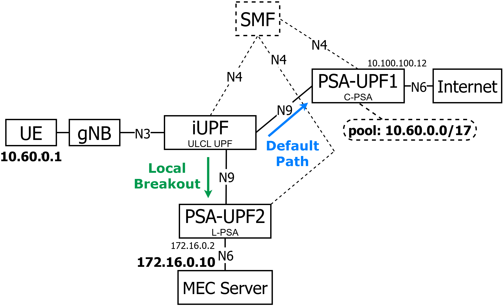

# Cloud-Native 5G Standalone ULCL Testbed

A reproducible cloud-native 5G Standalone (SA) testbed on Kubernetes with free5GC in a ULCL configuration with one branching and two anchor UPFs, deployed over Proxmox with Cilium, Multus, Longhorn, and a Prometheus-Grafana-Loki observability stack, documented from bare metal and released publicly.

<p align="center">
  
</p>

## Overview

The user plane follows a ULCL topology with three UPF instances: BranchingUPF (iUPF) classifies uplink flows by destination prefix and forwards them over N9; AnchorUPF1 (PSA-UPF1) allocates UE addresses and provides internet breakout over N6; AnchorUPF2 (PSA-UPF2) provides Multi-access Edge Computing (MEC) local breakout toward a campus application server.

<p align="center">
  
</p>

## Demo

ULCL steering verification using a security drone scenario, routing MEC and internet traffic through distinct anchors.

[](https://www.youtube.com/watch?v=G7dTJ8kTV3o)


## Key Results

| Experiment | Result |
|---|---|
| Steering correctness | Destination-based steering confirmed across both anchor paths, 0% packet loss over 90 ICMP samples per destination |
| Load characterization | Forwarding ceiling at 9.60 Gbps imposed by the gtp5g kernel module on a single core, not by the ULCL topology; branching UPF introduces no measurable forwarding loss |
| Failure response | Graceful termination achieves full infrastructure and control-plane recovery; forced termination leaves the UPF permanently inoperable due to stale kernel state |

Full experimental results, figures, and raw measurement data are in [experiments](experiments).

## Quick Start

Deployment is documented step by step in [docs](docs), organized by chapter:

1. [Virtualization Setup](docs/chapter-01-virtualization-setup)
2. [VM Provisioning](docs/chapter-02-vm-provisioning)
3. [Kubernetes Setup](docs/chapter-03-kubernetes-setup)
4. [Observability](docs/chapter-04-observability)
5. [5G Network Environment](docs/chapter-05-5g-network-environment)

## Repository Structure

```
5gc-cloudnative-testbed/
docs/           Step-by-step deployment documentation, by chapter
experiments/    Experimental tooling, raw measurement data, and figures
scripts/        Deployment and measurement automation
values/         Helm values used across the deployment
README.md
TROUBLESHOOTING.md
```

## Affiliation

Faculty of Electronic and Electrical Engineering, Universidad Nacional Mayor de San Marcos, Lima, Peru.

## License

This project is licensed under the MIT License, allowing free use, modification, and redistribution for academic and non-academic purposes, with attribution. See [LICENSE](LICENSE) for details.
