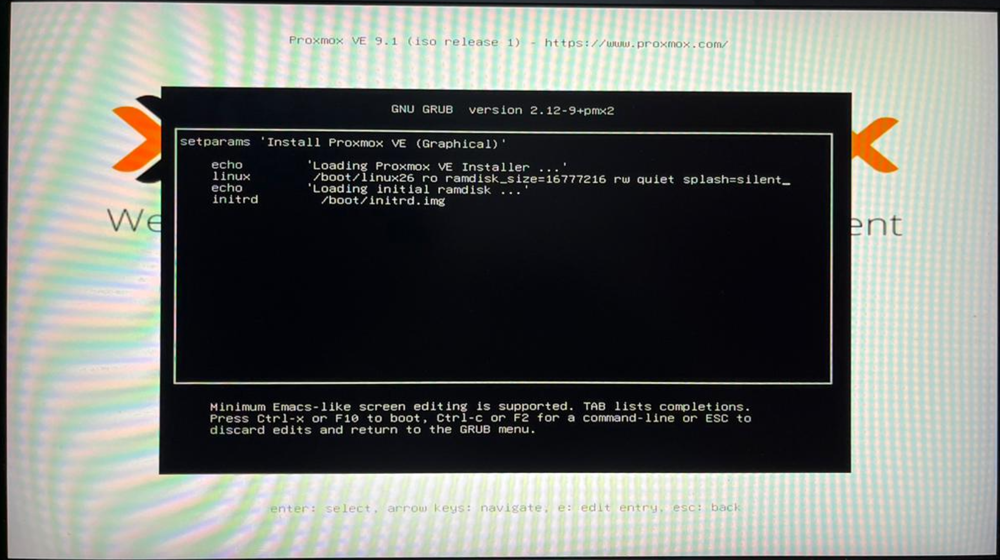
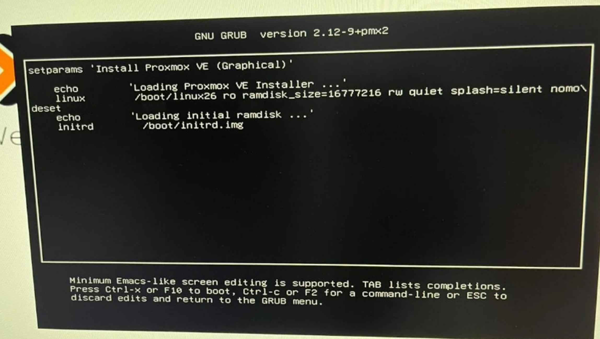

# Troubleshooting

This document covers known issues encountered during the deployment of this testbed and their verified solutions. Each entry includes symptoms, root cause, and step-by-step resolution.

---

## GPU Driver Compatibility — Graphical Installer Freeze

**Affected section:** [Chapter 1 — 04: Proxmox VE Installation](docs/chapter-01-virtualization-setup/04-proxmox-installation/README.md)

### Symptom

The Proxmox VE graphical installer freezes during the loading phase — before the EULA screen appears. The screen stops responding while validating or loading system drivers.

1. The installer starts loading after selecting Install Proxmox VE (Graphical)

   
   <br><sub>Figure 1. Graphical installer frozen during driver loading phase. This is caused by GPU driver incompatibility during the boot process.</sub>
   <br><br>

### Root Cause

The Proxmox VE installer attempts to load GPU drivers for high-resolution graphics during the boot process. Certain GPU models — particularly NVIDIA cards — are not fully compatible with the installer's driver loading mechanism, causing the process to hang indefinitely. This is an installer-only issue and does not affect Proxmox VE operation after installation.

### Solution

Disable GPU driver loading during the installer boot by adding the `nomodeset` kernel parameter. This forces the installer to use a legacy low-resolution graphics mode — sufficient for the installation process and with no effect on post-installation performance.

**Step 1 — Select graphical install without pressing Enter**

1. When the Proxmox VE boot menu appears, highlight **Install Proxmox VE (Graphical)**
2. Do **not** press Enter — press **`e`** instead to open the GRUB boot editor

   
   <br><sub>Figure 2. Proxmox VE boot menu. Highlight Install Proxmox VE (Graphical) and press e — do not press Enter.</sub>
   <br><br>

**Step 2 — Open the GRUB boot editor**

1. Pressing `e` opens the GRUB boot entry editor showing the kernel boot parameters

   
   <br><sub>Figure 3. GRUB boot editor. Locate the line beginning with linux /boot/linux ro ram...</sub>
   <br><br>

**Step 3 — Add nomodeset to the kernel parameters**

1. Locate the line beginning with `linux /boot/linux ro ram…`
2. Navigate to the end of that line
3. Add a space followed by `nomodeset`

   ```
   linux /boot/linux ro ram… nomodeset
   ```

   The `nomodeset` parameter instructs the kernel not to load video mode setting drivers during boot, forcing the use of a basic framebuffer instead of GPU-specific drivers.

   
   <br><sub>Figure 4. GRUB boot editor with nomodeset appended to the kernel parameters line.</sub>
   <br><br>

**Step 4 — Continue installation**

1. Press **Ctrl + X** to boot with the modified parameters
2. The installer will load in legacy graphics mode and proceed normally to the EULA screen

   
   <br><sub>Figure 5. Proxmox VE EULA screen — the installer loads successfully after applying the nomodeset fix.</sub>
   <br><br>

> **Note:** This fix only applies to the installation process. Once Proxmox VE is installed and running, GPU drivers are managed by the host OS independently of this parameter.

---

*More troubleshooting entries will be added as the deployment guide expands.*
