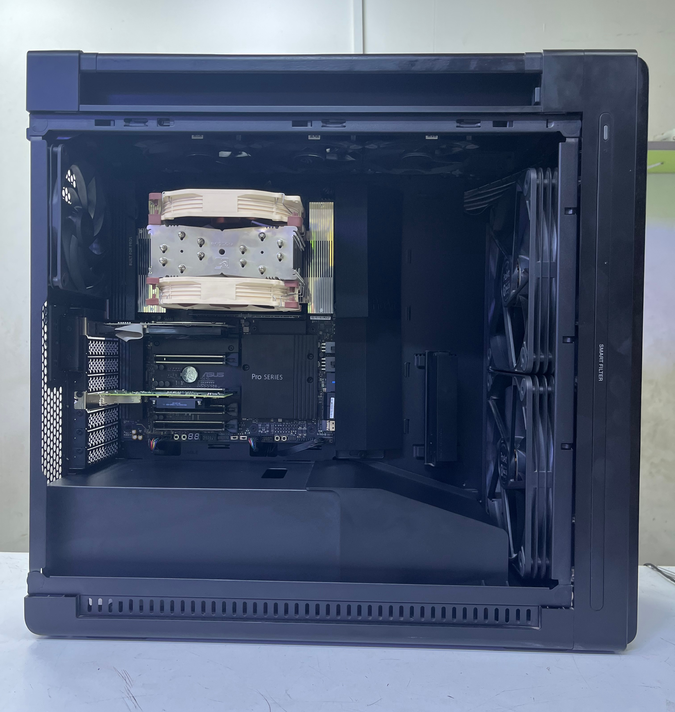

# 01 — Hardware Requirements

This section describes the physical hardware used to build this testbed and defines the minimum specifications required for replication. The testbed runs on a single bare-metal workstation acting as the physical host for all virtualized infrastructure. No cloud provider or external compute resources are required.

---

## Prerequisites

- [ ] A bare-metal workstation or server with x86_64 CPU and hardware virtualization support (AMD-V or Intel VT-x)
- [ ] A USB drive of at least 4 GB
- [ ] A wired Ethernet connection to a local network switch or router
- [ ] Physical access to the workstation
- [ ] Internet access from the local network

---

## Tested Hardware

The following table describes the exact hardware configuration on which this testbed was implemented and validated.

| Component       | Specification               | Model                        |
|-----------------|----------------------------|------------------------------|
| CPU             | 24 cores / 48 threads      | AMD Ryzen Threadripper 9960X |
| Motherboard     | Socket STR5, AMD TRX50     | ASUS Pro WS TRX50-SAGE WIFI  |
| RAM             | 128 GB DDR5 ECC, 4800 MT/s | Kingston Fury Renegade Pro   |
| OS Disk         | 1 TB NVMe PCIe 4.0         | WD Black SN850X              |
| VM Storage Disk | 1 TB NVMe PCIe 5.0         | Crucial P510                 |
| NIC Primary     | 10 GbE                     | Aquantia AQC113              |
| NIC Secondary   | 2.5 GbE                    | Intel I226-LM                |
| PSU             | 850W                       | XPG Core Reactor II          |
| UPS             | 1500VA / 1350W             | Forza FDC-1502R              |
| Switch          | 8-port, 1 GbE              | TP-Link TL-SG2008P           |
| Cabling         | UTP Cat6                   | —                            |

*Figure 1. Internal view of the AMD Threadripper 9960X workstation showing CPU cooler, DDR5 RAM modules, and dual NVMe storage devices.*

---

## Minimum Requirements

Derived from official component documentation [[1]](#references) [[2]](#references) [[3]](#references). All virtual machines run on a single physical host — scale these values according to your available hardware capacity.

| Component       | Minimum        | Recommended         |
|-----------------|----------------|---------------------|
| CPU             | 8 cores x86_64 | 16+ cores           |
| RAM             | 64 GB          | 128 GB ECC          |
| OS Disk         | 120 GB SSD     | 500 GB NVMe         |
| VM Storage Disk | 500 GB NVMe    | 1 TB NVMe PCIe 4.0+ |
| NIC             | 1 GbE          | 2.5 GbE or higher   |
| Switch          | 1 GbE          | Smart managed       |

> **Important:** The VM storage disk must be physically separate from the Proxmox OS disk. Sharing a single disk causes I/O contention under Kubernetes workloads [[3]](#references).

> **Recommendation:** A UPS is strongly advised for bare-metal deployments. Unexpected power loss during Kubernetes etcd writes can corrupt the cluster state.

---

## Network Addressing

The testbed uses a flat management network on subnet `192.168.18.0/24`. The table below defines the static IP assignments for all nodes. Addresses in the `.210–.213` range are reserved for this testbed to avoid conflicts with other deployments on the same LAN.

| Element         | Hostname     | Role          | IP                | Mode   |
|-----------------|--------------|---------------|-------------------|--------|
| Proxmox Host    | pve-tc       | Hypervisor    | 192.168.18.200/24 | Static |
| VM 201          | k8s-master   | Control Plane | 192.168.18.210/24 | Static |
| VM 202          | k8s-worker-1 | Worker Node   | 192.168.18.211/24 | Static |
| VM 203          | k8s-worker-2 | Worker Node   | 192.168.18.212/24 | Static |
| VM 204          | k8s-worker-3 | Worker Node   | 192.168.18.213/24 | Static |

> **Note:** Gateway 192.168.18.1, DNS 8.8.8.8. Adjust to match your local network.

---

## Node Planning

The following table defines the virtual machine resource allocation provisioned on the physical host. Review these values against your available hardware before proceeding to Chapter 2.

| VM ID | Hostname     | Role          | vCPU | RAM   | Disk   |
|-------|--------------|---------------|------|-------|--------|
| 201   | k8s-master   | Control Plane | 4    | 12 GB | 120 GB |
| 202   | k8s-worker-1 | Worker Node   | 8    | 24 GB | 280 GB |
| 203   | k8s-worker-2 | Worker Node   | 6    | 20 GB | 160 GB |
| 204   | k8s-worker-3 | Worker Node   | 8    | 24 GB | 260 GB |

---

## Management Endpoint

A separate device with SSH client and web browser is required for remote administration of the testbed. Any workstation or laptop on the same LAN is sufficient. Remote access setup is covered in [Chapter 2 — Section 05: Remote Access](../../chapter-02-vm-provisioning/05-remote-access/README.md).

---

## References

- \[1\] free5GC Project, "System Requirements," Linux Foundation. https://free5gc.org/guide/ [Accessed: April 2026]
- \[2\] Kubernetes, "Production Environment Requirements," CNCF. https://kubernetes.io/docs/setup/production-environment/ [Accessed: April 2026]
- \[3\] Proxmox Server Solutions, "Proxmox VE Installation Guide." https://pve.proxmox.com/wiki/Installation [Accessed: April 2026]

---

✅ You are here: `chapter-01-virtualization-setup / 01-hardware-requirements`

⏭️ Next: [02 — Proxmox Bootable Media →](../02-proxmox-bootable-media/README.md)
