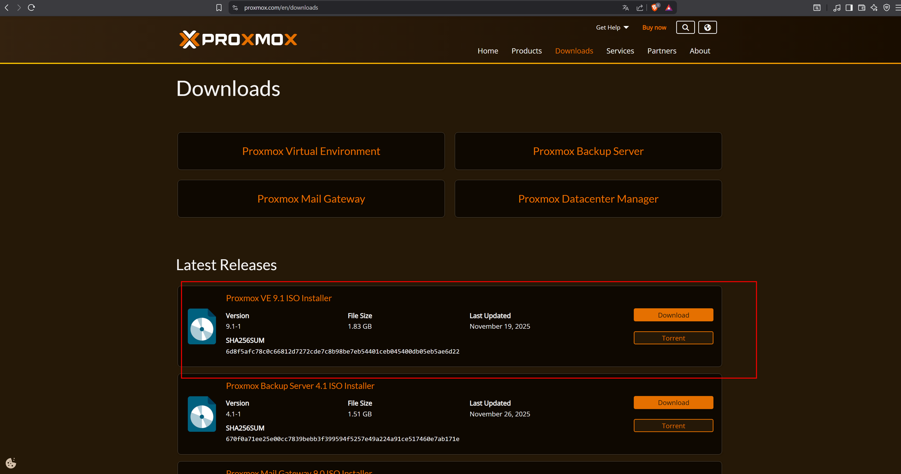
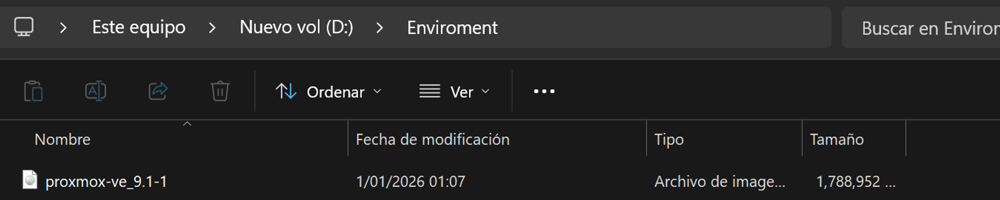
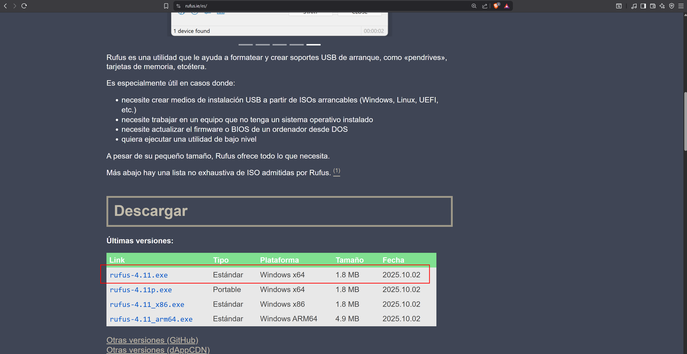
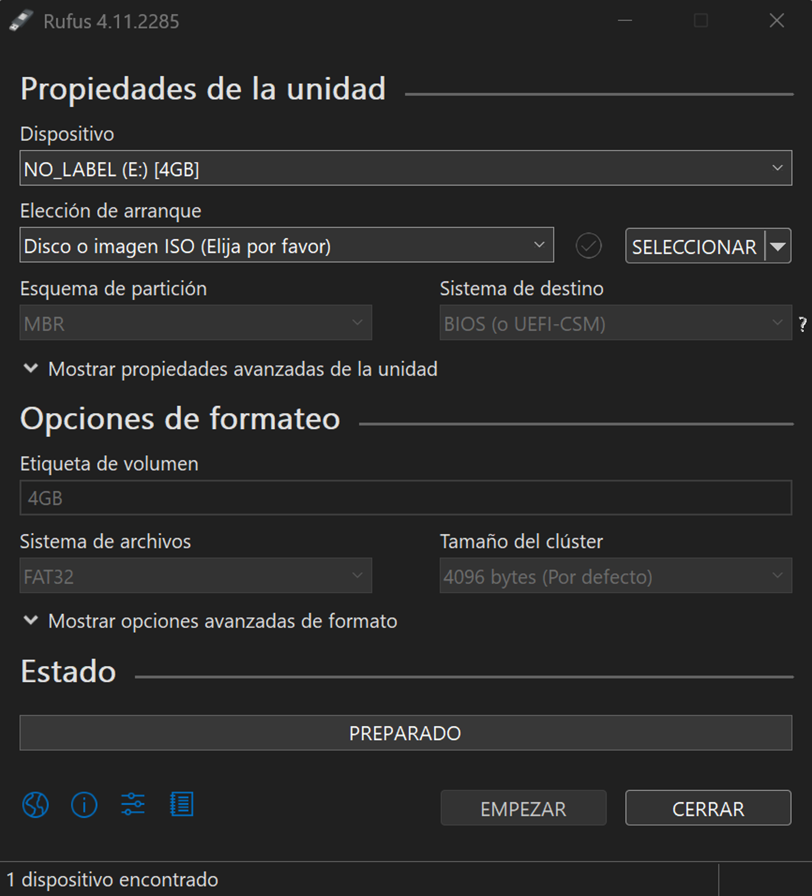
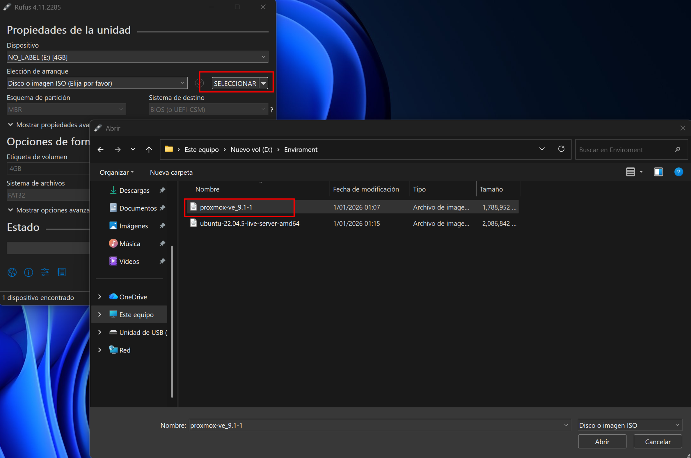
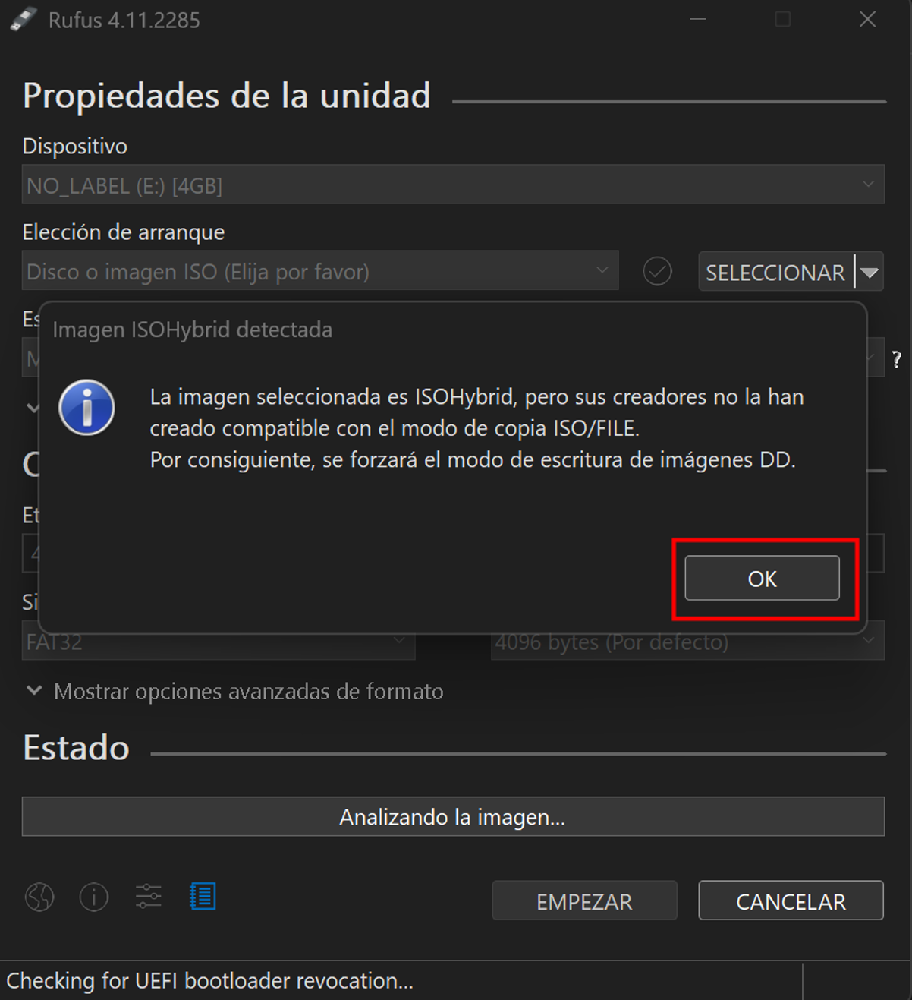
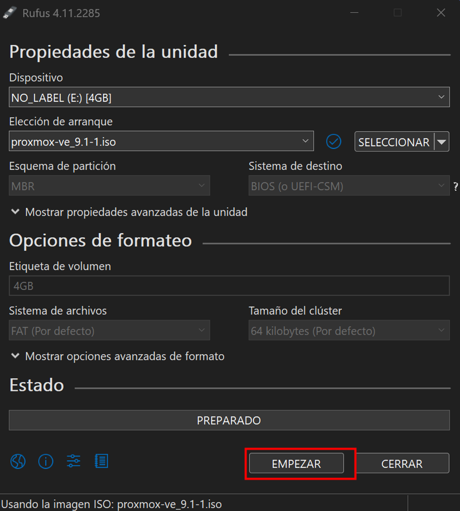
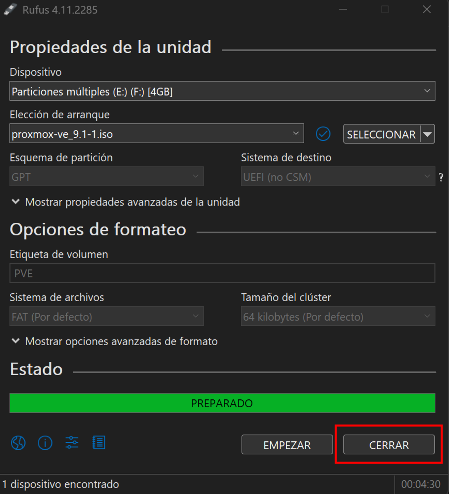

# 02 — Proxmox Bootable Media

This section covers downloading the Proxmox VE ISO and creating a bootable USB drive using Rufus. All steps in this section are performed on the management endpoint — not on the bare-metal server, which has not been configured yet.

---

## Prerequisites

- [ ] Completed [01 — Hardware Requirements](../01-hardware-requirements/README.md)
- [ ] A USB drive of at least 4 GB — all existing data will be erased
- [ ] A Windows machine (management endpoint)
- [ ] Internet access to download the ISO and Rufus

---

## Step 1 — Download Proxmox VE ISO

1. Go to https://www.proxmox.com/en/downloads
2. Select **Proxmox VE** (Virtual Environment) — do not select Proxmox Backup Server or Proxmox Mail Gateway
3. Click **Download** next to the latest available ISO Installer

*Figure 1. Proxmox VE downloads page. This testbed was validated with version 9.1-1. Use the latest available version unless exact reproducibility is required.*

4. Wait for the download to complete — confirm the `.iso` file exists in your local storage before proceeding

*Figure 2. Proxmox VE ISO file saved to local storage.*

---

## Step 2 — Download Rufus

Rufus is a free utility for creating bootable USB drives from ISO files. It is used here to write the Proxmox VE ISO to the USB drive. Alternative tools such as Balena Etcher or Ventoy can also be used, but this guide was validated with Rufus.

1. Go to https://rufus.ie
2. Download the latest available **Rufus portable** version — no installation required. This testbed was validated with Rufus 4.11. Use the latest available version

*Figure 3. Rufus download page. Download the portable version.*

*Figure 4. Rufus 4.11 portable executable downloaded — no installation required.*

---

## Step 3 — Create Bootable USB

1. Insert the USB drive into the Windows machine
2. Open the Rufus executable
3. Rufus will detect the USB drive automatically — verify the correct device is selected under **Device**

*Figure 5. Rufus open with USB drive detected. Verify the correct device is shown before proceeding.*

4. Under **Boot selection** click **SELECT** — browse to the Proxmox VE ISO downloaded in Step 1 and select it

*Figure 6. Proxmox VE ISO selected as boot source.*

5. When the **ISOHybrid image detected** dialog appears, select **Write in ISO Image mode** — click **OK**

> **Note:** The ISOHybrid message appears immediately after selecting the ISO. Always select ISO Image mode — do not select DD mode.

*Figure 7. ISOHybrid image detected dialog. Select Write in ISO Image mode and click OK.*

6. Rufus automatically adjusts the formatting options after confirming ISO Image mode. Verify the final configuration matches the following before proceeding

| Field            | Value                  |
|------------------|------------------------|
| Device           | Your USB drive         |
| Boot selection   | proxmox-ve_9.1-1.iso   |
| Partition scheme | MBR                    |
| Target system    | BIOS or UEFI (CSM)     |
| Volume label     | Auto (set by Rufus)    |
| File system      | FAT (default)          |
| Cluster size     | 64 kilobytes (default) |

*Figure 8. Rufus final configuration with Proxmox VE ISO loaded and ready to start.*

7. Click **START**
8. Confirm the warning that all data on the USB drive will be erased — click **OK**
9. Wait for the process to complete

*Figure 9. Rufus showing 100% completion. The timestamp confirms total write time — in this testbed the process took approximately 44 minutes. Click CLOSE — do not click START again as it will restart the process.*

> **Important:** Click **CLOSE** when done — do not click START again.

---

## References

- \[1\] Proxmox Server Solutions, "Proxmox VE Downloads." https://www.proxmox.com/en/downloads [Accessed: April 2026]
- \[2\] Rufus, "Create bootable USB drives the easy way." https://rufus.ie [Accessed: April 2026]

---

✅ You are here: `chapter-01-virtualization-setup / 02-proxmox-bootable-media`

⏭️ Next: [03 — BIOS Configuration →](../03-bios-configuration/README.md)
