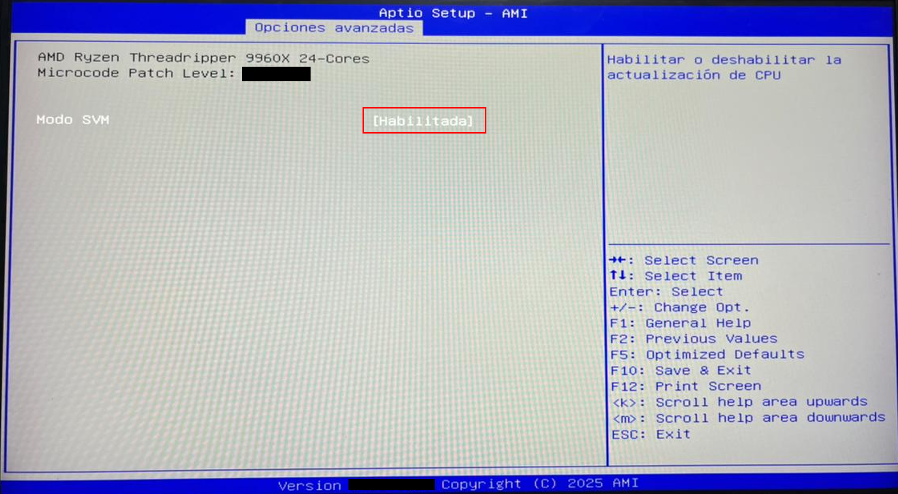
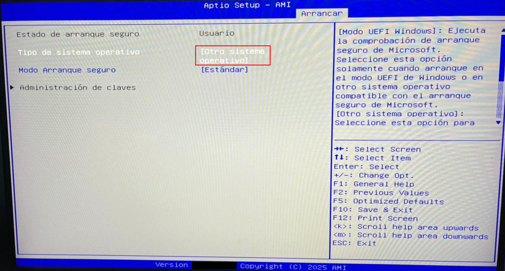

# 03 — BIOS Configuration

This section covers the required BIOS settings before installing Proxmox VE. These steps are performed directly on the bare-metal workstation with a keyboard, monitor, and mouse connected. No operating system is required — the workstation boots directly into BIOS when no bootable OS is detected.

---

## Prerequisites

- [ ] Completed [02 — Proxmox Bootable Media](../02-proxmox-bootable-media/README.md)
- [ ] Monitor, keyboard and mouse connected to the workstation
- [ ] Bootable USB drive not yet inserted — insert only after BIOS configuration is complete

---

## Step 1 — Enter BIOS

1. Power on the workstation
2. Since no operating system is installed, the system boots directly into BIOS automatically

   
    Figure 1. BIOS main screen on the ASUS Pro WS TRX50-SAGE WIFI. The system enters BIOS automatically when no bootable OS is detected.
     

> **Note:** If your workstation does not enter BIOS automatically, press **DEL** or **F2** repeatedly immediately after powering on.

---

## Step 2 — Enable SVM (Hardware Virtualization)

SVM (Secure Virtual Machine) is AMD's hardware virtualization technology. It must be enabled for Proxmox VE to create and manage virtual machines.

1. Navigate to **Advanced**
2. Locate **SVM Mode** and set to **Enabled**

   
    Figure 2. SVM Mode set to Enabled under Advanced. This is mandatory for Proxmox VE virtualization.
     

> **Important:** Without SVM enabled Proxmox VE will not be able to create virtual machines.

---

## Step 3 — Configure Power Restore Behavior

This setting ensures the workstation restarts automatically after a power outage. Combined with the UPS configured in the hardware layer, this provides resilience against unexpected power events.

1. Navigate to **Advanced**
2. Locate **Restore AC Power Loss** and set to **Power On**

   
    Figure 3. Restore AC Power Loss set to Power On. The server will restart automatically after power is restored following an outage.
     

---

## Step 4 — Configure Boot Mode

Both CSM and Secure Boot are configured from the same Boot menu screen. Disabling CSM forces UEFI boot mode, which is required by Proxmox VE. Setting Secure Boot OS Type to Other OS allows Proxmox VE to boot without requiring a Microsoft-signed bootloader.

1. Navigate to **Boot**
2. Locate **CSM** and set to **Disabled**
3. Locate **Secure Boot** → **OS Type** and set to **Other OS**

   
    Figure 4. Boot configuration screen. CSM set to Disabled and Secure Boot OS Type set to Other OS. Both settings are required for Proxmox VE installation.
     

> **Note:** If CSM is enabled, Proxmox VE may fail to boot after installation. Disabling CSM and setting Secure Boot to Other OS ensures full UEFI compatibility with the Proxmox VE bootloader.

---

## Step 5 — Save and Exit

1. Press **F10** to save all changes and exit BIOS
2. The workstation will restart automatically

   
    Figure 5. F10 save and exit confirmation dialog. Click OK to restart the workstation with the new settings applied.
     

---

## References

- \[1\] ASUS, "Pro WS TRX50-SAGE WIFI User Manual," ASUS Support.
      https://www.asus.com/supportonly/pro%20ws%20trx50-sage%20wifi/helpdesk_manual/ [Accessed: April 2026]
- \[2\] ASUS, "How to enable or disable AMD Virtualization (AMD-V) technology," ASUS Support FAQ.
      https://www.asus.com/support/faq/1043992/ [Accessed: April 2026]
- \[3\] Proxmox Server Solutions, "Proxmox VE System Requirements," Proxmox Documentation.
      https://pve.proxmox.com/wiki/System_Requirements [Accessed: April 2026]

---

✅ You are here: `chapter-01-virtualization-setup / 03-bios-configuration`

⏭️ Next: [04 — Proxmox Installation →](../04-proxmox-installation/README.md)
