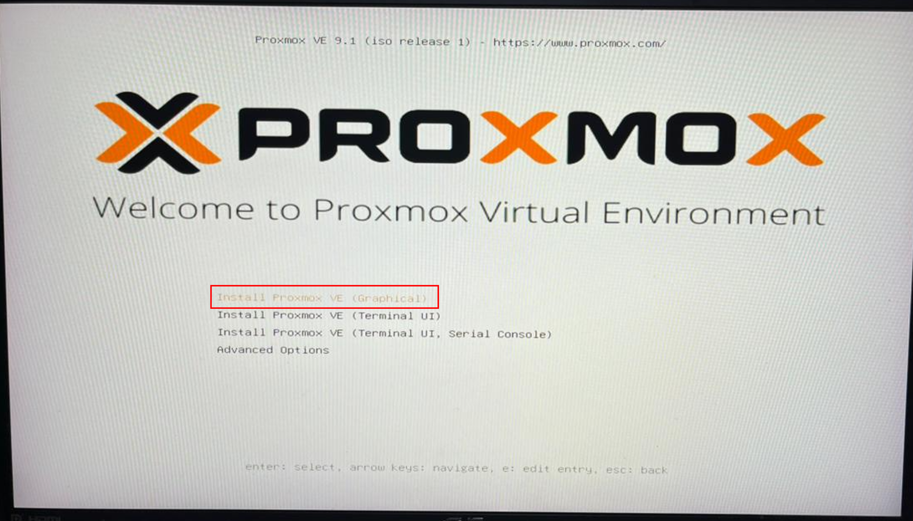
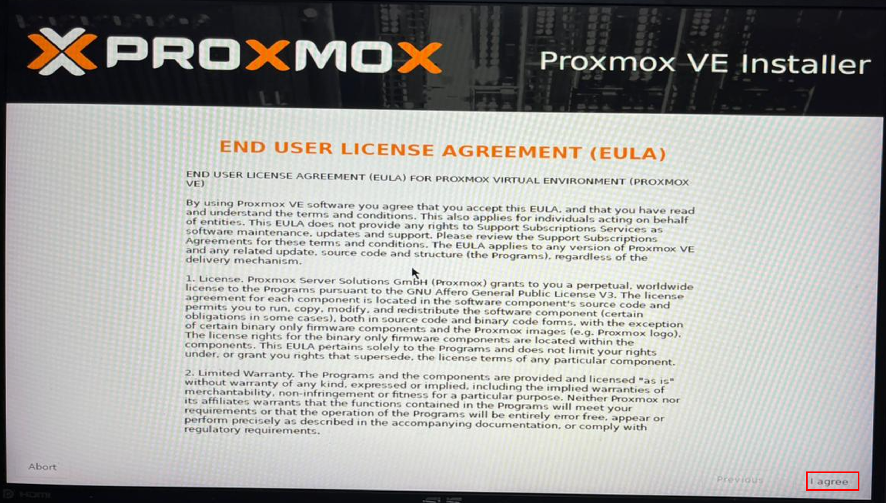
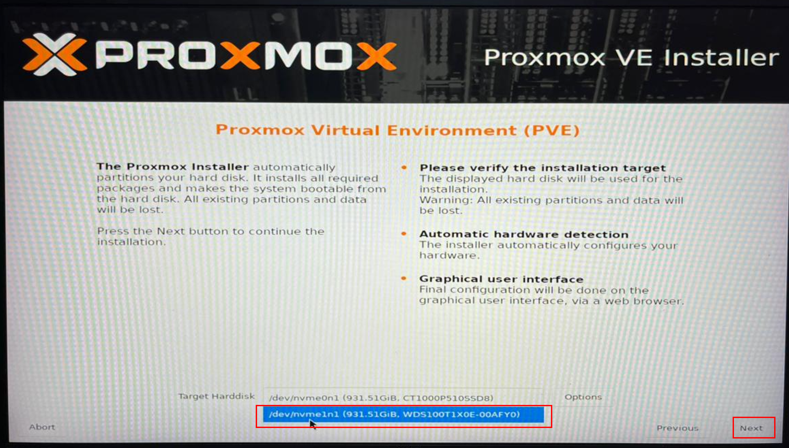
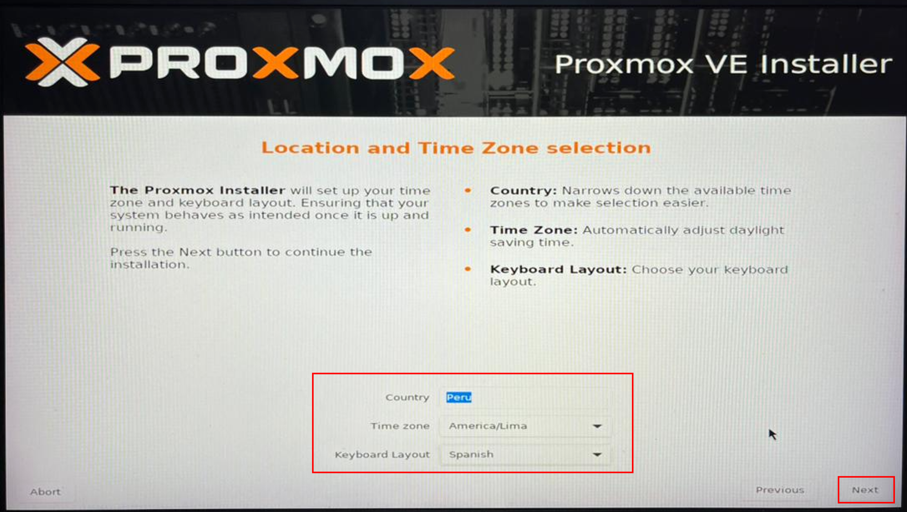
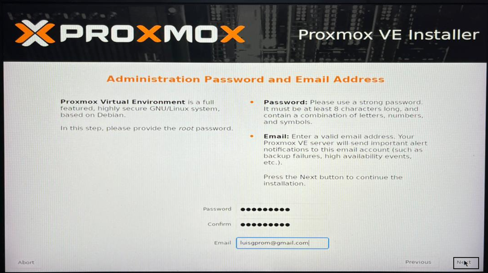
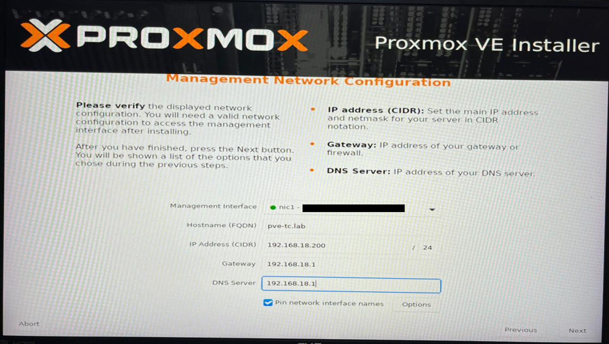
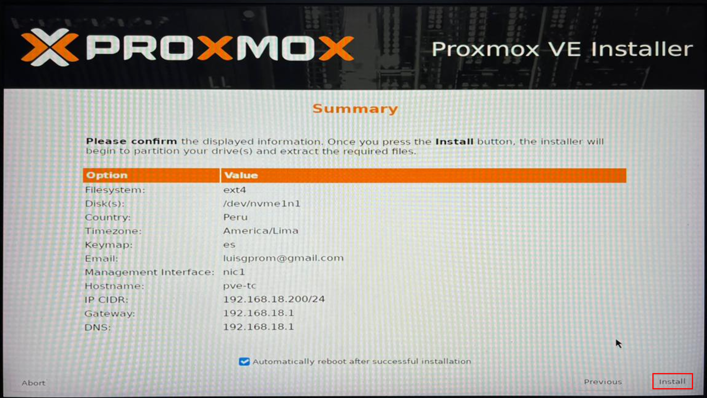
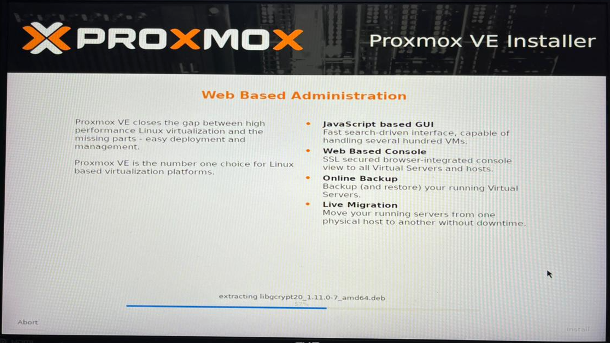
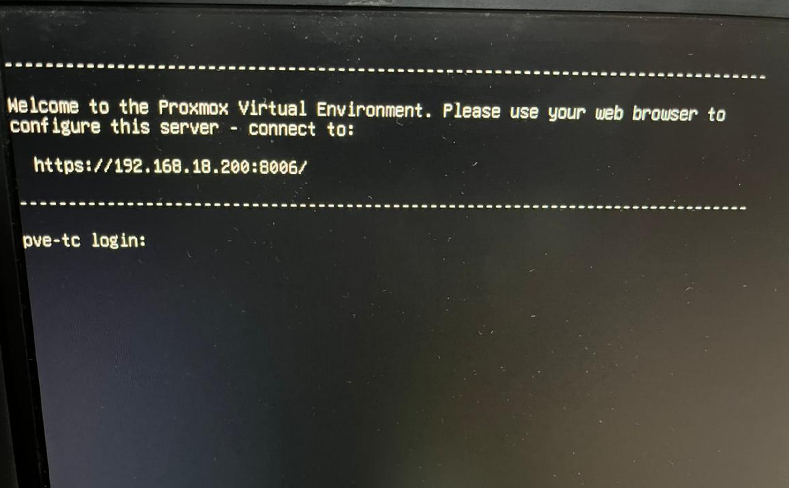

# 04 — Proxmox VE Installation

This section covers the complete Proxmox VE installation process from USB boot to first login. All steps are performed directly on the bare-metal workstation with monitor, keyboard, and mouse connected.

---

## Prerequisites

- [ ] Completed [03 — BIOS Configuration](../03-bios-configuration/README.md)
- [ ] Proxmox VE bootable USB drive ready
- [ ] Network cable connected to the workstation NIC
- [ ] Management endpoint on the same LAN to verify web access after installation

---

## Step 1 — Boot from USB

After pressing F10 in the previous section the workstation restarts. Wait for the restart to complete — the BIOS screen will appear again. At this point insert the Proxmox VE bootable USB drive into the workstation and exit BIOS to trigger the boot sequence.

1. Insert the Proxmox VE bootable USB drive while the BIOS screen is showing
2. Exit BIOS — the workstation will restart automatically
3. Press **F8** immediately during the restart to open the boot device selection menu

   > **Note:** On ASUS boards the boot device menu key is **F8**. On other manufacturers it may be **F11**, **F12**, or **ESC**. Refer to your motherboard manual if F8 does not open the boot menu.

4. Select the **UEFI** entry corresponding to your USB drive
5. The Proxmox VE installer will load automatically

---

## Step 2 — Start Installation

1. When the Proxmox VE boot menu appears, select **Install Proxmox VE (Graphical)** and press **Enter**

   
    Figure 1. Proxmox VE boot menu. Select Install Proxmox VE (Graphical).
     

2. The installer will load and validate system components — wait for the graphical interface to appear

> **Note:** If the graphical installer freezes during loading, this is typically caused by GPU driver compatibility. See [TROUBLESHOOTING.md — Graphical installer freeze](../../../../TROUBLESHOOTING.md) for the nomodeset fix.

---

## Step 3 — Accept EULA

1. Read the End User License Agreement
2. Click **I agree** to proceed

   
    Figure 2. Proxmox VE End User License Agreement. Click I agree to continue.
     

---

## Step 4 — Select Installation Disk

Proxmox VE must be installed on a dedicated disk — separate from the VM storage disk. This isolates the OS from VM workloads and avoids I/O contention.

1. Under **Target Harddisk** select the OS disk — in this testbed: **WD Black SN850X** (`/dev/nvme0n1`)
2. Do not select the VM storage disk (Crucial P510) — that disk is reserved for VM provisioning in Chapter 2

   
    Figure 3. Target disk selection. Select the OS disk only — do not select the VM storage disk.
     

---

## Step 5 — Set Location and Timezone

1. Set **Country** to your country — in this testbed: **Peru**
2. Set **Timezone** to your timezone — in this testbed: **America/Lima**
3. Set **Keyboard Layout** to your preference — in this testbed: **Spanish Latin America**
4. Click **Next**

   
    Figure 4. Location and timezone selection. Adjust to match your local configuration.
     

---

## Step 6 — Set Root Password and Email

1. Enter a strong password for the **root** account and confirm it
2. Enter an email address — used for system notifications
3. Click **Next**

   
    Figure 5. Root password and email configuration.
     

> **Important:** Store the root password securely. It is required for all Proxmox administration and cannot be recovered without console access.

---

## Step 7 — Configure Management Network

The management network provides remote access to the Proxmox web interface. Use the following values — adjust to match your local network if necessary.

| Field             | Value             |
|-------------------|-------------------|
| Hostname (FQDN)   | pve-tc.lab        |
| IP Address (CIDR) | 192.168.18.200/24 |
| Gateway           | 192.168.18.1      |
| DNS Server        | 192.168.18.1      |

1. Select the management NIC — in this testbed: **Intel I226-LM** (2.5 GbE)
2. Enter the values from the table above

   
    Figure 6. Management network configuration. Adjust IP address, gateway, and DNS to match your local network design.
     

3. Click **Next**

> **Note:** The values above correspond to the network plan defined in [Chapter 1 — Section 01: Hardware Requirements](../../chapter-01-virtualization-setup/01-hardware-requirements/README.md).

---

## Step 8 — Review Summary and Install

1. Review all parameters in the installation summary
2. Verify **Automatically reboot after successful installation** is checked
3. Click **Install**

   
    Figure 7. Installation summary. Verify all parameters before clicking Install.
     

---

## Step 9 — Wait for Installation to Complete

The installation takes approximately 2 to 3 minutes. A progress bar shows the current status.

   
    Figure 8. Installation in progress. Wait for the process to complete without interruption.
     

---

## Step 10 — Remove USB and Verify Boot

1. When the installation completes the workstation will restart automatically
2. **Remove the USB drive immediately** during the restart — before the system boots again
3. The workstation will boot into Proxmox VE and display the management URL

   
    Figure 9. Proxmox VE running after installation. Note the management URL displayed on the console.
     

> **Note:** If the Proxmox installer launches again after reboot, the USB was not removed in time. Power off, remove the USB, and power on again.

---

## Step 11 — Verify Web Access

From the management endpoint open a browser and navigate to the Proxmox web interface URL shown on the console. Confirm the login page loads — login and post-installation configuration are covered in the next section.

`https://192.168.18.200:8006`

   
    Figure 10. Proxmox VE web interface login page accessible from the management endpoint. Installation is complete.
     

---

## References

- \[1\] Proxmox Server Solutions, "Proxmox VE Installation Guide."
      https://pve.proxmox.com/wiki/Installation [Accessed: April 2026]
- \[2\] Proxmox Server Solutions, "Proxmox VE System Requirements."
      https://pve.proxmox.com/wiki/System_Requirements [Accessed: April 2026]

---

✅ You are here: `chapter-01-virtualization-setup / 04-proxmox-installation`

⏭️ Next: [05 — Proxmox Post-Install Configuration →](../05-proxmox-post-install/README.md)
