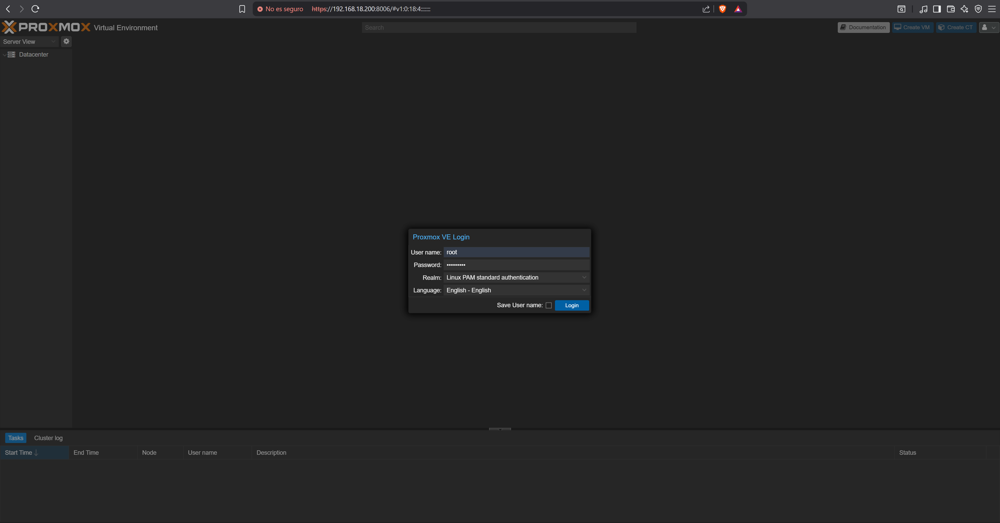
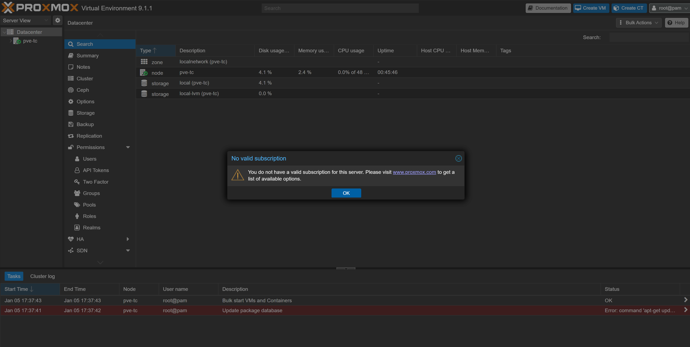
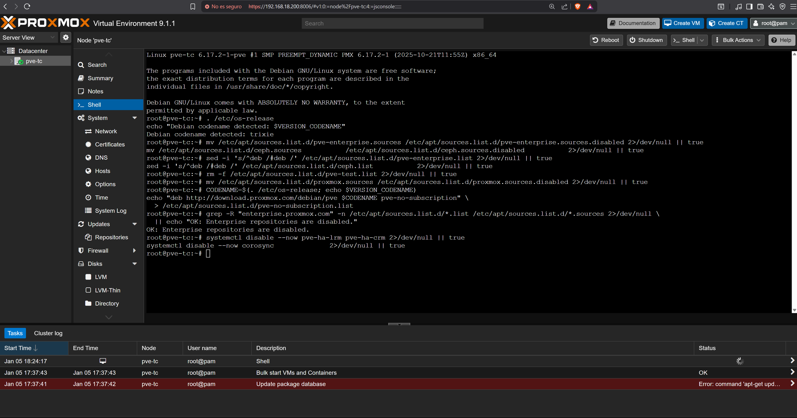
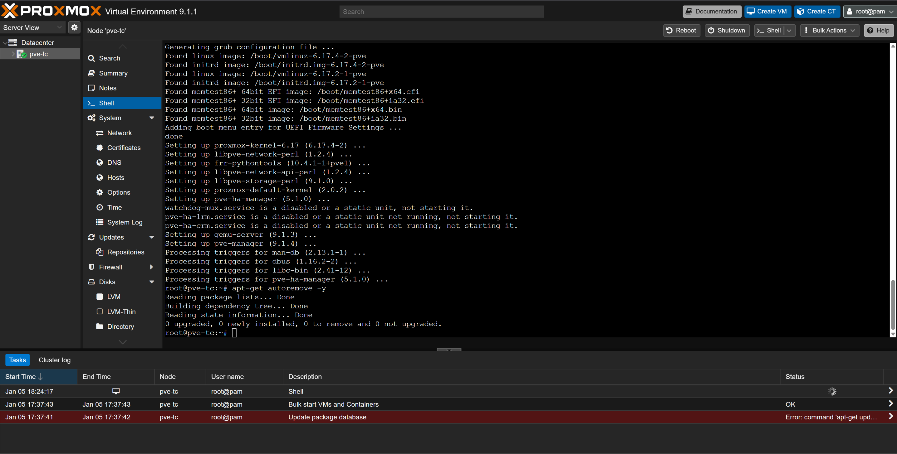
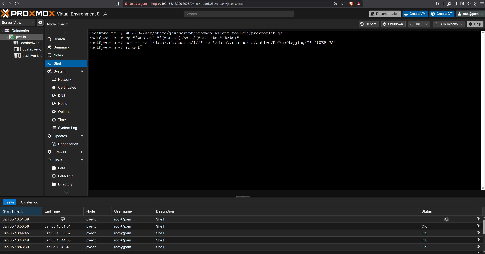
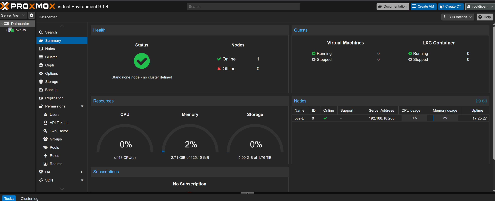

# 05 — Proxmox Post-Install Configuration

This section covers the initial configuration of the Proxmox VE server after installation. All steps are performed from the management endpoint via the Proxmox web interface and the built-in Shell. No VM provisioning occurs in this section.

---

## Prerequisites

- [ ] Completed [04 — Proxmox VE Installation](../04-proxmox-installation/README.md)
- [ ] Management endpoint with browser access to `https://192.168.18.200:8006`

---

## Step 1 — Login to Proxmox Web Interface

1. From the management endpoint open a browser and navigate to `https://192.168.18.200:8006`
2. Accept the self-signed certificate warning
3. Login with username **root** and the password set during installation

   
   <br><sub>Figure 1. Proxmox VE web interface login. Use root credentials configured during installation.</sub>
   <br><br>

---

## Step 2 — Dismiss No Subscription Dialog

1. After login a **No valid subscription** dialog will appear — click **OK** to dismiss

   
   <br><sub>Figure 2. No valid subscription dialog. Click OK to dismiss — this does not affect functionality. The dialog will be removed permanently in Step 5.</sub>
   <br><br>

---

## Step 3 — Open Shell and Run Baseline Script (Steps 1–7)

This script performs the following actions:

- Disables the Enterprise APT repositories that require a paid subscription and cause `apt update` errors
- Enables the free `pve-no-subscription` repository
- Disables HA and Corosync daemons not required for single-node deployments

1. In the left panel select your node — in this testbed: **pve-tc**
2. Click **Shell** to open the Proxmox terminal
3. Copy and paste the following block into the Shell and press **Enter**

```bash
# 0) Detect Debian codename
. /etc/os-release
echo "Debian codename detected: $VERSION_CODENAME"

# 1) Disable Enterprise repos (Deb822 *.sources)
mv /etc/apt/sources.list.d/pve-enterprise.sources \
   /etc/apt/sources.list.d/pve-enterprise.sources.disabled 2>/dev/null || true
mv /etc/apt/sources.list.d/ceph.sources \
   /etc/apt/sources.list.d/ceph.sources.disabled 2>/dev/null || true

# 2) Disable Enterprise repos (legacy *.list), if present
sed -i 's/^deb /#deb /' /etc/apt/sources.list.d/pve-enterprise.list 2>/dev/null || true
sed -i 's/^deb /#deb /' /etc/apt/sources.list.d/ceph.list 2>/dev/null || true

# 3) Remove pve-test repo (unstable), if present
rm -f /etc/apt/sources.list.d/pve-test.list 2>/dev/null || true

# 4) Disable proxmox.sources to prevent duplicate APT targets, if present
mv /etc/apt/sources.list.d/proxmox.sources \
   /etc/apt/sources.list.d/proxmox.sources.disabled 2>/dev/null || true

# 5) Enable Proxmox no-subscription repo
CODENAME=$(. /etc/os-release; echo $VERSION_CODENAME)
echo "deb http://download.proxmox.com/debian/pve $CODENAME pve-no-subscription" \
  > /etc/apt/sources.list.d/pve-no-subscription.list

# 6) Verify Enterprise repos are not active
grep -R "enterprise.proxmox.com" -n \
  /etc/apt/sources.list.d/*.list \
  /etc/apt/sources.list.d/*.sources 2>/dev/null \
  || echo "OK: Enterprise repositories are disabled."

# 7) Disable HA/Corosync (single-node — skip if clustering soon)
systemctl disable --now pve-ha-lrm pve-ha-crm 2>/dev/null || true
systemctl disable --now corosync 2>/dev/null || true
```

   
   <br><sub>Figure 3. Proxmox shell showing steps 1 to 7 of the baseline script executed successfully.</sub>
   <br><br>

---

## Step 4 — Update, Upgrade and Reboot

1. Run the following commands to update the package list, apply all upgrades, and reboot

```bash
# 8) Update, upgrade and reboot
apt-get update
apt-get full-upgrade -y
apt-get autoremove -y
reboot
```

2. When prompted during `full-upgrade` confirm any Yes/No prompts with the default values
3. The server will reboot automatically when complete

   
   <br><sub>Figure 4. apt update, full-upgrade and reboot running in the Proxmox shell. Wait for the server to reboot before proceeding.</sub>
   <br><br>

---

## Step 5 — Remove No Subscription Popup

After the server reboots login again and open the Shell. Run the following command to permanently remove the no-subscription dialog from the web interface:

```bash
# 9) Remove "No valid subscription" popup
WEB_JS=/usr/share/javascript/proxmox-widget-toolkit/proxmoxlib.js
cp "$WEB_JS" "${WEB_JS}.bak.$(date +%F-%H%M%S)"
sed -i \
  -e '/data\.status/ s/!//' \
  -e '/data\.status/ s/active/NoMoreNagging/I' \
  "$WEB_JS"
reboot
```

   
   <br><sub>Figure 5. Popup removal command executed in the Proxmox shell. A backup of the original file is created automatically before modification.</sub>
   <br><br>

> **Note:** This modification patches the Proxmox web UI JavaScript file. The patch may be reverted by a Proxmox package upgrade — re-run this step after any `pve-manager` update if the popup returns.

---

## Step 6 — Verify Post-Install State

After the second reboot login to the web interface and verify the following:

1. No subscription dialog does **not** appear on login
2. The node shows as **online** in the left panel
3. The Summary page shows the node operating as standalone with no cluster defined

   
   <br><sub>Figure 6. Proxmox VE dashboard after post-install configuration. Node online, standalone mode, no subscription dialog.</sub>
   <br><br>

---

## References

- \[1\] Proxmox Server Solutions, "Package Repositories."
      https://pve.proxmox.com/wiki/Package_Repositories [Accessed: April 2026]
- \[2\] Proxmox Server Solutions, "High Availability Manager."
      https://pve.proxmox.com/wiki/High_Availability [Accessed: April 2026]

---

✅ You are here: `chapter-01-virtualization-setup / 05-proxmox-post-install`

⏭️ Next: [06 — Storage Setup →](../06-storage-setup/README.md)
