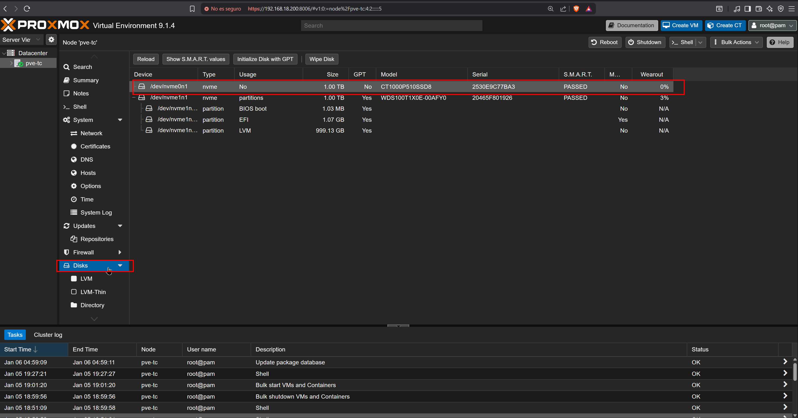
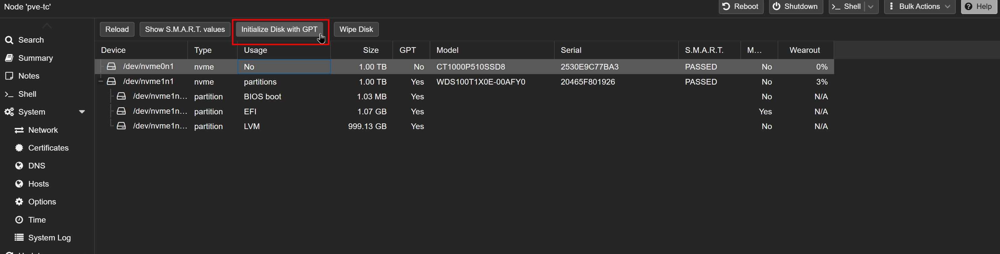
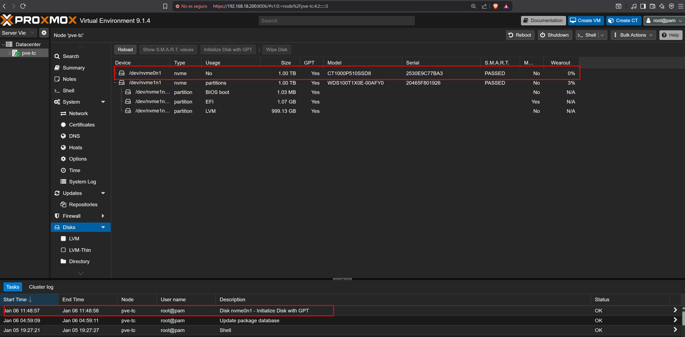
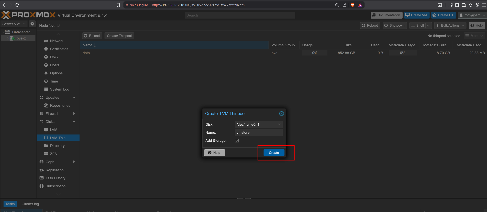
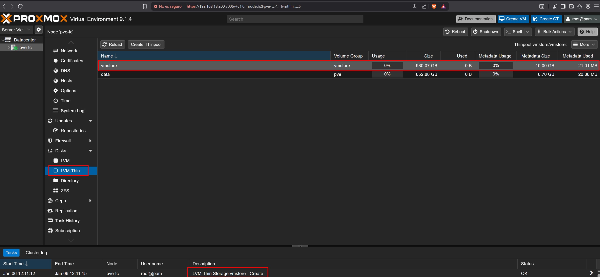
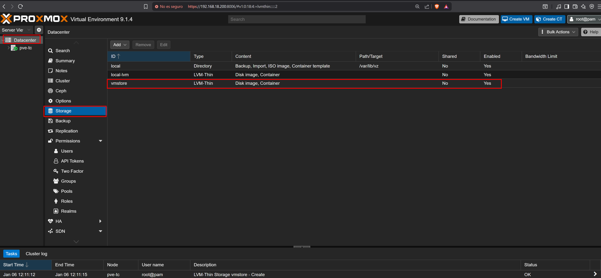
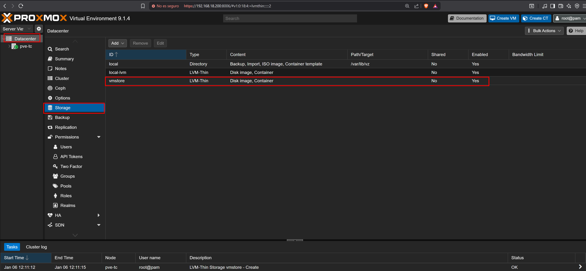

# 06 — Storage Setup

This section provisions the dedicated NVMe disk as the VM storage backend. A GPT partition table, LVM Volume Group, and LVM-Thin Pool are configured on the Crucial P510 disk to provide the storage infrastructure required for VM disk allocation in Chapter 2.

### Proxmox VE Storage Overview

Proxmox VE organizes storage in layers. The diagram below shows the general architecture where a single physical disk can be partitioned into multiple LVM Physical Volumes, each belonging to a separate Volume Group with its own storage pools and volumes.

```
Physical Disk (NVMe) — /dev/nvme0n1
└── GPT Partition Table
    ├── /dev/nvme0n1p1
    │   └── LVM Physical Volume
    │       └── Volume Group: vg-vms
    │           ├── LVM-Thin Pool: pool-vms
    │           │   ├── VM-1 · disk-0  (thin volume)
    │           │   ├── VM-2 · disk-0  (thin volume)
    │           │   └── VM-3 · disk-0  (thin volume)
    │           └── LVM-Thin Pool: pool-backups
    │               ├── VM-1 · disk-1  (thin volume)
    │               └── VM-2 · disk-1  (thin volume)
    │
    └── /dev/nvme0n1p2
        └── LVM Physical Volume
            └── Volume Group: vg-isos
                └── Logical Volume: lv-isos  (thick volume)
                    └── ext4 → /var/lib/vz/
```

> **Thin provisioning:** disk space is reserved at VM creation but consumed physically only as data is written. A VM with a 280 GB disk using only 30 GB occupies 30 GB physically.

In this testbed the Crucial P510 disk is used as a single Physical Volume without intermediate partitions. Proxmox registers the full disk directly into the `vmstore` Volume Group, which is created automatically with the same name as the Thin Pool.

### This Testbed Storage Plan

```
Physical Disk (NVMe) — /dev/nvme0n1 — Crucial P510
└── GPT Partition Table
    └── LVM Physical Volume (full disk)
        └── Volume Group: vmstore
            └── LVM-Thin Pool: vmstore
                ├── vm-201-disk-0  (thin volume)
                ├── vm-202-disk-0  (thin volume)
                ├── vm-203-disk-0  (thin volume)
                └── vm-204-disk-0  (thin volume)
```

---

## Prerequisites

- [ ] Completed [05 — Proxmox Post-Install Configuration](../05-proxmox-post-install/README.md)
- [ ] Management endpoint with browser access to `https://192.168.18.200:8006`

---

## Step 1 — Initialize VM Storage Disk (GPT)

The Crucial P510 NVMe disk (`/dev/nvme0n1`) is dedicated exclusively to VM disk storage. It must be initialized with a GPT partition table before creating the LVM-Thin pool.

1. Navigate to **Node** → **Disks**
2. Select `/dev/nvme0n1` — the Crucial P510 (CT1000)

   
   <br><sub>Figure 1. Disk list showing the Crucial P510 NVMe (/dev/nvme0n1). Confirm S.M.A.R.T. status shows PASSED before proceeding.</sub>
   <br><br>

3. Click **Initialize Disk with GPT**

   
   <br><sub>Figure 2. Initialize Disk with GPT. Required before LVM can use the disk.</sub>
   <br><br>

4. Confirm the disk now shows **GPT** in the partition table column

   
   <br><sub>Figure 3. Disk initialized with GPT. The partition table column now shows GPT confirming the operation completed successfully.</sub>
   <br><br>

---

## Step 2 — Create LVM-Thin Pool

1. Navigate to **Node** → **Disks** → **LVM-Thin**
2. Click **Create: Thinpool**
3. Configure with the following values

| Field | Value |
|---|---|
| Disk | /dev/nvme0n1 |
| Name | vmstore |
| Add Storage | Enabled |

4. Click **Create**

   
   <br><sub>Figure 4. LVM-Thin pool creation dialog. Disk set to /dev/nvme0n1, name vmstore, Add Storage enabled.</sub>
   <br><br>

5. Confirm the pool appears in the list

   
   <br><sub>Figure 5. vmstore LVM-Thin pool created successfully. Usage shows 0% with full capacity available.</sub>
   <br><br>

---

## Step 3 — Verify Volume Group

1. Navigate to **Node** → **Disks** → **LVM**
2. Confirm the Volume Group `vmstore` is listed and bound to `/dev/nvme0n1`

   
   <br><sub>Figure 6. LVM view showing the vmstore Volume Group bound to /dev/nvme0n1.</sub>
   <br><br>

---

## Step 4 — Verify Storage Registration

1. Navigate to **Datacenter** → **Storage**
2. Confirm `vmstore` is listed with status **Enabled**

   
   <br><sub>Figure 7. Datacenter storage view. vmstore registered as LVM-Thin, enabled and available for VM disk provisioning.</sub>
   <br><br>

The storage backend is now ready. VM disk allocation happens during VM creation in Chapter 2.

---

## References

- \[1\] Proxmox Server Solutions, "Storage."
      https://pve.proxmox.com/wiki/Storage [Accessed: April 2026]
- \[2\] Proxmox Server Solutions, "LVM Thin."
      https://pve.proxmox.com/wiki/Storage:_LVM_Thin [Accessed: April 2026]

---

✅ You are here: `chapter-01-virtualization-setup / 06-storage-setup`

⏭️ Next: [07 — ISO Upload →](../07-iso-upload/README.md)
