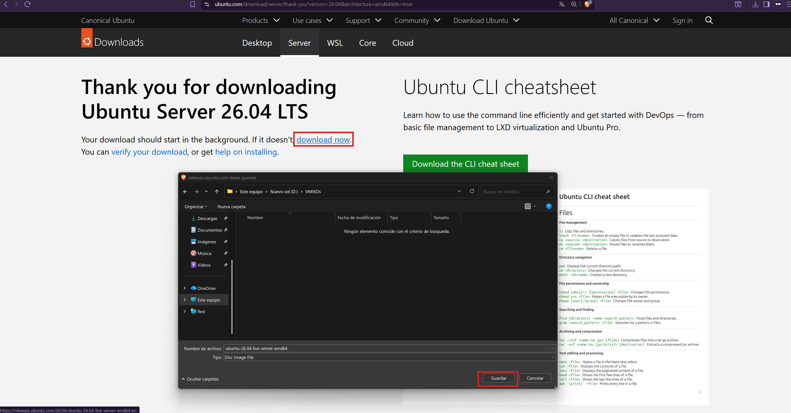
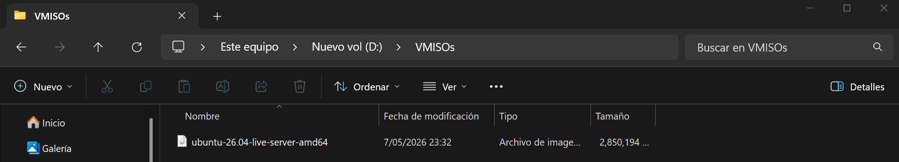
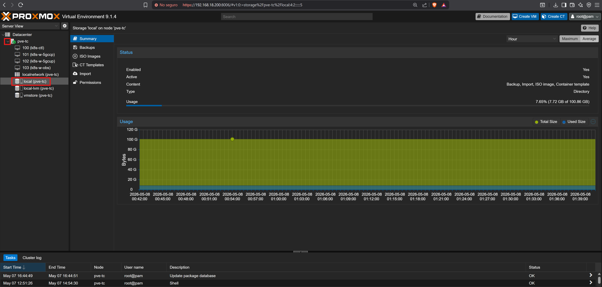
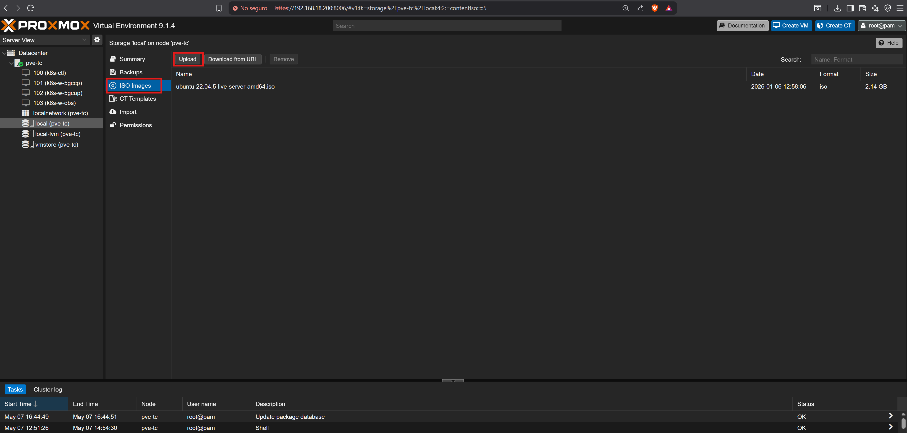
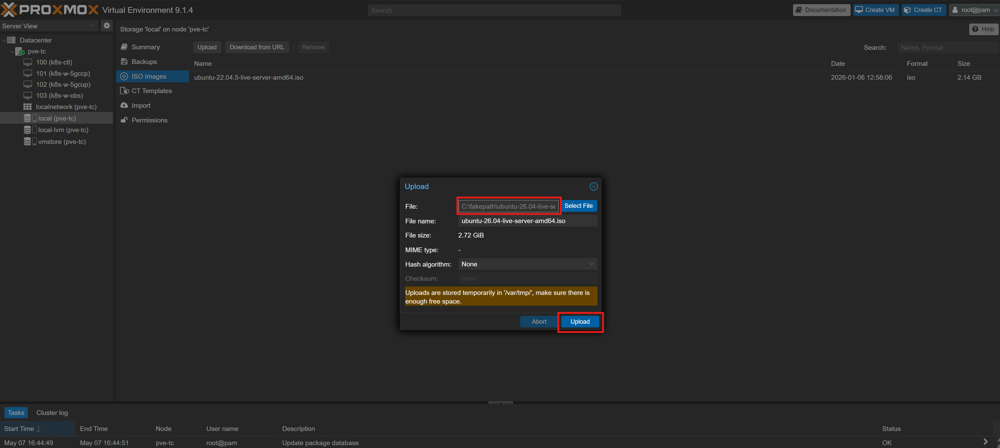
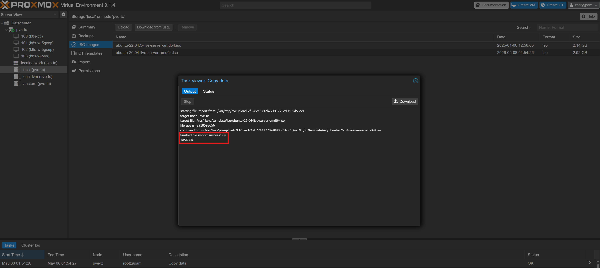
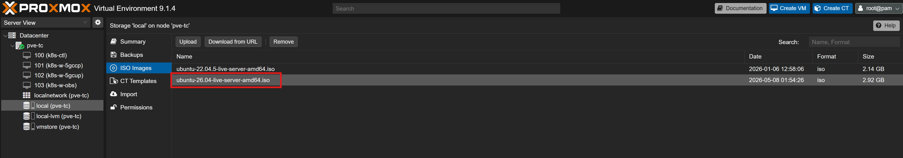

# 07 — ISO Upload

This section covers downloading the Ubuntu Server 26.04 LTS ISO and uploading it to Proxmox VE local storage. The ISO is used as the installation media for all four virtual machines provisioned in Chapter 2.

---

## Prerequisites

- [ ] Completed [06 — Storage Setup](../06-storage-setup/README.md)
- [ ] Management endpoint with browser access to `https://192.168.18.200:8006`
- [ ] Internet access from the management endpoint

---

## Step 1 — Download Ubuntu Server ISO

1. Open a browser on the management endpoint and navigate to the Ubuntu Server 26.04 LTS download page

   ```
   https://ubuntu.com/download/server/thank-you?version=26.04&architecture=amd64&lts=true
   ```

2. Click **Download now** to start the download

   > **Note:** The download does not start automatically. Click the **Download now** link to begin.

   
   <br><sub>Figure 1. Ubuntu Server 26.04 LTS download page. Click the Download now link to begin the ISO download.</sub>
   <br><br>

3. Wait for the download to complete. The resulting file is `ubuntu-26.04-live-server-amd64.iso`

   
   <br><sub>Figure 2. ubuntu-26.04-live-server-amd64.iso downloaded successfully.</sub>
   <br><br>

---

## Step 2 — Upload ISO to Proxmox

1. Log in to the Proxmox web interface at `https://192.168.18.200:8006`
2. Navigate to **local** storage on the left panel

   > **Important:** Select **local** — not **local-lvm** or **vmstore**. Only the `local` storage type accepts ISO images.

   
   <br><sub>Figure 3. Left panel showing local storage selected. Do not select local-lvm or vmstore.</sub>
   <br><br>

3. Click **ISO Images** → **Upload**

   
   <br><sub>Figure 4. ISO Images section under local storage. Click Upload to open the file picker.</sub>
   <br><br>

4. Click **Select File** and choose `ubuntu-26.04-live-server-amd64.iso`
5. Click **Upload**

   
   <br><sub>Figure 5. ISO upload in progress. Proxmox transfers the file to a temporary directory before moving it to local storage.</sub>
   <br><br>

6. Wait for the task to complete. The upload log confirms the ISO is ready when the task shows no errors.

   
   <br><sub>Figure 6. Upload completed. The ISO is now available at /var/lib/vz/template/iso/ and ready for VM installation.</sub>
   <br><br>

---

## Step 3 — Verify ISO Availability

1. Confirm the ISO appears in the **ISO Images** list under **local** storage

   
   <br><sub>Figure 7. ubuntu-26.04-live-server-amd64.iso listed and available for VM creation.</sub>
   <br><br>

---

## References

- \[1\] Canonical, "Ubuntu Server 26.04 LTS."
      https://ubuntu.com/download/server/thank-you?version=26.04&architecture=amd64&lts=true [Accessed: May 2026]
- \[2\] Proxmox Server Solutions, "Storage — Directory."
      https://pve.proxmox.com/wiki/Storage:_Directory [Accessed: May 2026]

---

✅ You are here: `chapter-01-virtualization-setup / 07-iso-upload`

⏭️ Next: [Chapter 2 — VM Provisioning →](../../chapter-02-vm-provisioning/README.md)
