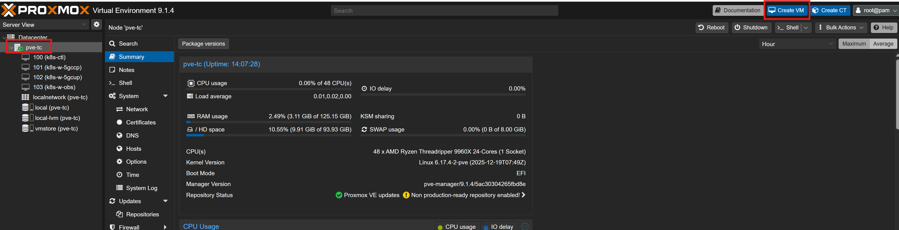
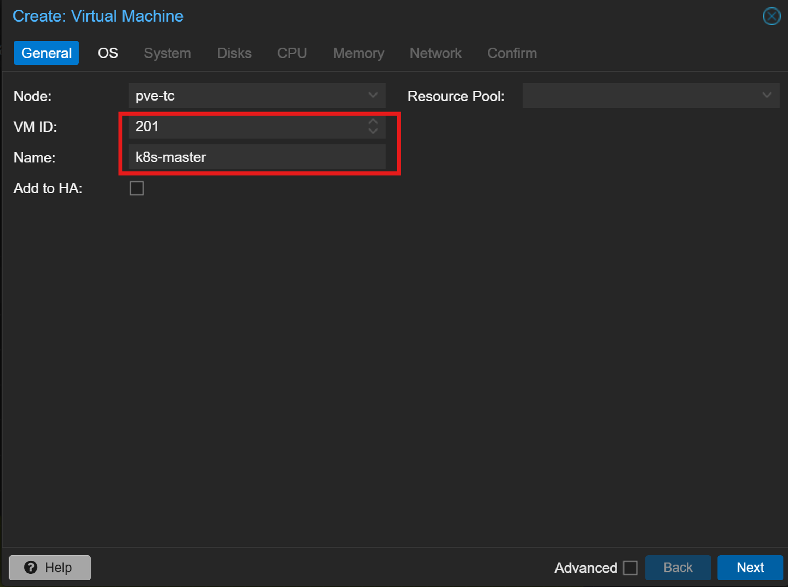
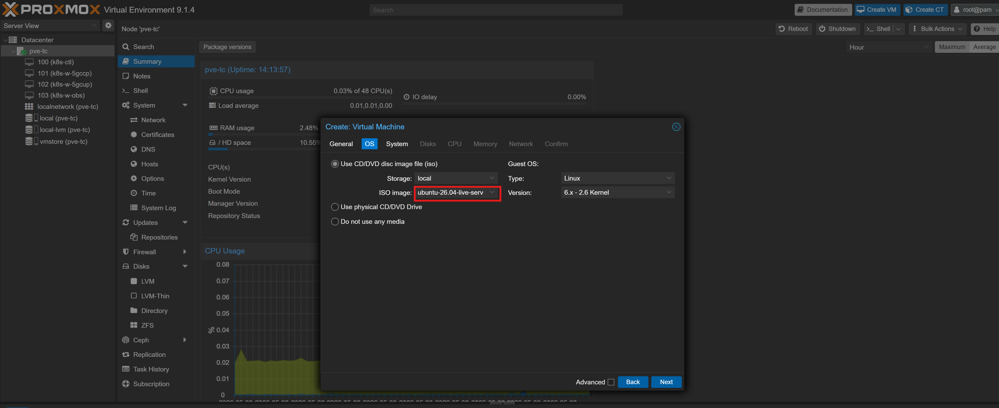
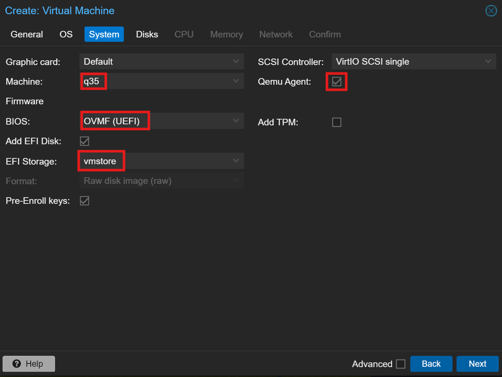
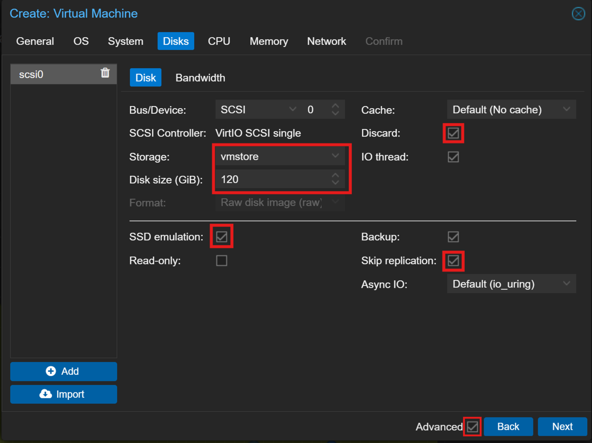
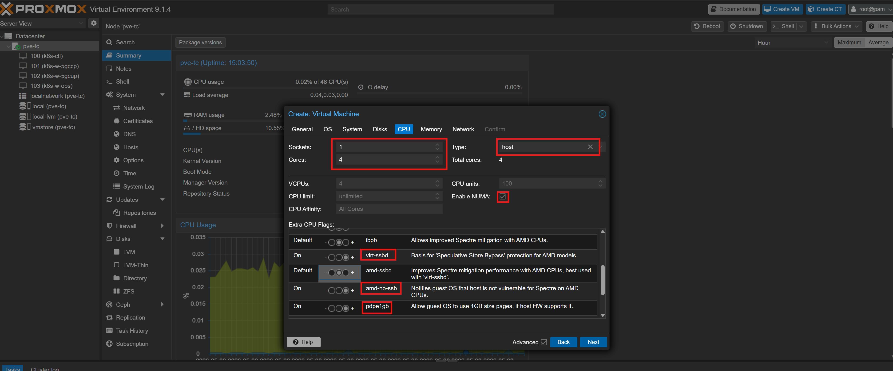
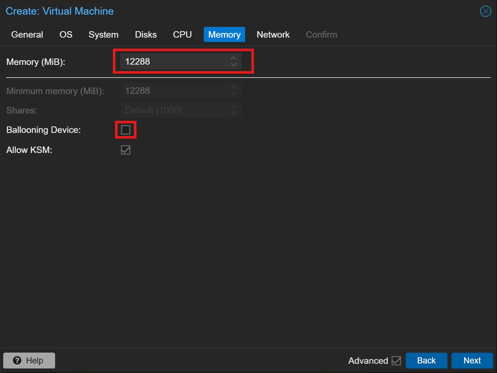
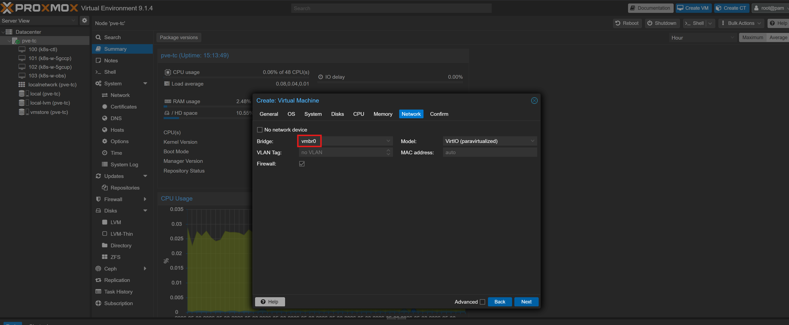
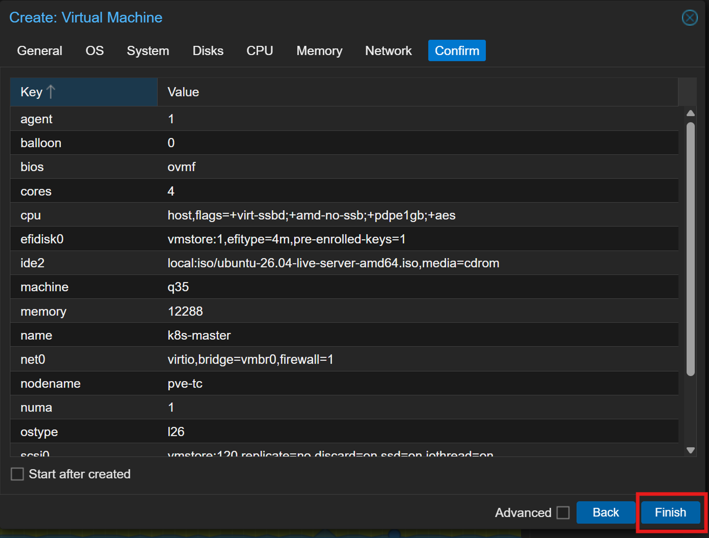
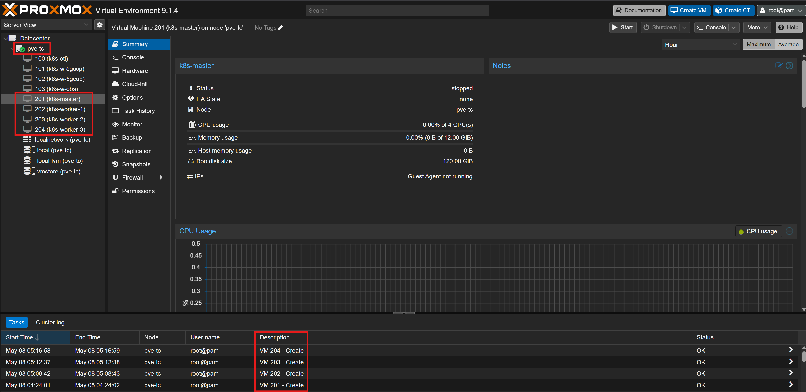

# 01 — VM Creation

This section creates the four virtual machines that form the Kubernetes cluster. All VMs are provisioned on the Proxmox host using the `vmstore` LVM-Thin pool created in [Chapter 1 — Storage Setup](../../chapter-01-virtualization-setup/06-storage-setup/README.md) and the Ubuntu Server ISO uploaded in [Chapter 1 — ISO Upload](../../chapter-01-virtualization-setup/07-iso-upload/README.md).

Each VM is created with the same procedure. The table below defines the resource allocation for each node — repeat the steps in this section once per VM.

| VM ID | Hostname | Role | vCPU | RAM | Disk | Storage |
|---|---|---|---|---|---|---|
| 201 | k8s-master | Control Plane | 4 | 12 GB | 120 GB | vmstore |
| 202 | k8s-worker-1 | Worker Node | 8 | 24 GB | 280 GB | vmstore |
| 203 | k8s-worker-2 | Worker Node | 6 | 20 GB | 160 GB | vmstore |
| 204 | k8s-worker-3 | Worker Node | 8 | 24 GB | 260 GB | vmstore |

> **Note:** Do not start the VMs until all four have been created.

---

## Prerequisites

- [ ] Completed [07 — ISO Upload](../../chapter-01-virtualization-setup/07-iso-upload/README.md)
- [ ] Management endpoint with browser access to `https://192.168.18.200:8006`

---

## Step 1 — Open VM Creation Wizard

1. Log in to the Proxmox web interface at `https://192.168.18.200:8006`
2. Click **Create VM** in the top right corner

   
    Figure 1. Proxmox Node Summary. Click Create VM to open the VM creation wizard.
     

---

## Step 2 — General

1. Set **VM ID** and **Name** according to the table above

   
    Figure 2. General tab. Set VM ID and Name matching the node plan. Example shown for VM 201 k8s-master.
     

2. Click **Next**

---

## Step 3 — OS

1. Select **Use CD/DVD disc image file (iso)**
2. Set **Storage** to `local`
3. Set **ISO image** to `ubuntu-26.04-live-server-amd64.iso`
4. Set **Guest OS** to `Linux`, version `6.x - 2.6 Kernel`

   
    Figure 3. OS tab. Select the Ubuntu 26.04 ISO from local storage.
     

5. Click **Next**

---

## Step 4 — System

1. Set **Machine** to `q35`
2. Set **BIOS** to `OVMF (UEFI)`
3. Set **EFI Storage** to `vmstore`
4. Check **QEMU Guest Agent**

   
    Figure 4. System tab. q35 machine with UEFI, EFI disk on vmstore, and QEMU Guest Agent enabled.
     

5. Click **Next**

---

## Step 5 — Disks

1. Set **Storage** to `vmstore`
2. Set **Disk size** according to the table for the current VM
3. Check **Discard**

   
    Figure 5. Disks tab. Storage vmstore, size from node plan, Discard enabled.
     

4. *(Optional)* Under **Advanced** check **SSD Emulation** and **Skip Replication**

   > **Note:** Enable SSD Emulation only if the underlying storage is NVMe or SSD.

5. Click **Next**

---

## Step 6 — CPU

1. Set **Sockets** to `1` *(adjust if your host has multiple physical CPUs)*
2. Set **Cores** according to the table for the current VM — total cores = 1 socket × N cores
3. Set **Type** to `host`

   
    Figure 6. CPU tab. Type host exposes the full physical CPU feature set to the VM.
     

4. *(Optional)* Under **Advanced** enable **NUMA** and set additional flags for your hardware — in this testbed: `virt-ssbd` on, `amd-no-ssb` on, `pdpe1gb` on, `aes` on

   > **Note:** These flags are AMD Threadripper-specific. On other hardware sockets, cores, and type host are sufficient.

5. Click **Next**

---

## Step 7 — Memory

1. Set **Memory** according to the table for the current VM
2. Under **Advanced** uncheck **Ballooning Device**

   
    Figure 7. Memory tab. Ballooning disabled for fixed and predictable memory allocation.
     

3. Click **Next**

---

## Step 8 — Network

1. Confirm **Bridge** is set to `vmbr0`

   
    Figure 8. Network tab. vmbr0 bridge with VirtIO model.
     

2. Click **Next**

---

## Step 9 — Confirm and Create

1. Review the summary — verify VM ID, name, cores, memory, disk size, and storage match the node plan
2. Uncheck **Start after created**
3. Click **Finish**

   
    Figure 9. Confirmation summary. Verify all parameters before clicking Finish.
     

---

## Step 10 — Repeat for Remaining VMs

Repeat Steps 1 through 9 for each remaining VM using the values from the node plan table. After completing all four VMs the Proxmox dashboard should show VMs 201 through 204 in stopped state.

 Figure 10. All four VMs created and listed in stopped state.
  

---

## References

- \[1\] Proxmox Server Solutions, "Qemu/KVM Virtual Machines."
      https://pve.proxmox.com/wiki/Qemu/KVM_Virtual_Machines [Accessed: May 2026]

---

✅ You are here: `chapter-02-vm-provisioning / 01-vm-creation`

⏭️ Next: [02 — Ubuntu Installation →](../02-ubuntu-installation/README.md)
