# 02 — Ubuntu Installation

This section installs Ubuntu Server 26.04 LTS on each of the four virtual machines created in the previous section. The process is identical for all nodes — repeat every step for VMs 201, 202, 203, and 204 using the corresponding hostname and IP address from the table below.

| VM ID | Hostname | IP | Username |
|---|---|---|---|
| 201 | k8s-master | 192.168.18.210 | operator1 |
| 202 | k8s-worker-1 | 192.168.18.211 | operator1 |
| 203 | k8s-worker-2 | 192.168.18.212 | operator1 |
| 204 | k8s-worker-3 | 192.168.18.213 | operator1 |

---

## Prerequisites

- [ ] Completed [01 — VM Creation](../01-vm-creation/README.md)
- [ ] Management endpoint with browser access to `https://192.168.18.200:8006`

---

## Step 1 — Start VM and Open Console

1. Log in to the Proxmox web interface at `https://192.168.18.200:8006`
2. Select the VM from the left panel
3. Click **Console** then click **Start** in the toolbar

   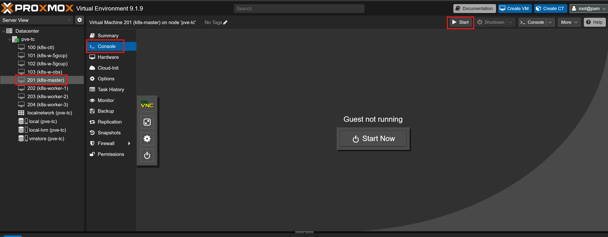
   <br><sub>Figure 1. Proxmox VM console. Click Start to boot the VM from the ISO.</sub>
   <br><br>

---

## Step 2 — Boot Ubuntu Installer

1. The VM boots into the GNU GRUB bootloader
2. Select **Try or Install Ubuntu Server** and press **Enter**

   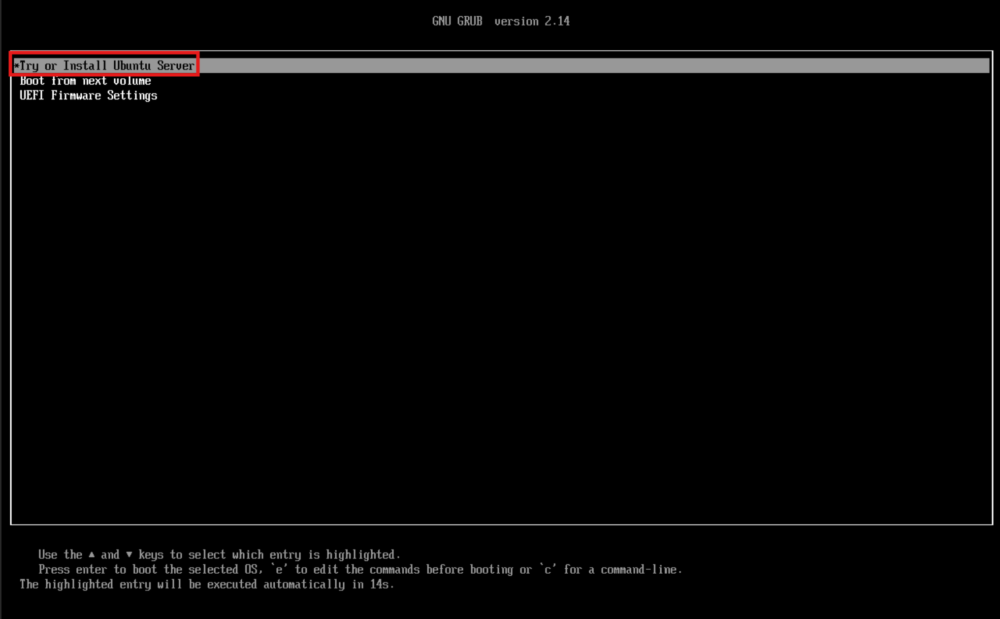
   <br><sub>Figure 2. GNU GRUB boot menu. Select Try or Install Ubuntu Server and press Enter.</sub>
   <br><br>

---

## Step 3 — Language and Keyboard

1. Select your language and press **Enter**

   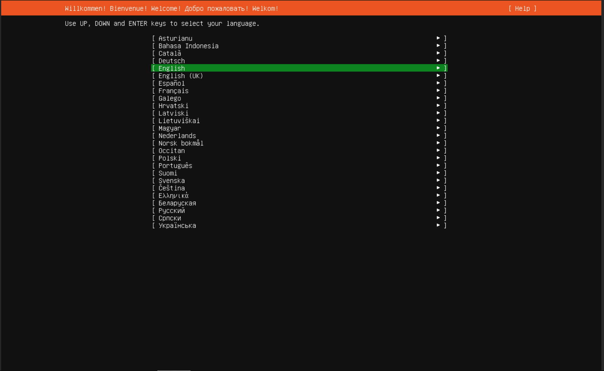
   <br><sub>Figure 3. Language selection. Select your preferred language and press Enter.</sub>
   <br><br>

2. Select your keyboard layout and press **Enter** on **Done**

   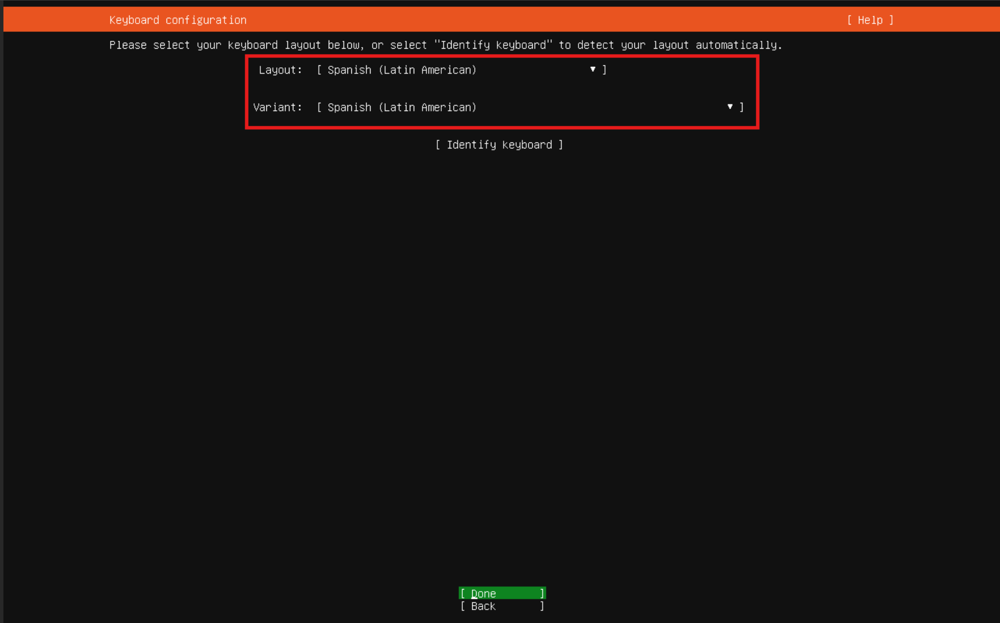
   <br><sub>Figure 4. Keyboard configuration. Select your layout and press Done.</sub>
   <br><br>

---

## Step 4 — Type of Installation

1. Select **Ubuntu Server** and press **Enter** on **Done**

   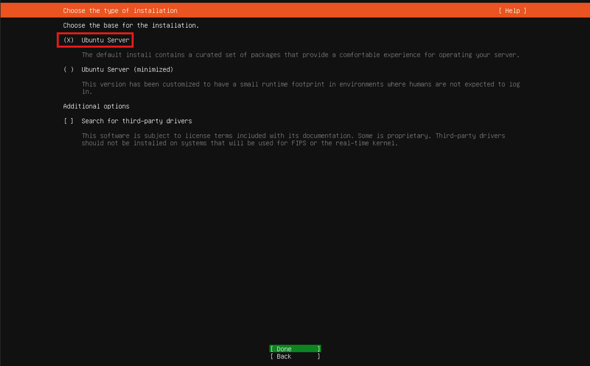
   <br><sub>Figure 5. Installation type. Select Ubuntu Server and press Done.</sub>
   <br><br>

---

## Step 5 — Network Configuration

> **Important:** All nodes must have a static IP. A dynamic address will change on reboot and break cluster communication.

1. Select the network interface (`enp6s18` or the interface available on your system) and press **Enter**
2. Select **Edit IPv4** from the dropdown

   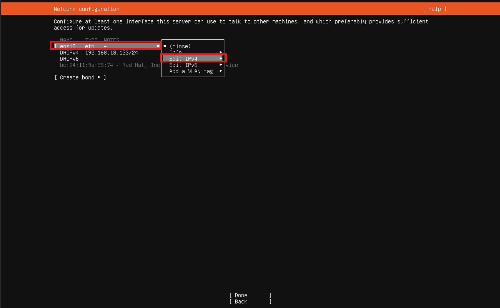
   <br><sub>Figure 6. Network configuration. Select the available interface and choose Edit IPv4.</sub>
   <br><br>

3. Set **IPv4 Method** to **Manual** and press **Enter**

   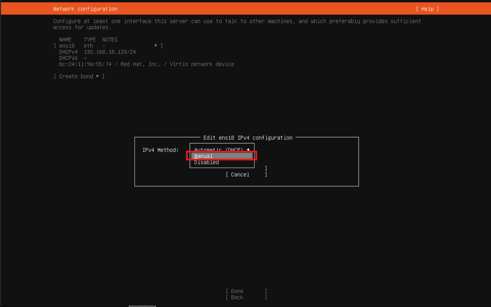
   <br><sub>Figure 7. IPv4 method set to Manual.</sub>
   <br><br>

4. Fill in the network values for the current VM and press **Enter** on **Save**

   | Field | Value |
   |---|---|
   | Subnet | 192.168.18.0/24 |
   | Address | 192.168.18.210 *(adjust per VM)* |
   | Gateway | 192.168.18.1 |
   | Name servers | 1.1.1.1, 8.8.8.8, 192.168.18.1 |
   | Search domains | lab |

   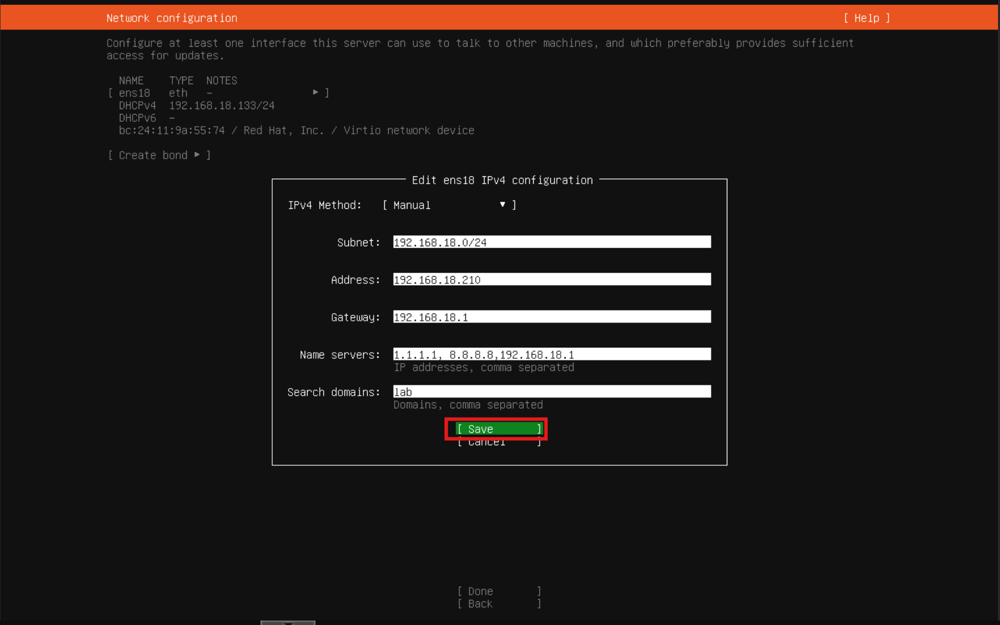
   <br><sub>Figure 8. IPv4 static configuration. Enter the values from the node plan and press Save.</sub>
   <br><br>

5. Select **DHCPv6** and set **IPv6 Method** to **Disabled**, press **Enter** on **Save**

   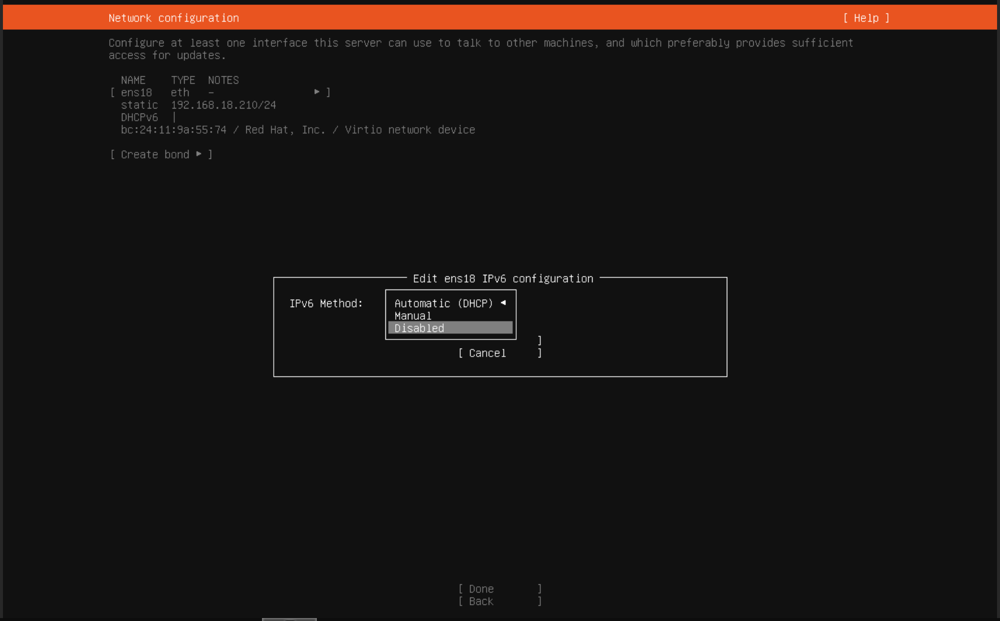
   <br><sub>Figure 9. IPv6 disabled. Not required for this testbed.</sub>
   <br><br>

6. Confirm the network summary shows the static IP and press **Enter** on **Done**

   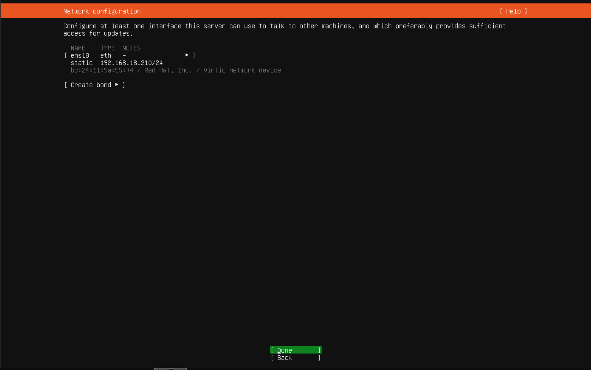
   <br><sub>Figure 10. Network configuration summary showing the static IP assigned. Press Done to continue.</sub>
   <br><br>

---

## Step 6 — Proxy Configuration

1. Leave the proxy address empty and press **Enter** on **Done**

   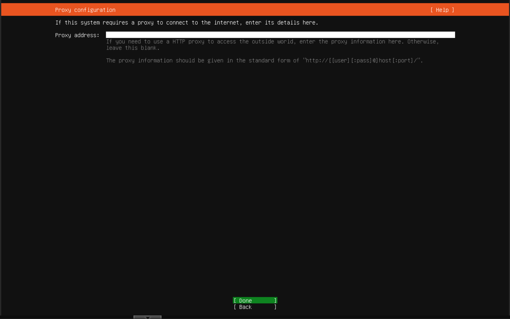
   <br><sub>Figure 11. Proxy configuration. Leave empty and press Done.</sub>
   <br><br>

---

## Step 7 — Ubuntu Archive Mirror

1. Wait for the mirror test to complete and press **Enter** on **Done**

   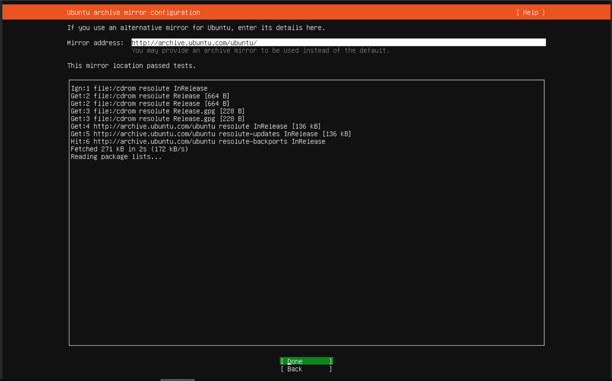
   <br><sub>Figure 12. Archive mirror configuration. Wait for the mirror test to complete then press Done.</sub>
   <br><br>

---

## Step 8 — Storage Configuration

1. Leave **Use an entire disk** selected and press **Enter** on **Done**

   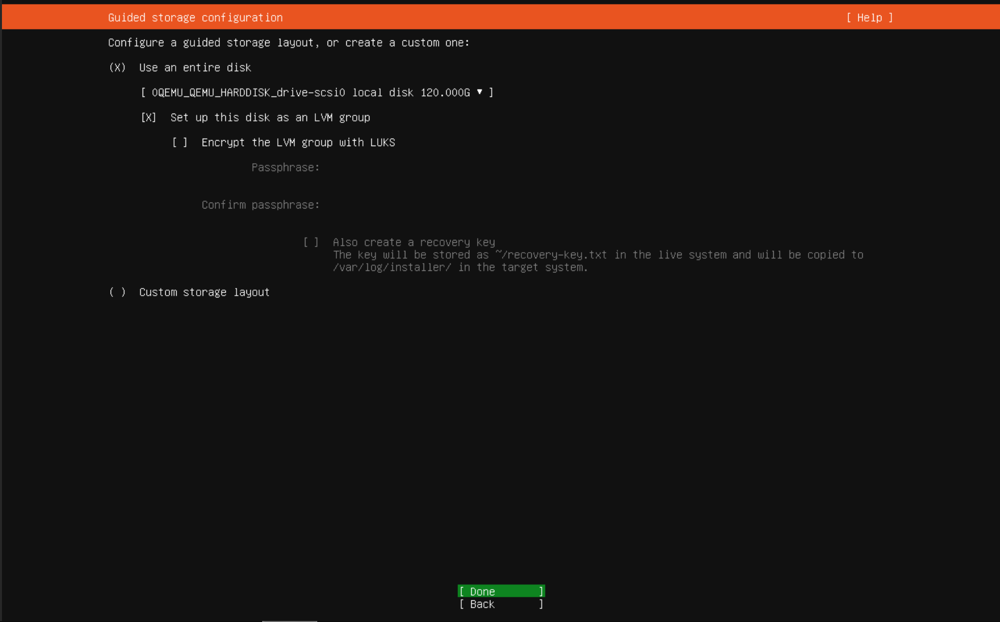
   <br><sub>Figure 13. Guided storage configuration. Leave default selection and press Done.</sub>
   <br><br>

2. Review the filesystem summary and press **Enter** on **Done**

   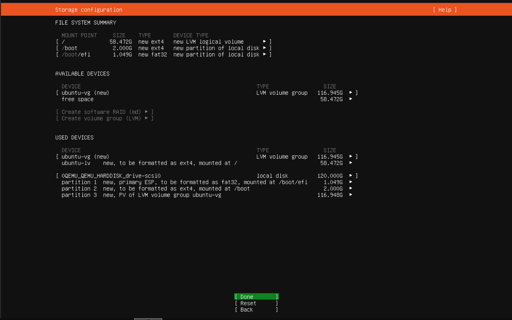
   <br><sub>Figure 14. Storage filesystem summary. Review and press Done.</sub>
   <br><br>

3. Press **Enter** on **Continue** to confirm the destructive action

   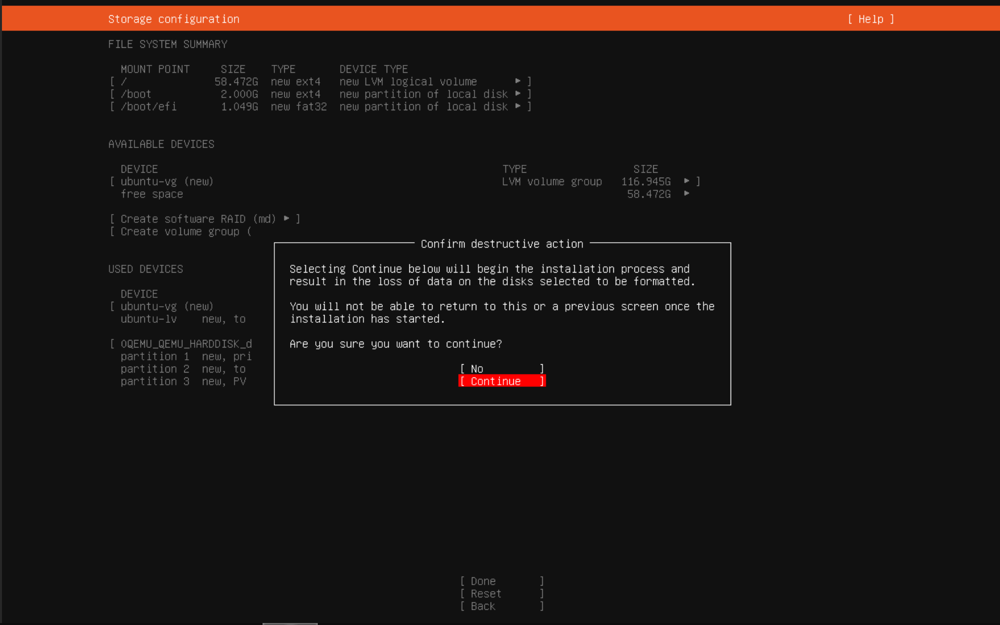
   <br><sub>Figure 15. Destructive action confirmation. Press Continue to proceed with disk formatting.</sub>
   <br><br>

---

## Step 9 — Profile Configuration

1. Fill in the profile fields for the current VM and press **Enter** on **Done**

   | Field | Value |
   |---|---|
   | Your name | *(your chosen name)* |
   | Server name | k8s-master *(adjust per VM)* |
   | Username | unmsm |
   | Password | *(your chosen password)* |

   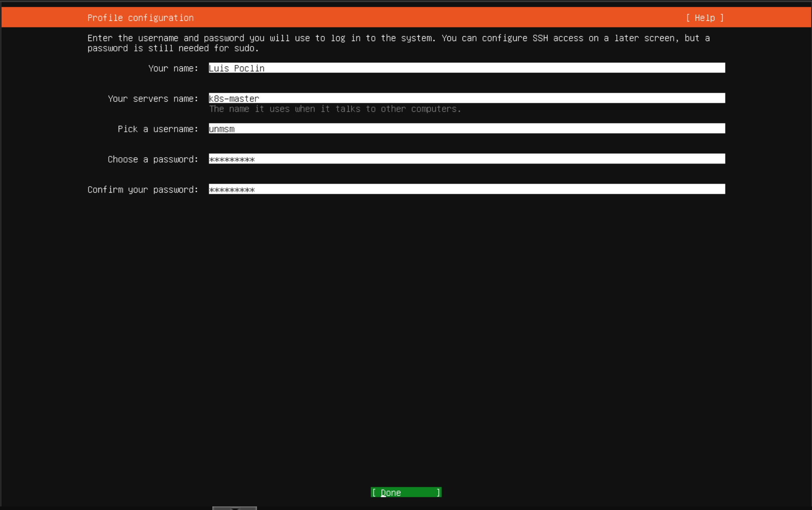
   <br><sub>Figure 16. Profile configuration. Set name, hostname, username and password according to the node plan.</sub>
   <br><br>

---

## Step 10 — Ubuntu Pro

1. Select **Skip for now** and press **Enter** on **Continue**

   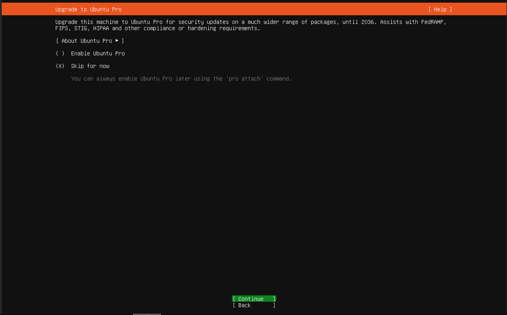
   <br><sub>Figure 17. Ubuntu Pro. Select Skip for now and press Continue.</sub>
   <br><br>

---

## Step 11 — SSH Configuration

1. Check **Install OpenSSH server** and press **Enter** on **Done**

   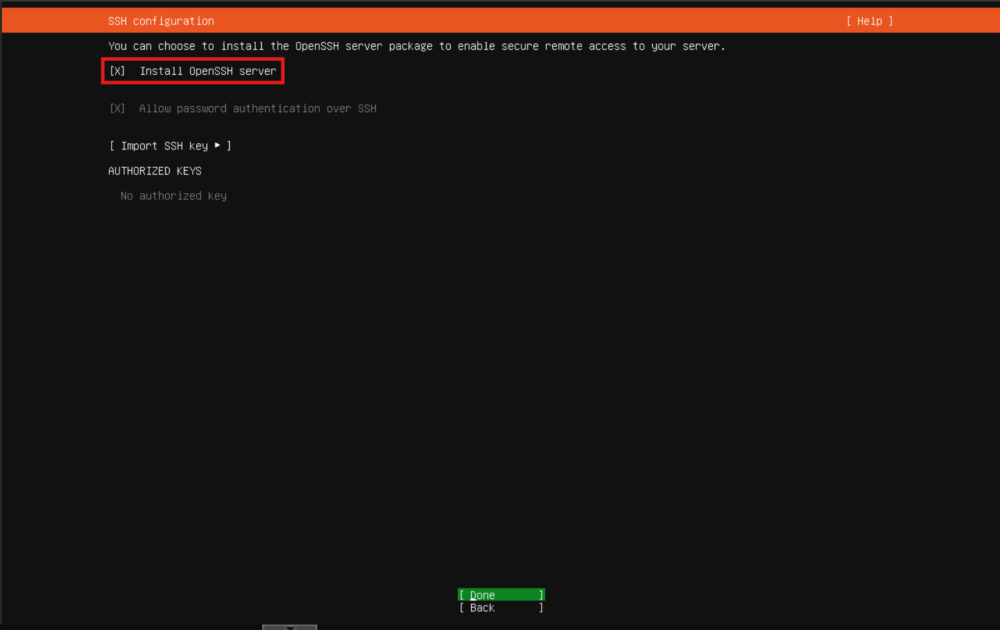
   <br><sub>Figure 18. SSH configuration. Enable OpenSSH server to allow remote access after installation.</sub>
   <br><br>

---

## Step 12 — Featured Server Snaps

1. Leave all snaps unselected and press **Enter** on **Done**

   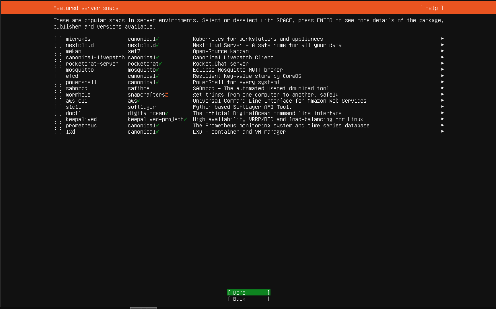
   <br><sub>Figure 19. Featured server snaps. Leave all unselected and press Done.</sub>
   <br><br>

---

## Step 13 — Installation and Reboot

1. Wait for the installation to complete. When **Installation complete!** appears select **Reboot Now** and press **Enter**

   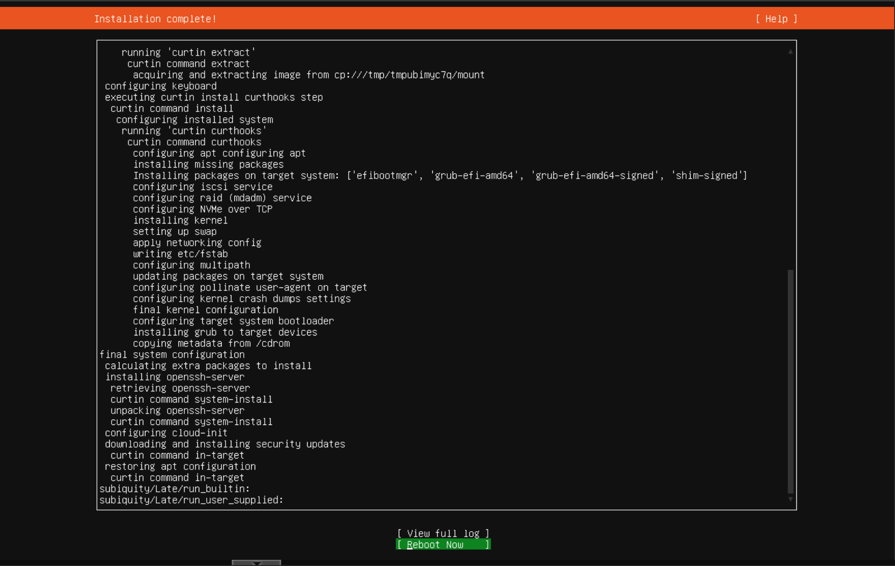
   <br><sub>Figure 20. Installation complete. Select Reboot Now and press Enter.</sub>
   <br><br>

---

## Step 14 — Remove Installation ISO

After selecting Reboot Now the VM will pause waiting for the boot media to be removed. While the VM is at that screen:

1. In the Proxmox web interface select the VM and navigate to **Hardware**
2. Select the **CD/DVD Drive** entry showing the Ubuntu ISO and click **Remove**

   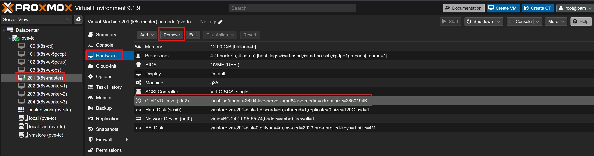
   <br><sub>Figure 21. Hardware tab. Select the CD/DVD Drive entry and click Remove to detach the ISO.</sub>
   <br><br>

3. Confirm the CD/DVD Drive now shows as empty

   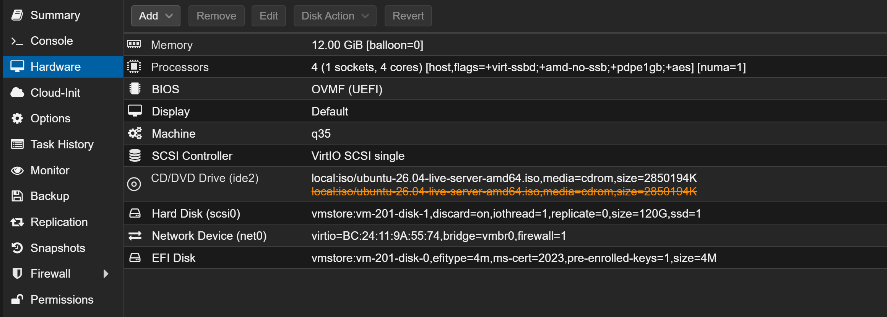
   <br><sub>Figure 22. CD/DVD Drive detached. The entry now shows no media attached.</sub>
   <br><br>

4. Return to the VM console and press **Enter** to complete the reboot

---

## Step 15 — Verify Installation

1. Return to the VM console in the Proxmox web interface and log in with the credentials configured in Step 9

   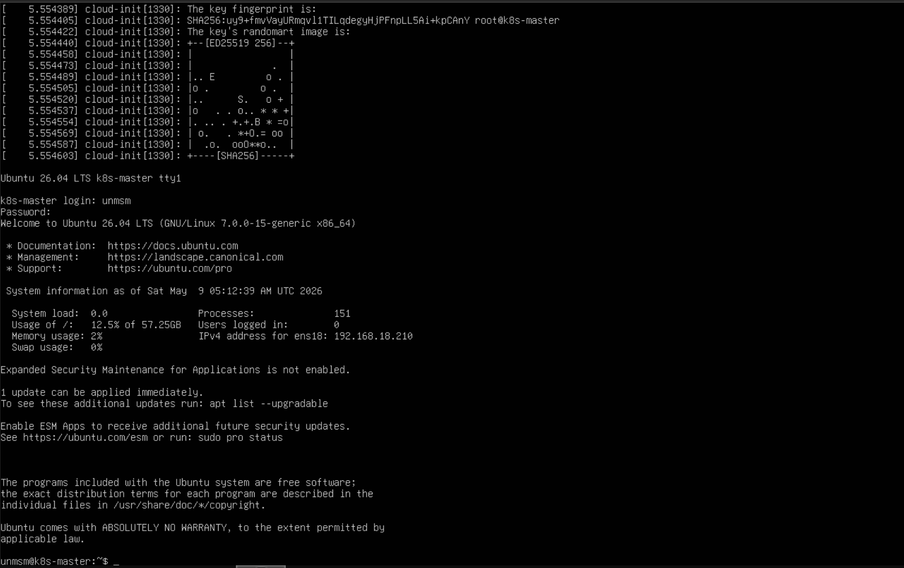
   <br><sub>Figure 23. Ubuntu Server login prompt after reboot. Log in with the credentials set during installation.</sub>
   <br><br>

2. Run the following commands to verify the installation is complete and SSH is accessible

   ```bash
   systemctl status ssh
   ip a
   ip r
   sudo ufw status
   ```

   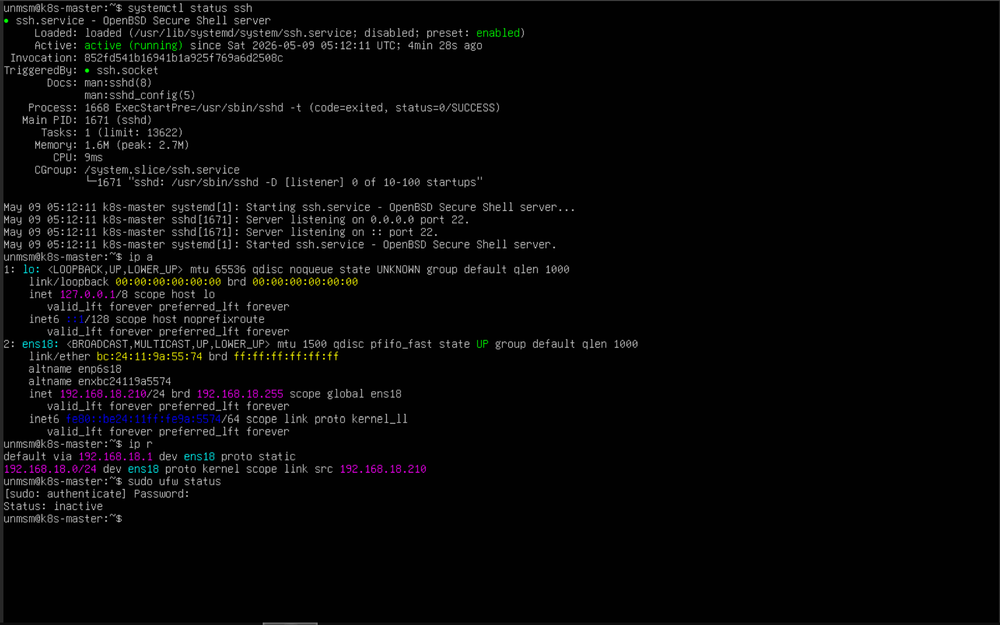
   <br><sub>Figure 24. Verification output. SSH active, static IP assigned, default route present.</sub>
   <br><br>

---

## Step 16 — Repeat for Remaining VMs

Repeat Steps 1 through 15 for VMs 202, 203, and 204 using the corresponding hostname and IP address from the node plan table.

---

## References

- \[1\] Canonical, "Ubuntu Server Installation Guide."
      https://ubuntu.com/server/docs/tutorial/basic-installation/ [Accessed: May 2026]

---

✅ You are here: `chapter-02-vm-provisioning / 02-ubuntu-installation`

⏭️ Next: [03 — Kernel Setup →](../03-kernel-setup/README.md)
