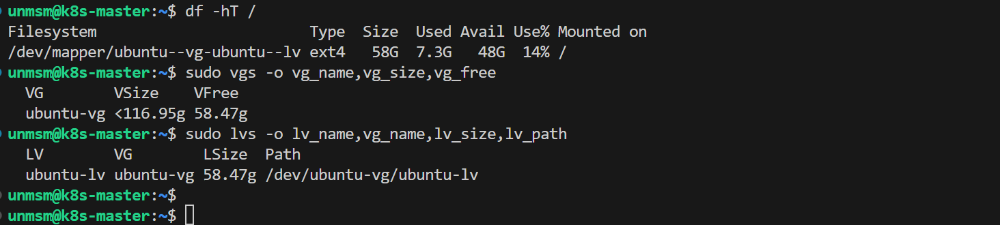
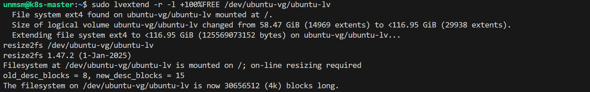
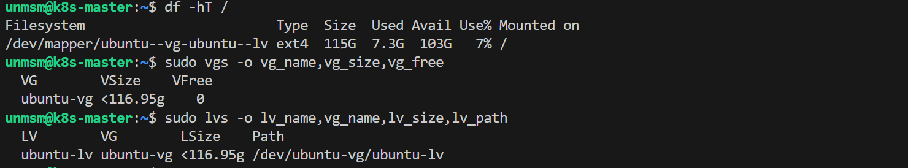

# 03 — Disk Expansion

Ubuntu Server's guided installer with LVM allocates only half of the provisioned disk to the root logical volume by default, leaving the remaining space unallocated within the volume group. This section extends the root volume to consume all available space without reinstalling the system.

```
BEFORE (post-install default)
DISK ~120G
└── LVM PV (~118G)
    └── VG: ubuntu-vg (~118G total)
        ├── LV: ubuntu-lv (~59G)  ← mounted on /
        └── FREE in VG   (~59G)   ← unallocated, available for expansion

AFTER (post lvextend)
DISK ~120G
└── LVM PV (~118G)
    └── VG: ubuntu-vg (~118G total)
        └── LV: ubuntu-lv (~118G) ← mounted on /
            (VG FREE = 0G)
```

Expanding the root volume before deploying Kubernetes is required. Container images, logs, packages, and cluster components grow over time and will exhaust a 59G root filesystem well before the provisioned disk is full.

---

## Prerequisites

- [ ] Completed [02 — Ubuntu Installation](../02-ubuntu-installation/README.md)
- [ ] An SSH client on the management endpoint — any client works (OpenSSH, PuTTY, Termius, VS Code with Remote SSH extension, or similar)

---

## Step 1 — Connect to the VM via SSH

From the management endpoint open a terminal and connect to the VM using the credentials configured during installation. Repeat this section once per VM.

```bash
ssh unmsm@192.168.18.210
```
---

## Step 2 — Verify Current Disk Layout

Run the following commands to confirm the current filesystem size and LVM structure before expanding.

```bash
df -hT /
sudo vgs -o vg_name,vg_size,vg_free
sudo lvs -o lv_name,vg_name,lv_size,lv_path
```


<br><sub>Figure 2. Current disk layout. The root filesystem uses approximately half the provisioned disk. VFree shows the unallocated space available in the volume group.</sub>
<br><br>

---

## Step 3 — Extend Root Logical Volume

Run the following command to assign all free space in the volume group to the root logical volume. The `-l +100%FREE` flag consumes all unallocated space in the VG. The `-r` flag resizes the ext4 filesystem online in the same operation, without requiring a reboot.

```bash
sudo lvextend -r -l +100%FREE /dev/ubuntu-vg/ubuntu-lv
```


<br><sub>Figure 3. lvextend output. The logical volume and ext4 filesystem are extended in a single operation.</sub>
<br><br>

---

## Step 4 — Verify Expansion

Run the same commands from Step 2 to confirm the root filesystem now reflects the full provisioned disk size and the volume group has no remaining free space.

```bash
df -hT /
sudo vgs -o vg_name,vg_size,vg_free
sudo lvs -o lv_name,vg_name,lv_size,lv_path
```


<br><sub>Figure 4. Expanded disk layout. The root filesystem now reflects the full provisioned size. VFree shows 0, confirming all space is allocated to the logical volume.</sub>
<br><br>

---

## Step 5 — Repeat for Remaining VMs

Repeat Steps 1 through 4 on each remaining VM. The disk sizes differ per node but the commands are identical.

| VM ID | Hostname | IP | Provisioned Disk | Expected size after expansion |
|---|---|---|---|---|
| 201 | k8s-master | 192.168.18.210 | 120 GB | ~116 GB |
| 202 | k8s-worker-1 | 192.168.18.211 | 280 GB | ~276 GB |
| 203 | k8s-worker-2 | 192.168.18.212 | 160 GB | ~157 GB |
| 204 | k8s-worker-3 | 192.168.18.213 | 260 GB | ~256 GB |

> **Note:** The usable size after expansion is slightly less than the provisioned disk size due to LVM metadata overhead and partition alignment.

---

## References

- \[1\] Ubuntu Documentation, "About LVM."
      https://ubuntu.com/server/docs/explanation/storage/about-lvm/ [Accessed: May 2026]
- \[2\] Red Hat, "Extending a Logical Volume."
      https://access.redhat.com/documentation/en-us/red_hat_enterprise_linux/8/html/configuring_and_managing_logical_volumes/index [Accessed: May 2026]

---

✅ You are here: `chapter-02-vm-provisioning / 03-disk-expansion`

⏭️ Next: [04 — Kernel Setup →](../04-kernel-setup/README.md)
