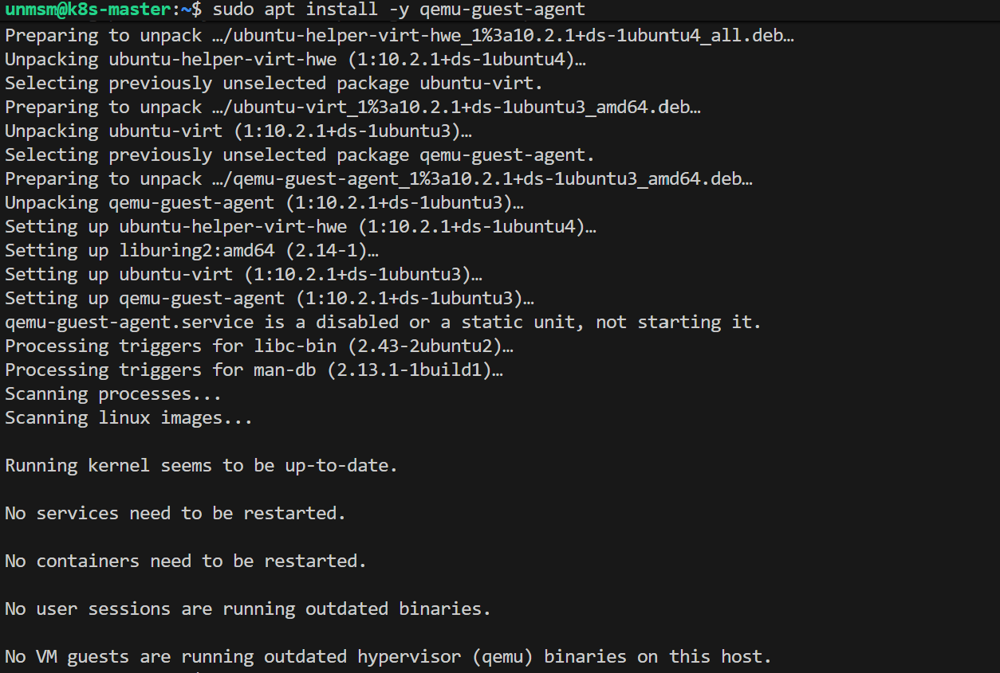
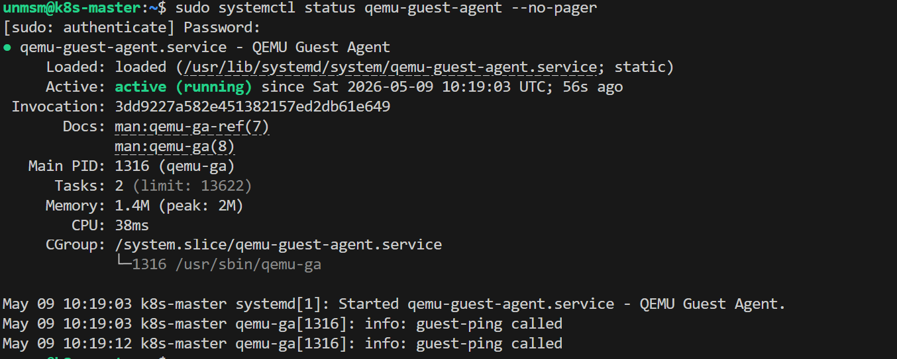
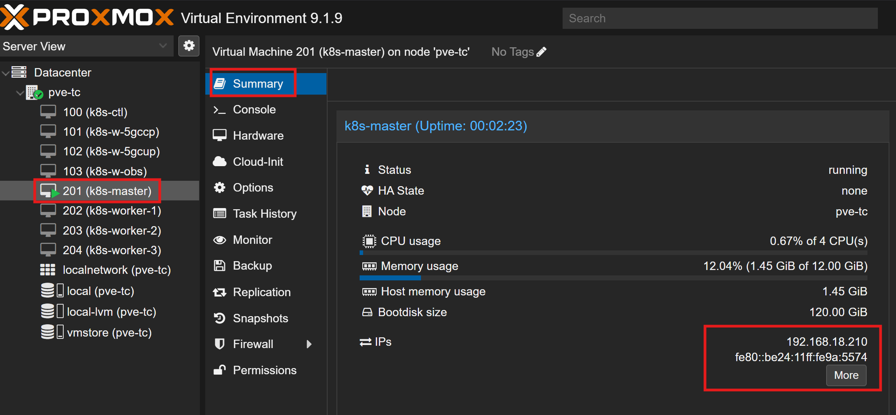

# 04 — QEMU Guest Agent

The QEMU Guest Agent is a daemon that runs inside the VM and exposes guest OS information to the Proxmox hypervisor — including IP addresses, hostname, and filesystem state. Without it the VM summary panel shows no network information and guest-aware snapshot coordination is unavailable.

The agent channel was enabled at the hypervisor level during VM creation in [Chapter 2 — Section 01](../01-vm-creation/README.md). This section installs the agent package inside each VM to complete the setup.

---

## Prerequisites

- [ ] Completed [03 — Disk Expansion](../03-disk-expansion/README.md)
- [ ] SSH client on the management endpoint

---

## Step 1 — Connect to the VM via SSH

```bash
ssh operator1@192.168.18.210
```

Adjust the IP address for each node.

---

## Step 2 — Install QEMU Guest Agent

```bash
sudo apt install -y qemu-guest-agent
```


<br><sub>Figure 1. QEMU Guest Agent installed successfully.</sub>
<br><br>

---

## Step 3 — Shutdown and Start the VM

1. Shut down the VM from inside the guest

   ```bash
   sudo shutdown now
   ```

2. Once the VM shows as stopped in Proxmox, select it from the left panel and click **Start**

---

## Step 4 — Verify Agent is Running

Reconnect via SSH after the VM boots and confirm the agent daemon is active.

```bash
sudo systemctl status qemu-guest-agent --no-pager
```


<br><sub>Figure 2. QEMU Guest Agent status showing active (running). The agent is communicating with the Proxmox hypervisor.</sub>
<br><br>

---

## Step 5 — Verify in Proxmox Summary

In the Proxmox web interface select the VM and navigate to **Summary**. The IP address and network information are now visible — confirming the agent is operational.


<br><sub>Figure 3. Proxmox VM summary panel. The IP address is now reported by the QEMU Guest Agent.</sub>
<br><br>

---

## Step 6 — Repeat for Remaining VMs

Repeat Steps 1 through 5 for VMs 202, 203, and 204.

---

## References

- \[1\] Proxmox Server Solutions, "QEMU Guest Agent."
      https://pve.proxmox.com/wiki/Qemu-guest-agent [Accessed: May 2026]

---

✅ You are here: `chapter-02-vm-provisioning / 04-qemu-guest-agent`

⏭️ Next: [05 — Kernel Setup →](../05-kernel-setup/README.md)
