# 05 — Kernel Setup

The free5GC UPF and UERANSIM rely on the `gtp5g` kernel module for GTP-U packet processing on the N3 interface. The official gtp5g repository notes:

> *"Due to the evolution of Linux kernel, this module would not work with every kernel version. Please run this module with kernel version `5.0.0-23-generic`, upper than `5.4` (Ubuntu 20.04) or RHEL8."*
> — [free5GC/gtp5g](https://github.com/free5gc/gtp5g)

Compilation was validated on kernel **5.15.x** in this testbed and confirmed to fail on kernel **7.0** due to upstream API changes. Kernel 5.15.204 is therefore installed exclusively on the worker node designated for GTP-U workloads. The setup scripts download the target kernel directly from the Ubuntu mainline repository and are independent of the Ubuntu release version on the node.

### Kernel Planning

| Node | Hostname | Default Kernel | Final Kernel | Reason |
|---|---|---|---|---|
| k8s-master | k8s-master | 7.0.0-15-generic | 7.0.0-15-generic | Control plane workloads only |
| k8s-worker-1 | k8s-worker-1 | 7.0.0-15-generic | 7.0.0-15-generic | General workloads |
| k8s-worker-2 | k8s-worker-2 | 7.0.0-15-generic | 5.15.204-0515204-generic | GTP-U workloads — UPF and UERANSIM |
| k8s-worker-3 | k8s-worker-3 | 7.0.0-15-generic | 7.0.0-15-generic | Observability workloads |

> **Note:** If a future kernel version becomes compatible with gtp5g, update the `KERNEL_VERSION` variable in the setup script. No other changes are required.

---

## Prerequisites

- [ ] Completed [04 — QEMU Guest Agent](../04-qemu-guest-agent/README.md)
- [ ] SSH client on the management endpoint
- [ ] Internet access from k8s-worker-2

---

## Step 1 — Connect to k8s-worker-2

```bash
ssh unmsm@192.168.18.212
```

---

## Step 2 — Run Kernel Setup Script

The script downloads kernel 5.15.204 from the Ubuntu mainline repository, installs it, pins the packages to prevent automatic upgrades, and configures GRUB to boot into it by default.

```bash
curl -fsSL https://raw.githubusercontent.com/lpoclin/5gc-cloudnative-testbed/main/scripts/gtp5g-kernel-setup.sh -o gtp5g-kernel-setup.sh
chmod +x gtp5g-kernel-setup.sh
sudo ./gtp5g-kernel-setup.sh
```

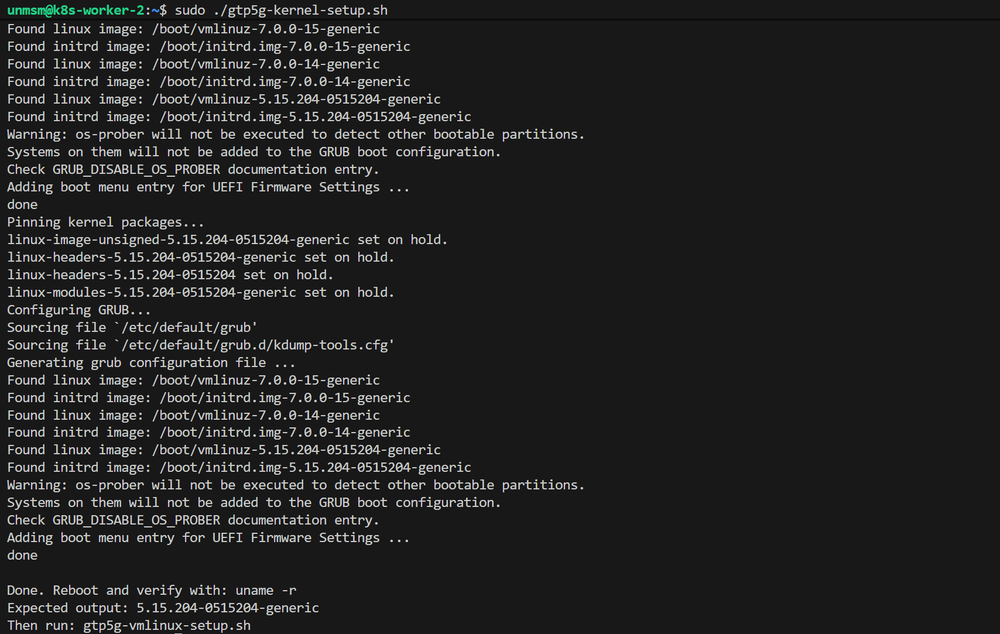
<sub>Figure 1. Kernel setup script output. Kernel packages downloaded, installed, pinned, and GRUB configured.</sub>
<br><br>

---

## Step 3 — Disable Secure Boot

The VM was created with UEFI firmware and pre-enrolled Secure Boot keys enabled. The mainline kernel 5.15.204 does not carry a signature recognized by the Ubuntu shim, which causes a `bad shim lock signature` error on first boot. Secure Boot must be disabled before the kernel can load.

**3.1 — Shut down the VM**

```bash
sudo shutdown -h now
```

**3.2 — Remove pre-enrolled keys from Proxmox shell**

In the Proxmox web interface navigate to the node **Shell** and run the following command.

```bash
qm set 203 --efidisk0 vmstore:vm-203-disk-0,efitype=4m,pre-enrolled-keys=0,size=4M
```

> **Note:** Replace `203` with the VM ID of k8s-worker-2 in your deployment.

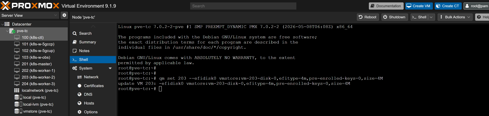
<sub>Figure 2. Proxmox shell. qm set updates the EFI disk configuration with pre-enrolled-keys=0.</sub>
<br><br>

**3.3 — Verify EFI disk configuration**

In the Proxmox web interface select the VM and navigate to **Hardware**. Confirm the EFI Disk entry shows `pre-enrolled-keys=0`.

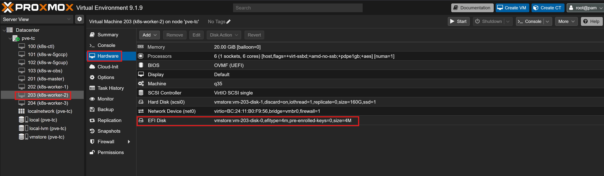
<sub>Figure 3. Hardware tab confirming pre-enrolled-keys=0.</sub>
<br><br>

**3.4 — Start the VM and enter UEFI firmware**

Start the VM from Proxmox. The first boot will fail with a shim signature error — this is expected.

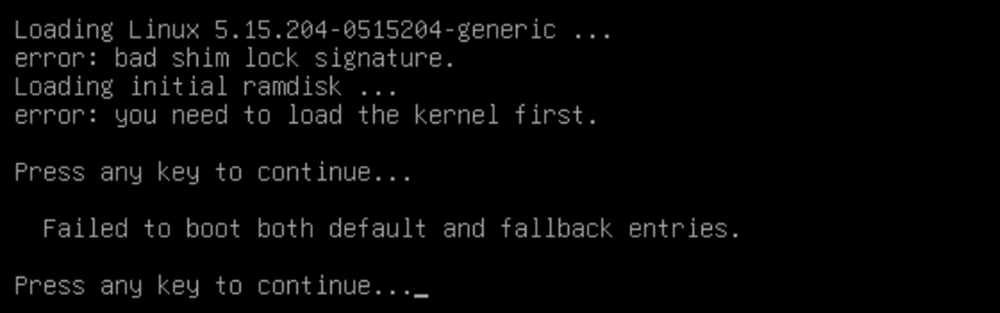
<br><sub>Figure 4. Shim signature error on first boot. Press any key to continue.</sub>
<br><br>

Press any key when prompted. The GRUB boot menu will appear — select **UEFI Firmware Settings** and press **Enter**.

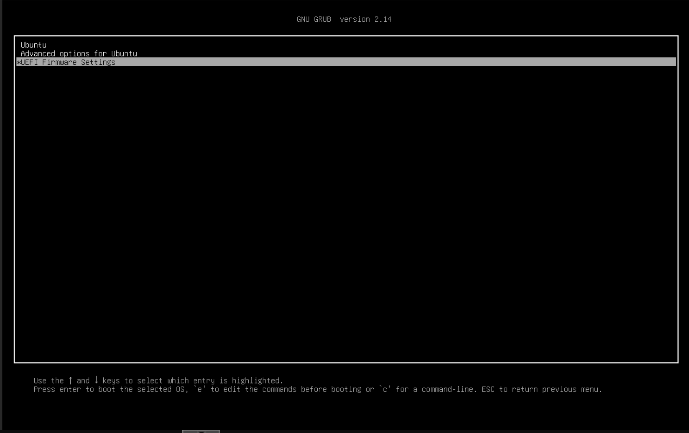
<sub>Figure 5. GRUB boot menu. Select UEFI Firmware Settings and press Enter.</sub>
<br><br>

The boot device selection screen will appear — select **EFI Firmware Setup** and press **Enter**.

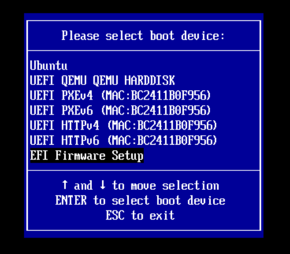
<sub>Figure 6. Boot device selection menu. Select EFI Firmware Setup and press Enter.</sub>
<br><br>

**3.5 — Disable Secure Boot in UEFI firmware**

1. Navigate to **Device Manager** and press **Enter**

   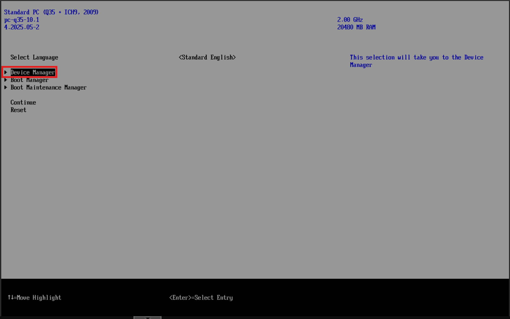
   <br><sub>Figure 7. UEFI firmware main menu. Navigate to Device Manager.</sub>
   <br><br>

2. Navigate to **Secure Boot Configuration** and press **Enter**

   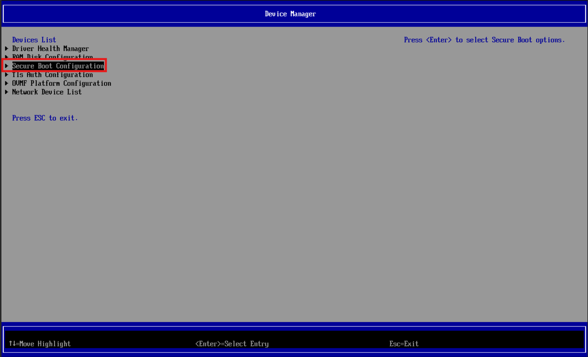
   <br><sub>Figure 8. Device Manager. Select Secure Boot Configuration.</sub>
   <br><br>

3. Select **Attempt Secure Boot** and press **Enter** to uncheck it

   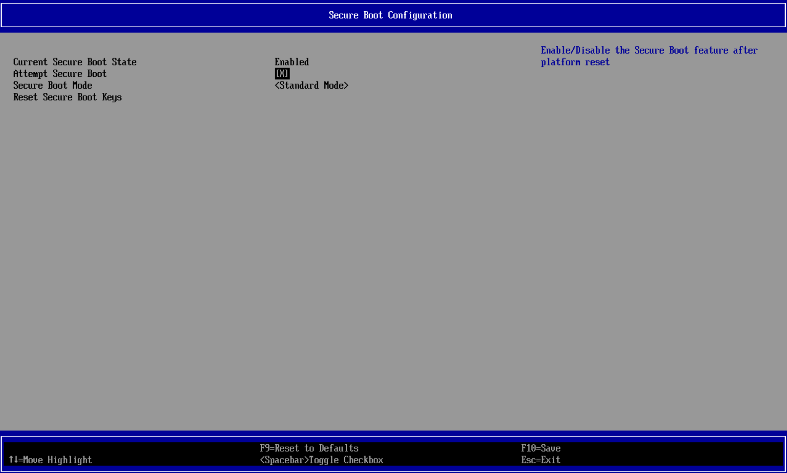
   <br><sub>Figure 9. Attempt Secure Boot enabled by default.</sub>
   <br><br>

   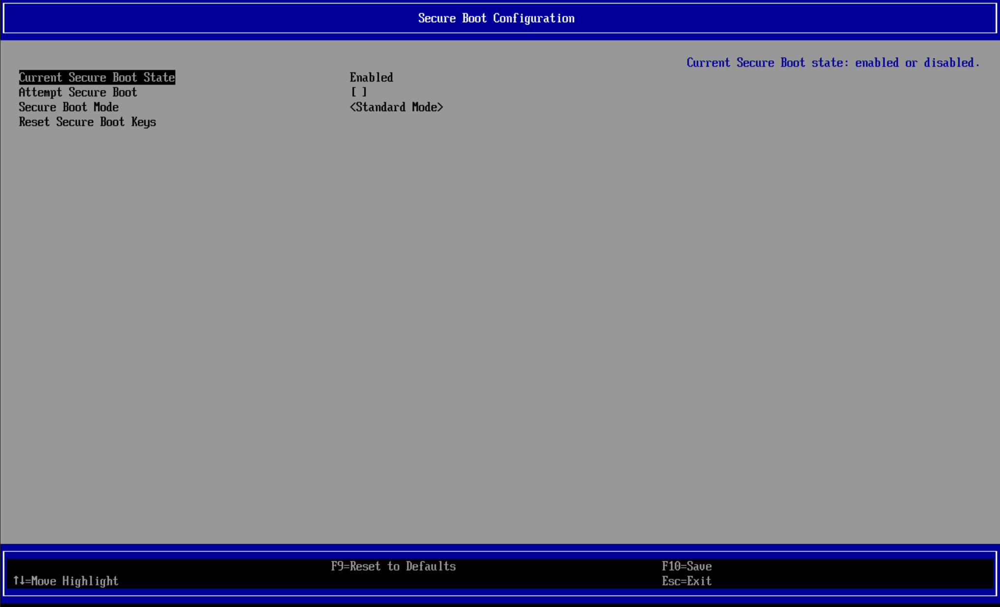
   <br><sub>Figure 10. Attempt Secure Boot unchecked. Secure Boot is now disabled.</sub>
   <br><br>

4. Press **F10** to save and confirm with **Y** when prompted

   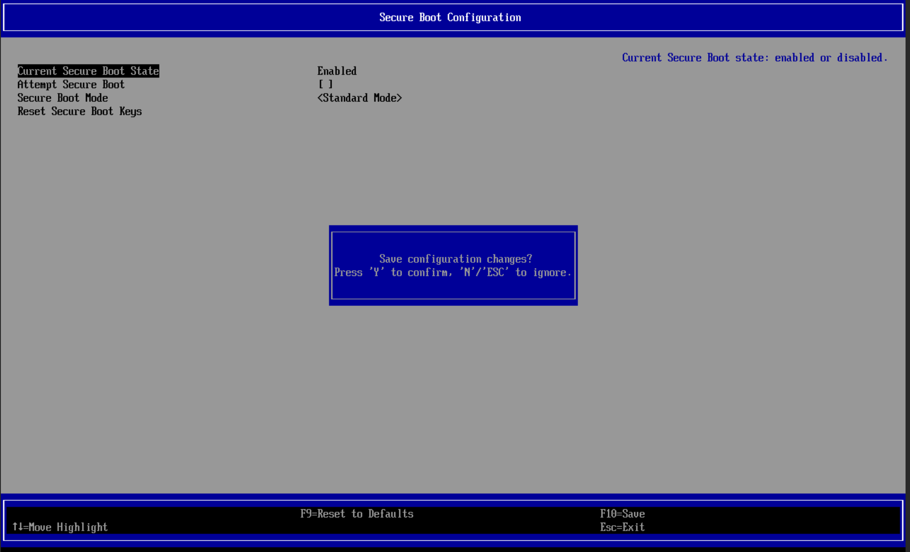
   <br><sub>Figure 11. Save configuration prompt. Press Y to confirm.</sub>
   <br><br>

5. Press **ESC** twice to return to the main menu, select **Continue** and press **Enter** — the VM will reboot into kernel 5.15 automatically

---

## Step 4 — Verify Kernel Version

Reconnect via SSH after the VM boots.

```bash
ssh unmsm@192.168.18.212
uname -r
```

Expected output:

```
5.15.204-0515204-generic
```


<sub>Figure 12. Kernel version confirmed as 5.15.204-0515204-generic after reboot.</sub>
<br><br>

---

## Step 5 — Run vmlinux Setup Script

The vmlinux file is required for BTF generation when compiling the gtp5g module. The script extracts it from the installed kernel image and places it where the gtp5g build system expects it.

```bash
curl -fsSL https://raw.githubusercontent.com/lpoclin/5gc-cloudnative-testbed/main/scripts/gtp5g-vmlinux-setup.sh -o gtp5g-vmlinux-setup.sh
chmod +x gtp5g-vmlinux-setup.sh
sudo ./gtp5g-vmlinux-setup.sh
```

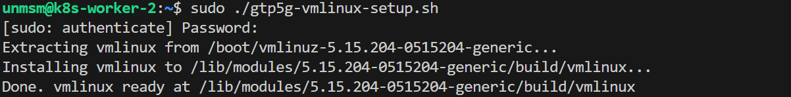
<sub>Figure 13. vmlinux extraction output. Placed at /lib/modules/5.15.204-0515204-generic/build/vmlinux.</sub>
<br><br>

---

## Step 6 — Verify vmlinux

```bash
ls -lh /lib/modules/$(uname -r)/build/vmlinux
```


<sub>Figure 14. vmlinux present at the expected path. The node is ready for gtp5g module compilation in the 5G deployment chapter.</sub>
<br><br>

---

## References

- \[1\] free5GC Project, "gtp5g — 5G Compatible GTP Kernel Module."
      https://github.com/free5gc/gtp5g [Accessed: May 2026]
- \[2\] Ubuntu Mainline Kernel Repository.
      https://kernel.ubuntu.com/mainline/ [Accessed: May 2026]

---

✅ You are here: `chapter-02-vm-provisioning / 05-kernel-setup`

⏭️ Next: [06 — Network Configuration →](../06-network-configuration/README.md)
