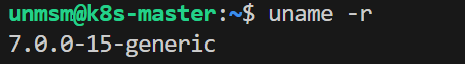
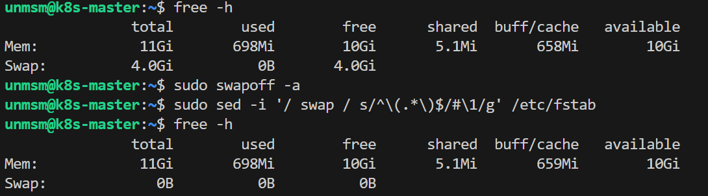
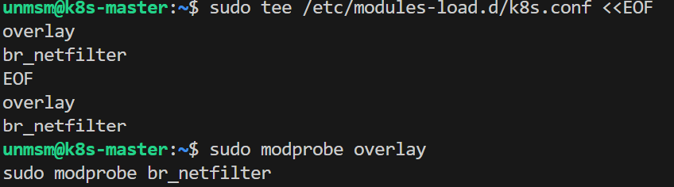
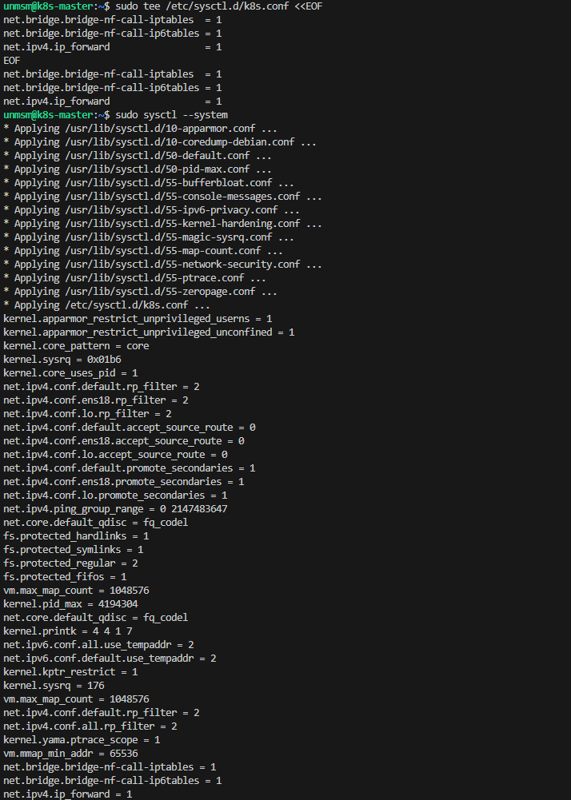
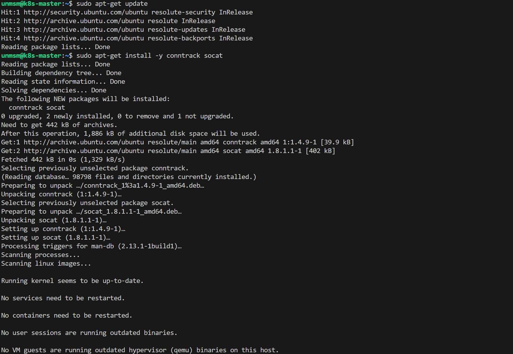
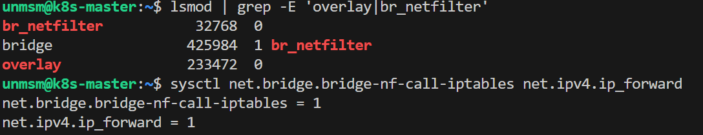

# 01 — Node Baseline

This section configures the operating system baseline required by containerd and Kubernetes on all four nodes. The steps load kernel modules, set networking parameters, disable swap, and install required userspace tools. All commands must be executed on every node before proceeding to containerd installation.

> **Note:** Complete this section on all four nodes before proceeding to [02 — containerd](../02-containerd/README.md).

---

## Prerequisites

- [ ] Completed [Chapter 2 — VM Provisioning](../../chapter-02-vm-provisioning/README.md)
- [ ] SSH access to all four nodes

---

## Node Reference

| Node | IP | Kernel |
|---|---|---|
| k8s-master | 192.168.18.210 | 7.0.0-15-generic |
| k8s-worker-1 | 192.168.18.211 | 7.0.0-15-generic |
| k8s-worker-2 | 192.168.18.212 | 5.15.204-0515204-generic |
| k8s-worker-3 | 192.168.18.213 | 7.0.0-15-generic |

---

## Step 1 — Connect to the Node via SSH

```bash
ssh unmsm@192.168.18.210
```

Repeat all steps in this section for each node using its corresponding IP address.

---

## Step 2 — Verify Kernel Version

```bash
uname -r
```


<br><sub>Figure 1. Kernel version verification on each node before proceeding.</sub>
<br><br>

---

## Step 3 — Disable Swap

```bash
sudo swapoff -a
sudo sed -i '/ swap / s/^\(.*\)$/#\1/g' /etc/fstab
```

Kubernetes requires swap to be disabled. `swapoff -a` disables it immediately. The `sed` command comments out the swap entry in `/etc/fstab` to prevent it from being re-enabled on reboot.

Verify:

```bash
free -h
```

The `Swap` row must show `0B` in all columns.


<br><sub>Figure 2. Swap disabled. The Swap row shows 0B.</sub>
<br><br>

---

## Step 4 — Load Kernel Modules

```bash
sudo tee /etc/modules-load.d/k8s.conf <<EOF
overlay
br_netfilter
EOF

sudo modprobe overlay
sudo modprobe br_netfilter
```

The `modules-load.d` file ensures both modules are loaded automatically on every boot. `modprobe` loads them immediately without requiring a reboot.

| Module | Purpose |
|---|---|
| overlay | Overlay filesystem driver used by containerd to layer container images |
| br_netfilter | Enables iptables and eBPF rules to inspect bridged traffic — required by Kubernetes networking and Cilium |


<br><sub>Figure 3. Kernel modules configured and loaded. No output from modprobe indicates success.</sub>
<br><br>

---

## Step 5 — Configure Kernel Networking Parameters

```bash
sudo tee /etc/sysctl.d/k8s.conf <<EOF
net.bridge.bridge-nf-call-iptables  = 1
net.bridge.bridge-nf-call-ip6tables = 1
net.ipv4.ip_forward                 = 1
EOF

sudo sysctl --system
```

The `sysctl.d` file persists the parameters across reboots. `sysctl --system` applies all files in `/etc/sysctl.d/` immediately.

| Parameter | Value | Purpose |
|---|---|---|
| net.bridge.bridge-nf-call-iptables | 1 | Allows iptables rules to process bridged IPv4 traffic between pods |
| net.bridge.bridge-nf-call-ip6tables | 1 | Same as above for IPv6 |
| net.ipv4.ip_forward | 1 | Allows the kernel to forward packets between interfaces — required for pod-to-pod and pod-to-external traffic |


<br><sub>Figure 4. sysctl --system output. Confirm the k8s.conf parameters appear in the output.</sub>
<br><br>

---

## Step 6 — Install Required Userspace Tools

```bash
sudo apt-get update
sudo apt-get install -y conntrack socat
```

| Package | Used by | Purpose |
|---|---|---|
| conntrack | kube-proxy, Cilium | Userspace tool for inspecting and managing kernel connection tracking tables |
| socat | kubectl | Required by `kubectl port-forward` for TCP stream forwarding |


<br><sub>Figure 5. conntrack and socat installed successfully.</sub>
<br><br>

---

## Step 7 — Verify Configuration

```bash
lsmod | grep -E 'overlay|br_netfilter'
sysctl net.bridge.bridge-nf-call-iptables net.ipv4.ip_forward
```

Expected output:

```
br_netfilter          ...
overlay               ...
net.bridge.bridge-nf-call-iptables = 1
net.ipv4.ip_forward = 1
```


<br><sub>Figure 6. Verification output. Both modules are loaded and networking parameters are active.</sub>
<br><br>

---

## Step 8 — Repeat for Remaining Nodes

Repeat Steps 1 through 8 on k8s-worker-1 (192.168.18.211), k8s-worker-2 (192.168.18.212), and k8s-worker-3 (192.168.18.213).

---

## References

- \[1\] Kubernetes Documentation, "Container Runtimes — Prerequisites."
      https://kubernetes.io/docs/setup/production-environment/container-runtimes/ [Accessed: May 2026]
- \[2\] Cilium Documentation, "System Requirements."
      https://docs.cilium.io/en/stable/operations/system_requirements/ [Accessed: May 2026]

---

✅ You are here: `chapter-03-kubernetes-setup / 01-node-baseline`

⏭️ Next: [02 — containerd →](../02-containerd/README.md)
