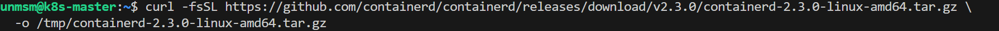
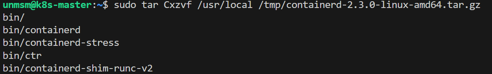
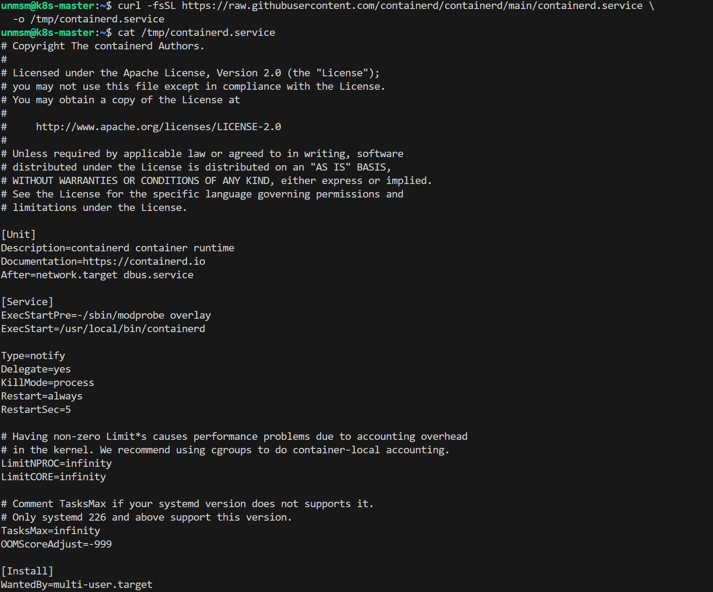
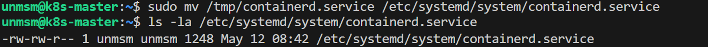
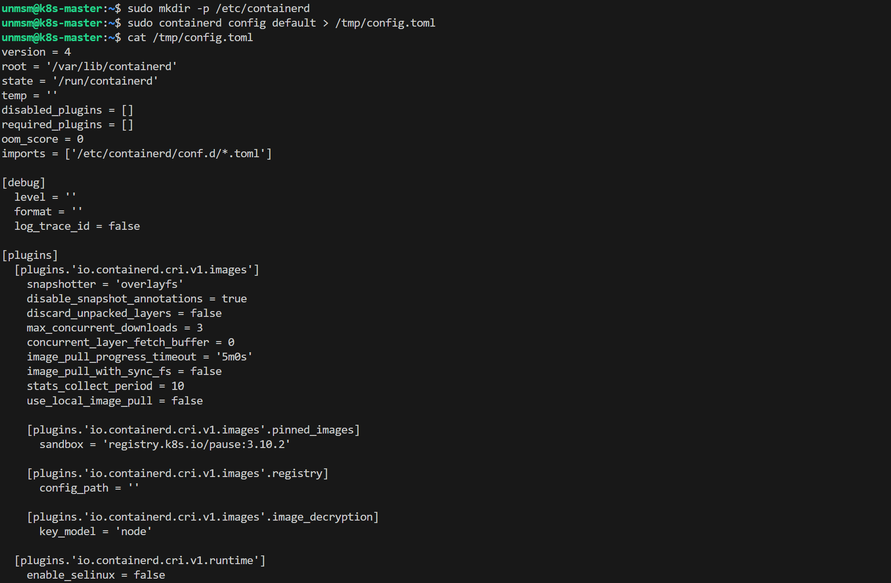
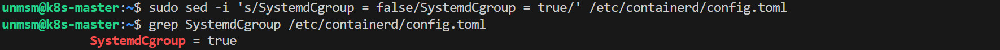
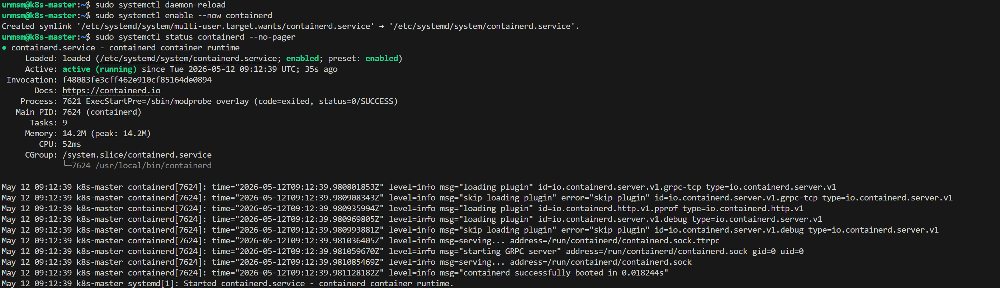
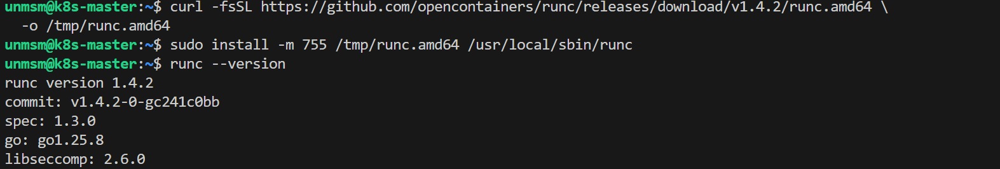
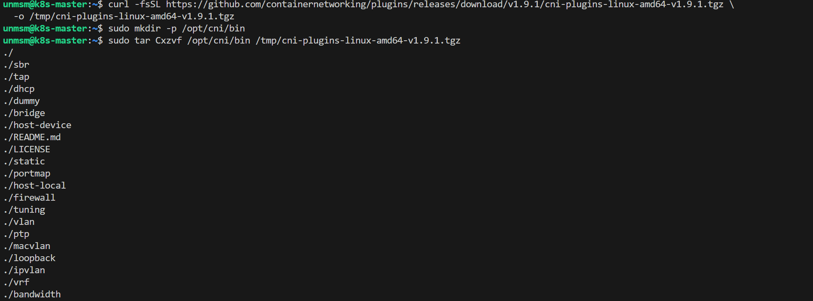
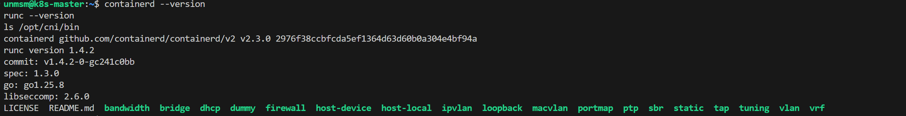

# 02 — containerd

This section installs containerd, runc, and the CNI plugins on all four nodes. containerd is the container runtime used by Kubernetes to pull images and manage container lifecycles. runc is the low-level container runtime that containerd delegates to for creating and running containers. The CNI plugins provide the standard network interface binaries required by the Kubernetes CRI.

All commands must be executed on every node.

> **Note:** Complete this section on all four nodes before proceeding to [03 — Kubernetes Install](../03-kubernetes-install/README.md).

---

## Prerequisites

- [ ] Completed [01 — Node Baseline](../01-node-baseline/README.md)
- [ ] SSH access to all four nodes
- [ ] Internet access from each node

---

## Component Versions

| Component | Version |
|---|---|
| containerd | 2.3.0 |
| runc | 1.4.2 |
| CNI plugins | 1.9.1 |

---

## Step 1 — Connect to the Node via SSH

```bash
ssh unmsm@192.168.18.210
```

Repeat all steps in this section for each node using its corresponding IP address.

---

## Step 2 — Download containerd

```bash
curl -fsSL https://github.com/containerd/containerd/releases/download/v2.3.0/containerd-2.3.0-linux-amd64.tar.gz \
  -o /tmp/containerd-2.3.0-linux-amd64.tar.gz
```


<sub>Figure 1. containerd 2.3.0 downloaded to /tmp.</sub>
<br><br>

---

## Step 3 — Install containerd Binaries

```bash
sudo tar Cxzvf /usr/local /tmp/containerd-2.3.0-linux-amd64.tar.gz
```


<sub>Figure 2. containerd binaries extracted to /usr/local/bin.</sub>
<br><br>

---

## Step 4 — Download and Verify the systemd Unit File

Download the official unit file from the containerd repository:

```bash
curl -fsSL https://raw.githubusercontent.com/containerd/containerd/main/containerd.service \
  -o /tmp/containerd.service
```

Verify the content before installing:

```bash
cat /tmp/containerd.service
```


<sub>Figure 3. containerd.service unit file content. Verify the ExecStart path is /usr/local/bin/containerd before proceeding.</sub>
<br><br>

Install the unit file and confirm it is in place:

```bash
sudo mv /tmp/containerd.service /etc/systemd/system/containerd.service
ls -la /etc/systemd/system/containerd.service
```


<sub>Figure 4. containerd.service installed at /etc/systemd/system/containerd.service.</sub>
<br><br>

---

## Step 5 — Generate Default containerd Configuration

Generate the default configuration and inspect it before installing:

```bash
sudo mkdir -p /etc/containerd
sudo containerd config default > /tmp/config.toml
cat /tmp/config.toml
```


<sub>Figure 5. Default containerd configuration. Verify the file was generated correctly before proceeding.</sub>
<br><br>

Install the configuration:

```bash
sudo cp /tmp/config.toml /etc/containerd/config.toml
```


<sub>Figure 6. config.toml installed at /etc/containerd/config.toml.</sub>
<br><br>

---

## Step 6 — Enable SystemdCgroup

Kubernetes requires containerd to use the systemd cgroup driver. Edit the configuration to enable it:

```bash
sudo sed -i 's/SystemdCgroup = false/SystemdCgroup = true/' /etc/containerd/config.toml
```

Verify the change:

```bash
grep SystemdCgroup /etc/containerd/config.toml
```


<sub>Figure 7. SystemdCgroup set to true in containerd configuration.</sub>
<br><br>

The systemd cgroup driver is required when running Kubernetes on systems using cgroupv2, which is the default on Ubuntu 26.04.

---

## Step 7 — Enable and Start containerd

```bash
sudo systemctl daemon-reload
sudo systemctl enable --now containerd
```

Verify containerd is running:

```bash
sudo systemctl status containerd --no-pager
```


<sub>Figure 8. containerd service active and running.</sub>
<br><br>

---

## Step 8 — Install runc

```bash
curl -fsSL https://github.com/opencontainers/runc/releases/download/v1.4.2/runc.amd64 \
  -o /tmp/runc.amd64

sudo install -m 755 /tmp/runc.amd64 /usr/local/sbin/runc
```

Verify:

```bash
runc --version
```


<sub>Figure 9. runc 1.4.2 installed successfully.</sub>
<br><br>

---

## Step 9 — Install CNI Plugins

```bash
curl -fsSL https://github.com/containernetworking/plugins/releases/download/v1.9.1/cni-plugins-linux-amd64-v1.9.1.tgz \
  -o /tmp/cni-plugins-linux-amd64-v1.9.1.tgz

sudo mkdir -p /opt/cni/bin
sudo tar Cxzvf /opt/cni/bin /tmp/cni-plugins-linux-amd64-v1.9.1.tgz
```


<sub>Figure 10. CNI plugins extracted to /opt/cni/bin.</sub>
<br><br>

---

## Step 10 — Verify Installation

```bash
containerd --version
runc --version
ls /opt/cni/bin
```


<sub>Figure 11. containerd 2.3.0, runc 1.4.2, and CNI plugins installed and verified.</sub>
<br><br>

---

## Step 11 — Repeat for Remaining Nodes

Repeat Steps 1 through 10 on k8s-worker-1 (192.168.18.211), k8s-worker-2 (192.168.18.212), and k8s-worker-3 (192.168.18.213).

---

## References

- \[1\] containerd Project, "Getting Started."
      https://github.com/containerd/containerd/blob/main/docs/getting-started.md [Accessed: May 2026]
- \[2\] opencontainers, "runc releases."
      https://github.com/opencontainers/runc/releases [Accessed: May 2026]
- \[3\] containernetworking, "CNI plugins releases."
      https://github.com/containernetworking/plugins/releases [Accessed: May 2026]

---

✅ You are here: `chapter-03-kubernetes-setup / 02-containerd`

⏭️ Next: [03 — Kubernetes Install →](../03-kubernetes-install/README.md)
