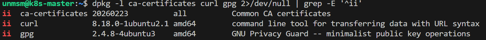
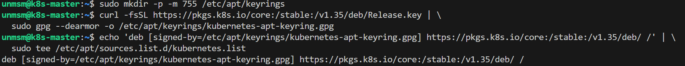
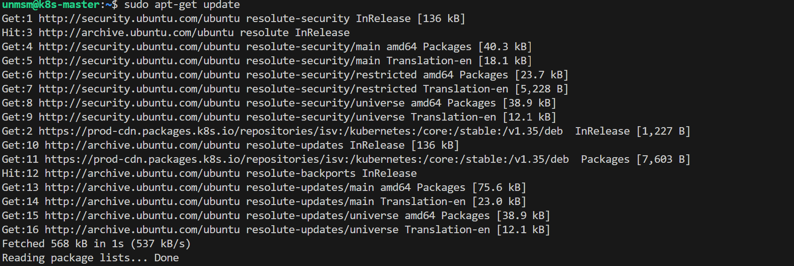
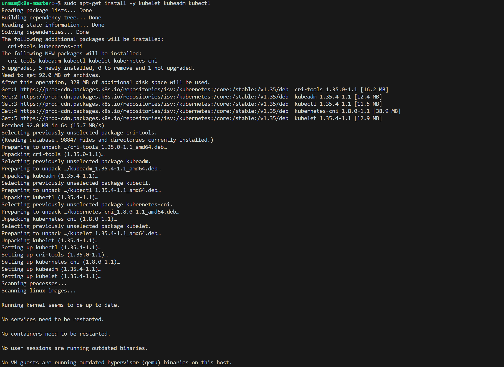
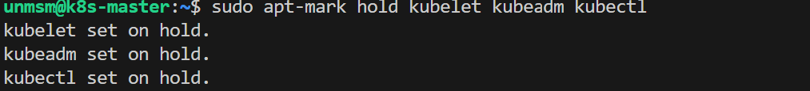
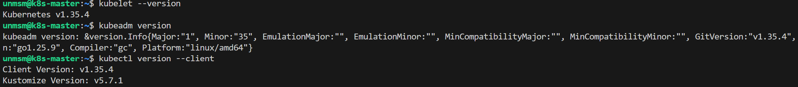

# 03 — Kubernetes Install

This section adds the Kubernetes package repository and installs kubelet, kubeadm, and kubectl on all four nodes. This testbed bootstraps the cluster using kubeadm — the official Kubernetes tool for initializing clusters from scratch on bare-metal and VMs. Alternative approaches such as MicroK8s, k3s, or managed cloud services abstract this process; kubeadm was chosen here for full control over the cluster configuration. All commands must be executed on every node.

> **Note:** Complete this section on all four nodes before proceeding to [04 — Cluster Init](../04-cluster-init/README.md).

---

## Prerequisites

- [ ] Completed [02 — containerd](../02-containerd/README.md)
- [ ] SSH access to all four nodes
- [ ] Internet access from each node

---

## Component Versions

| Component | Version |
|---|---|
| kubelet | 1.35.4 |
| kubeadm | 1.35.4 |
| kubectl | 1.35.4 |

---

## Step 1 — Connect to the Node via SSH

```bash
ssh unmsm@192.168.18.210
```

Repeat all steps in this section for each node using its corresponding IP address.

---

## Step 2 — Verify Required Packages

Ubuntu 26.04 ships with `ca-certificates`, `curl`, and `gpg` pre-installed. `apt-transport-https` is not required on Ubuntu 22.04 and later as apt supports HTTPS natively. Confirm the packages are present before proceeding:

```bash
dpkg -l ca-certificates curl gpg 2>/dev/null | grep -E '^ii'
```


<sub>Figure 1. ca-certificates, curl, and gpg confirmed present on Ubuntu 26.04.</sub>
<br><br>

---

## Step 3 — Add the Kubernetes APT Repository

Kubernetes packages are not available in the default Ubuntu repositories. The official Kubernetes package repository is added by importing its signing key and registering the repository source.

The signing key is stored in `/etc/apt/keyrings/` — a dedicated directory for trusted third-party repository keys, separate from the system keyring.

```bash
sudo mkdir -p -m 755 /etc/apt/keyrings

curl -fsSL https://pkgs.k8s.io/core:/stable:/v1.35/deb/Release.key | \
  sudo gpg --dearmor -o /etc/apt/keyrings/kubernetes-apt-keyring.gpg

echo 'deb [signed-by=/etc/apt/keyrings/kubernetes-apt-keyring.gpg] https://pkgs.k8s.io/core:/stable:/v1.35/deb/ /' | \
  sudo tee /etc/apt/sources.list.d/kubernetes.list
```


<sub>Figure 2. Kubernetes 1.35 APT repository and signing key configured.</sub>
<br><br>

| Step | Purpose |
|---|---|
| `mkdir /etc/apt/keyrings` | Creates the directory for third-party signing keys |
| `gpg --dearmor` | Converts the ASCII-armored GPG key to binary format required by apt |
| `tee kubernetes.list` | Registers the Kubernetes 1.35 repository as an apt source |

---

## Step 4 — Install kubelet, kubeadm, and kubectl

```bash
sudo apt-get update
```


<sub>Figure 3. apt-get update fetching package lists including the Kubernetes 1.35 repository.</sub>
<br><br>

```bash
sudo apt-get install -y kubelet kubeadm kubectl
```


<sub>Figure 4. kubelet, kubeadm, and kubectl installed from the Kubernetes 1.35 repository.</sub>
<br><br>

| Package | Purpose |
|---|---|
| kubelet | Node agent that runs on every node and manages pod lifecycles |
| kubeadm | Bootstrap tool for initializing and joining cluster nodes |
| kubectl | CLI client for interacting with the Kubernetes API server |

---

## Step 5 — Pin Package Versions

```bash
sudo apt-mark hold kubelet kubeadm kubectl
```


<sub>Figure 5. kubelet, kubeadm, and kubectl pinned to version 1.35.4 to prevent unintended upgrades.</sub>
<br><br>

Pinning prevents `apt upgrade` from automatically updating the Kubernetes components, which could cause version skew between nodes and break the cluster.

---

## Step 6 — Enable kubelet

```bash
sudo systemctl enable kubelet
```


<sub>Figure 6. kubelet enabled. It will start automatically after kubeadm init or kubeadm join.</sub>
<br><br>

> **Note:** kubelet will not start successfully at this point — it requires cluster configuration from `kubeadm init` or `kubeadm join` to run. Enabling it here ensures it starts automatically after those steps.

---

## Step 7 — Verify Installation

```bash
kubelet --version
kubeadm version
kubectl version --client
```


<sub>Figure 7. kubelet, kubeadm, and kubectl v1.35.4 confirmed.</sub>
<br><br>

---

## Step 8 — Repeat for Remaining Nodes

Repeat Steps 1 through 7 on k8s-worker-1 (192.168.18.211), k8s-worker-2 (192.168.18.212), and k8s-worker-3 (192.168.18.213).

---

## References

- \[1\] Kubernetes Documentation, "Installing kubeadm."
      https://kubernetes.io/docs/setup/production-environment/tools/kubeadm/install-kubeadm/ [Accessed: May 2026]

---

✅ You are here: `chapter-03-kubernetes-setup / 03-kubernetes-install`

⏭️ Next: [04 — Cluster Init →](../04-cluster-init/README.md)
