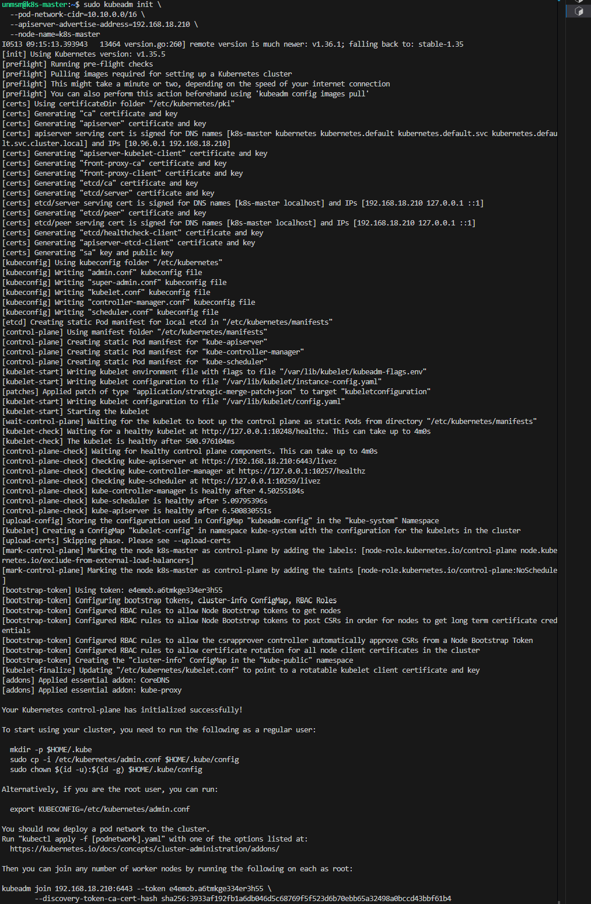
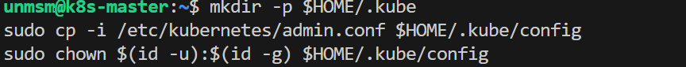
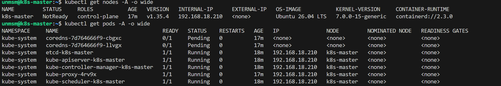

# 04 — Cluster Init

This section initializes the Kubernetes control plane on k8s-master using kubeadm and configures kubectl access.

> ⚠️ **Run this section on k8s-master (192.168.18.210) only. Do not run kubeadm init on worker nodes.**

---

## Prerequisites

- [ ] Completed [03 — Kubernetes Install](../03-kubernetes-install/README.md) on all four nodes
- [ ] SSH access to k8s-master

---

## Network Segments Reference

All IP ranges used across the testbed are listed below. None overlap. The 5G and UE ranges are configured in later chapters — they are included here to confirm no conflicts with the pod and service networks set at initialization time.

| Segment | CIDR | Used by |
|---|---|---|
| Management network | 192.168.18.0/24 | VMs, Proxmox host, physical LAN |
| Pod network | 10.10.0.0/16 | All pods assigned by Cilium |
| Service network | 10.96.0.0/12 | Kubernetes internal services, CoreDNS, and 5G SBI inter-NF communication via ClusterIP |
| 5G and UE networks (future) | 10.100.50.x, 10.100.100.x, 10.1.x | 5G interfaces via Multus and UE pools via UERANSIM |

---

## Step 1 — Connect to k8s-master

```bash
ssh unmsm@192.168.18.210
```

---

## Step 2 — Initialize the Cluster

> ⚠️ **Control plane node only — k8s-master (192.168.18.210)**

```bash
sudo kubeadm init \
  --pod-network-cidr=10.10.0.0/16 \
  --apiserver-advertise-address=192.168.18.210 \
  --node-name=k8s-master
```


<sub>Figure 1. kubeadm init output. Initializes etcd, API server, scheduler, and controller manager.</sub>
<br><br>

| Flag | Purpose |
|---|---|
| `--pod-network-cidr` | Reserves the pod IP range in the cluster. Must not overlap with host or service networks. |
| `--apiserver-advertise-address` | Explicitly sets the API server IP. Required on multi-NIC nodes to avoid selecting the wrong interface. |
| `--node-name` | Sets the node name registered in the cluster. Ensures consistent naming across environments regardless of OS hostname. |

---

## Step 3 — Save the Join Command

At the end of the init output a `kubeadm join` command is printed. Copy and save it — it is required to join worker nodes in the next section.

```
kubeadm join <control-plane-ip>:6443 --token <token> \
  --discovery-token-ca-cert-hash sha256:<hash>
```


<sub>Figure 2. kubeadm join command. Copy the full command including token and hash.</sub>
<br><br>

> **Note:** The bootstrap token expires after 24 hours. If it expires before all workers join, run `kubeadm token create --print-join-command` on k8s-master to generate a new one.

---

## Step 4 — Configure kubectl

> ⚠️ **Control plane node only — k8s-master (192.168.18.210)**

```bash
mkdir -p $HOME/.kube
sudo cp -i /etc/kubernetes/admin.conf $HOME/.kube/config
sudo chown $(id -u):$(id -g) $HOME/.kube/config
```


<sub>Figure 3. kubectl configuration copied to $HOME/.kube/config.</sub>
<br><br>

---

## Step 5 — Verify Control Plane

```bash
kubectl get nodes -A -o wide
kubectl get pods -A -o wide
```


<sub>Figure 4. Control plane verification output.</sub>
<br><br>

- **k8s-master NotReady** — kubelet cannot configure pod networking without a CNI plugin installed.
- **coredns Pending** — the scheduler cannot place coredns on k8s-master because the control plane NoSchedule taint is not tolerated by coredns. It will be scheduled on a worker node after kubeadm join.
- **etcd, apiserver, scheduler, controller-manager Running** — static pods running in host network mode, no CNI required.

Both NotReady and Pending states will resolve after Cilium is installed and workers have joined.

---

## Note on Control Plane Taint

kubeadm applies a `NoSchedule` taint to k8s-master automatically:

```
node-role.kubernetes.io/control-plane:NoSchedule
```

This prevents regular workloads from running on the control plane node and must not be removed. Components that need to run on all nodes, such as node-exporter, should use `tolerations` in their pod spec instead.

---

## References

- \[1\] Kubernetes Documentation, "Creating a cluster with kubeadm."
      https://kubernetes.io/docs/setup/production-environment/tools/kubeadm/create-cluster-kubeadm/ [Accessed: May 2026]
- \[2\] Kubernetes Documentation, "kubeadm init."
      https://kubernetes.io/docs/reference/setup-tools/kubeadm/kubeadm-init/ [Accessed: May 2026]

---

✅ You are here: `chapter-03-kubernetes-setup / 04-cluster-init`

⏭️ Next: [05 — Cilium →](../05-cilium/README.md)
