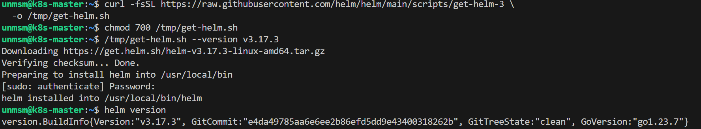
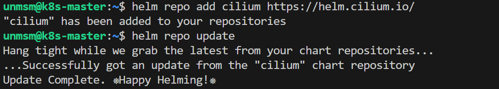
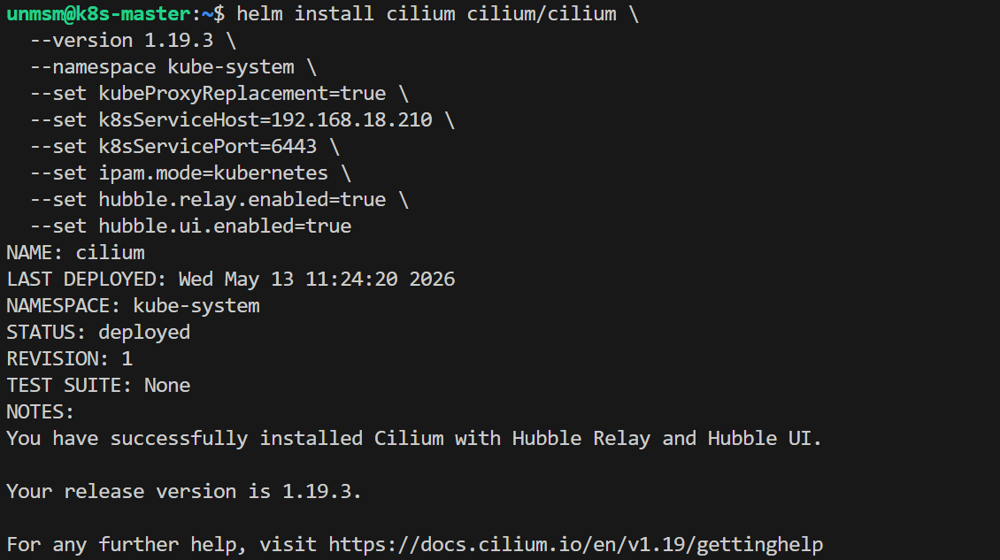
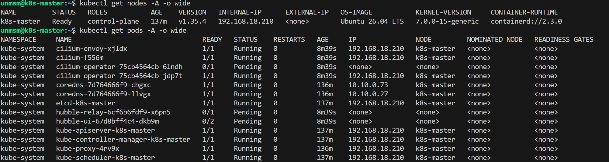

# 05 — Cilium

This section installs Cilium as the primary CNI and enables Hubble for SBI plane observability. Cilium replaces kube-proxy using eBPF for pod routing, service load balancing, and network policy enforcement.

> ⚠️ **Run this section on k8s-master only.**

---

## Prerequisites

- [ ] Completed [04 — Cluster Init](../04-cluster-init/README.md)
- [ ] SSH access to k8s-master
- [ ] Internet access from k8s-master

---

## Component Versions

| Component | Version |
|---|---|
| Helm | 3.17.3 |
| Cilium | 1.19.3 |

---

## Routing Mode

Cilium is deployed in **VXLAN encapsulation mode** (default per [Cilium 1.19.3 docs](https://docs.cilium.io/en/stable/network/concepts/routing/)). Inter-node pod traffic is encapsulated in UDP/VXLAN via eBPF with 50 bytes overhead, applied through kernel routing table entries. Same-node pod traffic is unaffected.

This overhead only applies to SBI signaling on eth0. GTP-U traffic uses dedicated Multus interfaces outside Cilium's datapath and retains full 1500 MTU.

VXLAN was chosen for reproducibility across heterogeneous infrastructure. Alternative modes for reference:

| Mode | MTU | Requirement | Best for |
|---|---|---|---|
| VXLAN (this testbed) | 1450 inter-node | None | Any infrastructure, maximum reproducibility |
| Native routing | 1500 | Underlay must route pod CIDRs between nodes | Single-host or pre-configured fabric |
| Native routing + BGP | 1500 | BGP-capable router or switch | Multi-rack bare metal, telco production |

---

## Step 1 — Connect to k8s-master

```bash
ssh unmsm@192.168.18.210
```

---

## Step 2 — Install Helm

```bash
curl -fsSL https://raw.githubusercontent.com/helm/helm/main/scripts/get-helm-3 \
  -o /tmp/get-helm.sh
chmod 700 /tmp/get-helm.sh
/tmp/get-helm.sh --version v3.17.3
```

```bash
helm version
```


<sub>Figure 1. Helm 3.17.3 installed successfully.</sub>
<br><br>

---

## Step 3 — Add Cilium Helm Repository

```bash
helm repo add cilium https://helm.cilium.io/
helm repo update
```


<br><sub>Figure 2. Cilium Helm repository added and updated.</sub>
<br><br>

---

## Step 4 — Install Cilium

```bash
helm install cilium cilium/cilium \
  --version 1.19.3 \
  --namespace kube-system \
  --set kubeProxyReplacement=true \
  --set k8sServiceHost=192.168.18.210 \
  --set k8sServicePort=6443 \
  --set ipam.mode=kubernetes \
  --set hubble.relay.enabled=true \
  --set hubble.ui.enabled=true
```


<br><sub>Figure 3. Cilium 1.19.3 installed with Hubble relay and UI enabled.</sub>
<br><br>

| Flag | Purpose |
|---|---|
| `kubeProxyReplacement=true` | Replaces kube-proxy with eBPF-based service routing |
| `k8sServiceHost/Port` | Required when kubeProxyReplacement is true so Cilium can reach the API server |
| `ipam.mode=kubernetes` | Uses the pod CIDR defined in kubeadm init (10.10.0.0/16) |
| `hubble.relay.enabled` | Enables Hubble relay for aggregated flow data across all nodes |
| `hubble.ui.enabled` | Enables Hubble web UI for real-time SBI flow visualization |

---

## Step 5 — Verify Installation

```bash
kubectl get nodes -o wide
kubectl get pods -A -o wide
```


<sub>Figure 4. Cluster state after Cilium installation.</sub>
<br><br>

- **k8s-master Ready** — Cilium initialized the CNI plugin. kubelet reported `NetworkReady=true` and the Node Lifecycle Controller removed the `node.kubernetes.io/not-ready:NoSchedule` taint automatically.
- **cilium, cilium-envoy Running** — Cilium DaemonSet uses a wildcard toleration (`operator: Exists`) allowing it to run on any node regardless of taint state. This is required so Cilium can bootstrap on not-ready nodes.
- **coredns Running** — once the not-ready taint was removed, the scheduler retried coredns. coredns already tolerated the permanent `control-plane:NoSchedule` taint and was assigned to k8s-master.
- **cilium-operator Pending (1 of 2 replicas)** — the operator Deployment has anti-affinity between its two replicas and a port conflict prevents both from running on a single node. The second replica will schedule on a worker after join.
- **hubble-relay, hubble-ui Pending** — these pods do not tolerate `node-role.kubernetes.io/control-plane:NoSchedule`. They will schedule on worker nodes after kubeadm join.

---

## References

- \[1\] Cilium Documentation, "Routing — Cilium 1.19.3."
      https://docs.cilium.io/en/stable/network/concepts/routing/ [Accessed: May 2026]
- \[2\] Cilium Documentation, "Kubernetes Without kube-proxy."
      https://docs.cilium.io/en/stable/network/kubernetes/kubeproxy-free/ [Accessed: May 2026]
- \[3\] Cilium Documentation, "Hubble Setup."
      https://docs.cilium.io/en/stable/observability/hubble/setup/ [Accessed: May 2026]

---

✅ You are here: `chapter-03-kubernetes-setup / 05-cilium`

⏭️ Next: [06 — Worker Join →](../06-worker-join/README.md)
