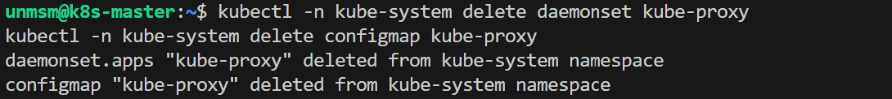
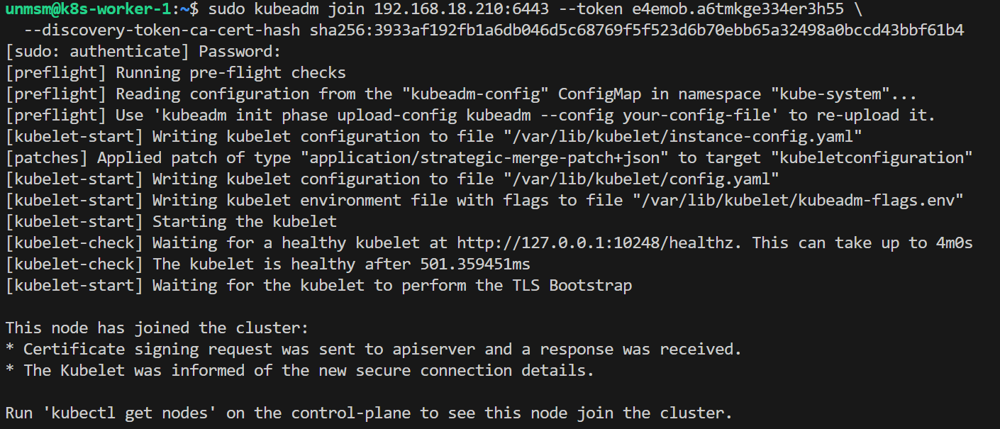
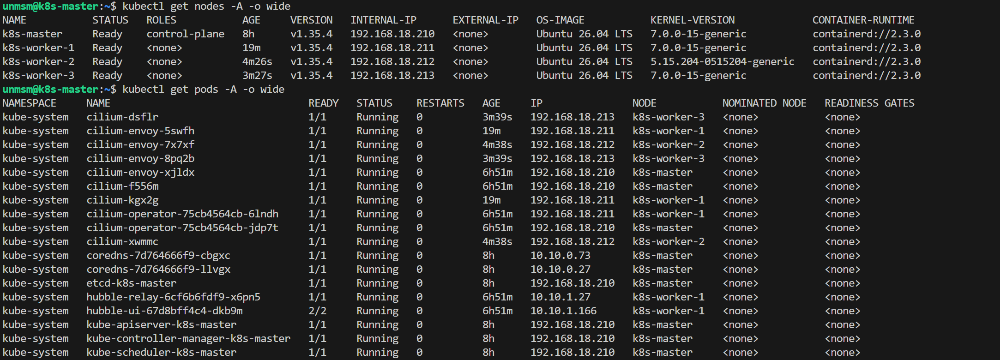

# 06 — Worker Join

This section removes kube-proxy from the cluster and joins the three worker nodes using the `kubeadm join` command generated during cluster initialization.

> ⚠️ **Step 2 (Remove kube-proxy) runs on k8s-master. Steps 3 and 4 run on worker nodes only.**

---

## Prerequisites

- [ ] Completed [05 — Cilium](../05-cilium/README.md)
- [ ] SSH access to k8s-master and all three worker nodes
- [ ] The `kubeadm join` command saved from Step 3 of [04 — Cluster Init](../04-cluster-init/README.md)

---

## Node Reference

| Node | IP | Role |
|---|---|---|
| k8s-worker-1 | 192.168.18.211 | Worker — general workloads |
| k8s-worker-2 | 192.168.18.212 | Worker — UPF and UERANSIM (kernel 5.15) |
| k8s-worker-3 | 192.168.18.213 | Worker — observability workloads |

---

## Step 1 — Connect to k8s-master

```bash
ssh unmsm@192.168.18.210
```

---

## Step 2 — Remove kube-proxy

> ⚠️ **Run on k8s-master only.**

Cilium is configured with `kubeProxyReplacement=true`, which means Cilium handles all service routing via eBPF. kube-proxy is deployed by kubeadm by default but serves no function in this configuration. Removing it before joining workers ensures it is never deployed on any node.

```bash
kubectl -n kube-system delete daemonset kube-proxy
kubectl -n kube-system delete configmap kube-proxy
```


<sub>Figure 1. kube-proxy DaemonSet and ConfigMap deleted. kube-proxy will not be deployed on any node going forward.</sub>
<br><br>

> **Note:** This can also be avoided at initialization time by passing `--skip-phases=addon/kube-proxy` to `kubeadm init`. Both approaches produce the same result.

---

## Step 3 — Join Each Worker Node

> ⚠️ **Worker nodes only — k8s-worker-1, k8s-worker-2, k8s-worker-3.**

SSH into each worker node and run the join command with `sudo`. Replace the token and hash with the values from your environment:

```bash
ssh operator1@192.168.18.211
```

```bash
sudo kubeadm join 192.168.18.210:6443 \
  --token <token> \
  --discovery-token-ca-cert-hash sha256:<hash>
```


<sub>Figure 2. kubeadm join output. The node registers with the control plane and kubelet starts.</sub>
<br><br>

> **Note:** If the token has expired (tokens expire after 24 hours), generate a new one on k8s-master with `kubeadm token create --print-join-command`.

Repeat for k8s-worker-2 (192.168.18.212) and k8s-worker-3 (192.168.18.213).

---

## Step 4 — Verify from k8s-master

After all three workers have joined, verify the cluster state from k8s-master.

```bash
ssh unmsm@192.168.18.210
kubectl get nodes -o wide
kubectl get pods -A -o wide
```


<sub>Figure 3. All four nodes Ready and all pods Running after workers join.</sub>
<br><br>

- **All nodes Ready** — Cilium DaemonSet deploys its agent on each worker automatically after join.
- **cilium, cilium-envoy Running on every node** — one agent and one Envoy proxy per node as DaemonSets. The agent handles eBPF-based routing and L3/L4 policy. The Envoy proxy handles L7 traffic inspection, only traffic matching L7 policies is redirected to it; all other traffic stays on the eBPF fast path.
- **kube-proxy absent** — confirmed removed from all nodes.
- **Workers show no Role** — standard kubeadm behaviour. Worker nodes do not receive a role label by default.

---

## References

- \[1\] Cilium Documentation, "Kubernetes Without kube-proxy."
      https://docs.cilium.io/en/stable/network/kubernetes/kubeproxy-free/ [Accessed: May 2026]
- \[2\] Kubernetes Documentation, "Creating a cluster with kubeadm."
      https://kubernetes.io/docs/setup/production-environment/tools/kubeadm/create-cluster-kubeadm/ [Accessed: May 2026]

---

✅ You are here: `chapter-03-kubernetes-setup / 06-worker-join`

⏭️ Next: [07 — Multus →](../07-multus/README.md)
