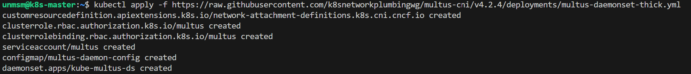
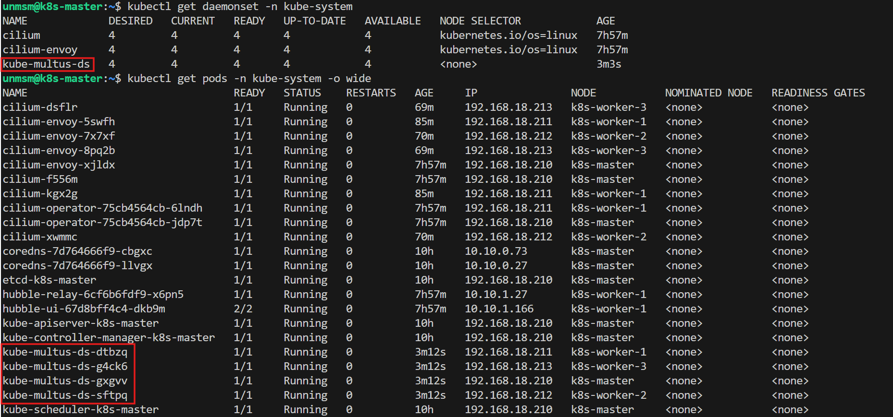
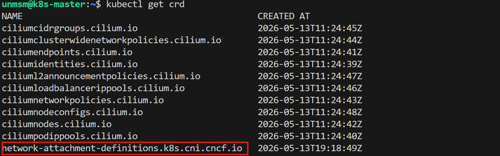

# 07 — Multus

This section installs Multus CNI as a meta-plugin on top of Cilium. Per the official Multus documentation, it is "a CNI plugin that can call multiple other CNI plugins." Each additional interface is defined by a `NetworkAttachmentDefinition` (NAD) resource. When a pod is created with NAD annotations, Multus calls the appropriate CNI plugin to configure each secondary interface.

In this testbed, Cilium remains the primary CNI for all pod networking. Multus adds dedicated secondary interfaces for 5G network planes on free5GC NF pods. These secondary interfaces operate via ipvlan outside Cilium's eBPF datapath.

> ⚠️ **Run this section on k8s-master only.**

---

## Prerequisites

- [ ] Completed [06 — Worker Join](../06-worker-join/README.md)
- [ ] All four nodes Ready
- [ ] SSH access to k8s-master

---

## Network Plane Mapping

| Interface | Plane | Used by |
|---|---|---|
| eth0 | SBI (primary CNI, Cilium) | All NFs, Hubble observability |
| n2 (future) | NGAP | AMF |
| n3 (future) | GTP-U | UPF, UERANSIM |
| n4 (future) | PFCP | SMF, UPF, PFCP monitor pod |
| n6 (future) | Data network (DN) | UPF |
| n9 (future) | Inter-UPF GTP-U (ULCL mode) | BranchingUPF, AnchorUPF |

---

## Component Version

| Component | Version |
|---|---|
| Multus CNI | 4.2.4 (thick plugin) |

---

## Step 1 — Connect to k8s-master

```bash
ssh unmsm@192.168.18.210
```

---

## Step 2 — Install Multus

Apply the official thick plugin manifest from the v4.2.4 release tag. Using a pinned release tag ensures reproducibility.

```bash
kubectl apply -f https://raw.githubusercontent.com/k8snetworkplumbingwg/multus-cni/v4.2.4/deployments/multus-daemonset-thick.yml
```


<sub>Figure 1. Multus 4.2.4 resources created — DaemonSet, ClusterRole, ClusterRoleBinding, ServiceAccount, and CRD.</sub>
<br><br>

---

## Step 3 — Verify Multus DaemonSet

```bash
kubectl get daemonset -n kube-system
kubectl get pods -n kube-system -o wide
```


<sub>Figure 2. kube-multus-ds DaemonSet running with one pod per node alongside Cilium DaemonSets. All four kube-multus-ds pods must show Running before proceeding.</sub>
<br><br>

---

## Step 4 — Verify NetworkAttachmentDefinition CRD

```bash
kubectl get crd
```


<sub>Figure 3. network-attachment-definitions.k8s.cni.cncf.io CRD registered alongside Cilium CRDs. NAD resources are created in later chapters to define the 5G network interfaces.</sub>
<br><br>

---

## References

- \[1\] Multus CNI Project, "README."
      https://github.com/k8snetworkplumbingwg/multus-cni [Accessed: May 2026]

---

✅ You are here: `chapter-03-kubernetes-setup / 07-multus`

⏭️ Next: [08 — Storage →](../08-storage/README.md)
