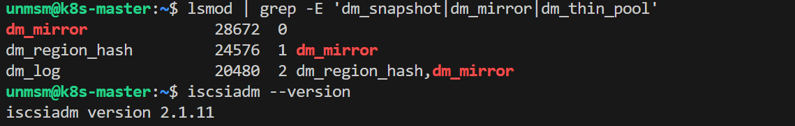
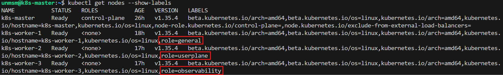
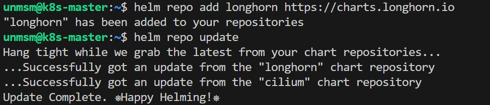
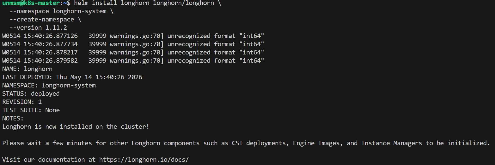
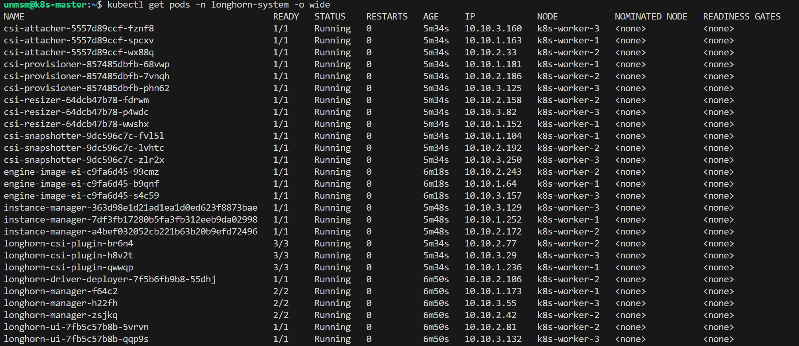
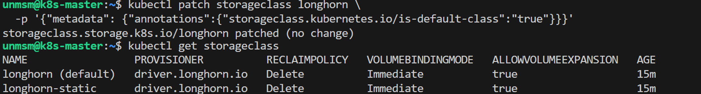

# 08 — Cluster Storage

This section installs Longhorn as the persistent block storage provisioner for the cluster and labels the worker nodes for workload placement. Several components in this testbed require persistent storage: MongoDB for free5GC subscriber data, Prometheus for time-series metrics, Loki for structured logs, and Grafana for custom dashboards. Longhorn is a CNCF Incubating project that implements the Kubernetes CSI to provide distributed block storage. Once installed, PVCs requested by Helm charts are provisioned automatically with no manual PersistentVolume creation required.

> ⚠️ **Run this section on k8s-master only.**

---

## Prerequisites

- [ ] Completed [07 — Multus](../07-multus/README.md)
- [ ] All four nodes Ready
- [ ] SSH access to k8s-master

---

## PVC Requirements

| Component | Chapter | PVC | Size | Node |
|---|---|---|---|---|
| MongoDB (free5GC) | 5 | 1 PVC | 6Gi | k8s-worker-1 |
| Prometheus | 4 | 1 PVC | 20Gi | k8s-worker-3 |
| Grafana | 4 | 1 PVC | 2Gi | k8s-worker-3 |
| Loki | 4 | 1 PVC | 10Gi | k8s-worker-3 |
| Alertmanager | 4 | 1 PVC | 2Gi | k8s-worker-3 |

---

## Node Roles

| Node | Label | Workloads |
|---|---|---|
| k8s-worker-1 | role=general | free5GC control plane NFs, MongoDB |
| k8s-worker-2 | role=userplane | UPF, UERANSIM (kernel 5.15) |
| k8s-worker-3 | role=observability | Prometheus, Grafana, Loki, Hubble UI, Ingress |

---

## Step 1 — Connect to k8s-master

```bash
ssh unmsm@192.168.18.210
```

---

## Step 2 — Verify Kernel and Package Requirements

Longhorn requires the following kernel modules and userspace tools on every node. Run this on each node before proceeding:

```bash
lsmod | grep -E 'dm_snapshot|dm_mirror|dm_thin_pool'
iscsiadm --version
```


<br><sub>Figure 1. Kernel modules and open-iscsi confirmed present. Repeat on all four nodes before installing Longhorn. Ubuntu 26.04 ships with all requirements by default.</sub>
<br><br>

---

## Step 3 — Label Worker Nodes

```bash
kubectl label node k8s-worker-1 role=general
kubectl label node k8s-worker-2 role=userplane
kubectl label node k8s-worker-3 role=observability
```

```bash
kubectl get nodes --show-labels
```


<br><sub>Figure 2. Worker nodes labeled with their roles.</sub>
<br><br>

---

## Step 4 — Add Longhorn Helm Repository

```bash
helm repo add longhorn https://charts.longhorn.io
helm repo update
```


<br><sub>Figure 3. Longhorn Helm repository added and updated.</sub>
<br><br>

---

## Step 5 — Install Longhorn

```bash
helm install longhorn longhorn/longhorn \
  --namespace longhorn-system \
  --create-namespace \
  --version 1.11.2
```


<br><sub>Figure 4. Longhorn 1.11.2 installed. The warnings about unrecognized format "int64" are a known Helm 3.17 schema validation issue with the Longhorn chart and do not affect the installation.</sub>
<br><br>

---

## Step 6 — Verify

```bash
kubectl get pods -n longhorn-system
```


<br><sub>Figure 5. All Longhorn pods Running. The CSI sidecars (csi-attacher, csi-provisioner, csi-resizer, csi-snapshotter) deploy with 3 replicas each using leader election for high availability.</sub>
<br><br>

```bash
kubectl get storageclass
```


<br><sub>Figure 6. Longhorn StorageClass showing as default. Any PVC without an explicit storageClassName will use Longhorn automatically.</sub>
<br><br>

---

## References

- \[1\] Longhorn Documentation, "Installation with Helm."
      https://longhorn.io/docs/1.11.2/deploy/install/install-with-helm/ [Accessed: May 2026]
- \[2\] CNCF, "Longhorn Project."
      https://www.cncf.io/projects/longhorn/ [Accessed: May 2026]

---

✅ You are here: `chapter-03-kubernetes-setup / 08-cluster-storage`

⏭️ Next: [09 — Ingress →](../09-ingress/README.md)
