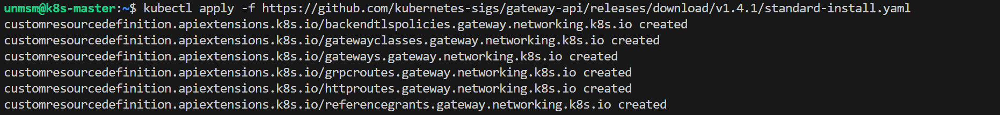
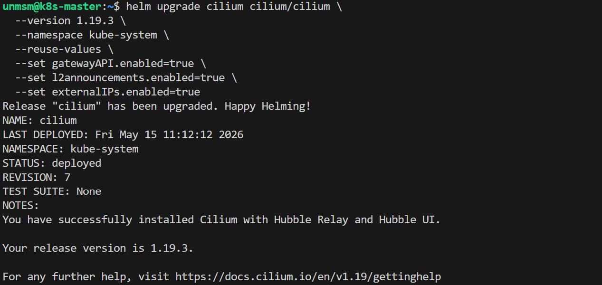
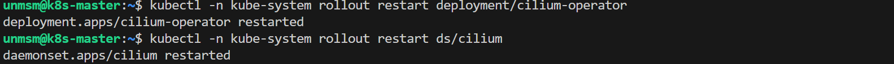
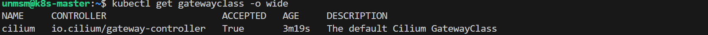
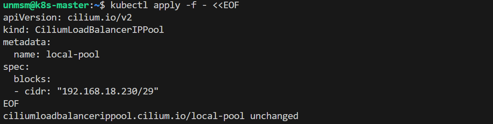
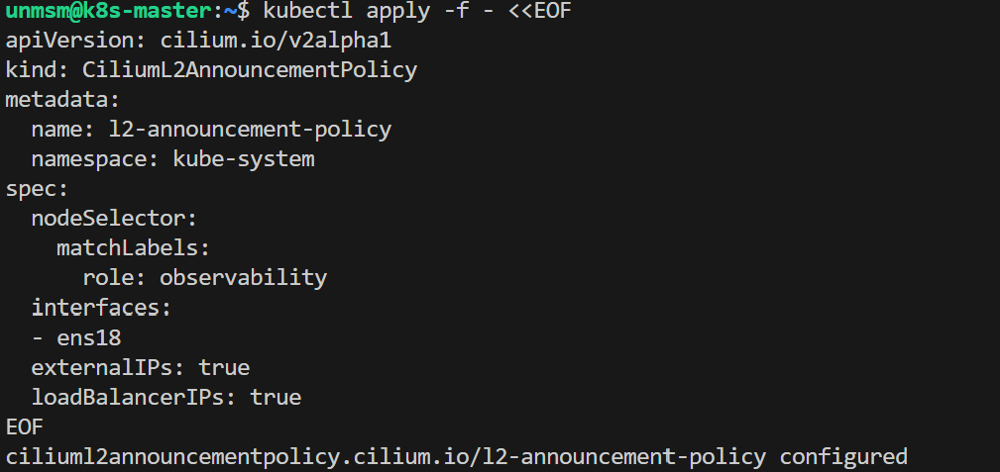
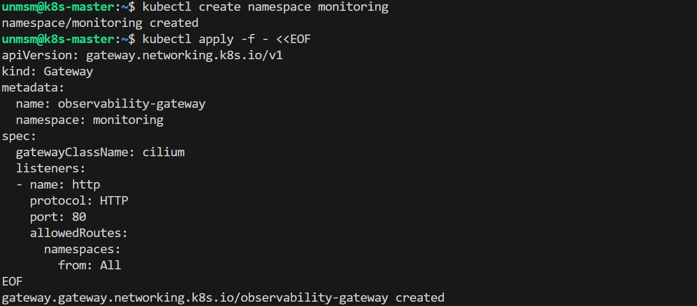
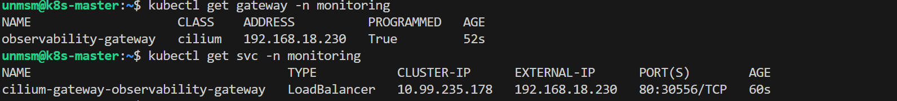
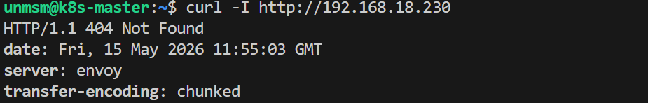

# 09 — Gateway API

This section enables the Kubernetes Gateway API on the cluster using Cilium's built-in controller. Gateway API is the official Kubernetes SIG Network successor to the Ingress API. It centralizes access to all observability and management UIs under a single dedicated IP on the local network.

> ⚠️ **Run this section on k8s-master only.**

---

## Prerequisites

- [ ] Completed [08 — Cluster Storage](../08-cluster-storage/README.md)
- [ ] All four nodes Ready
- [ ] SSH access to k8s-master

---

## Access Layout

| UI | Path | Chapter |
|---|---|---|
| Grafana | /grafana | 4 |
| Prometheus | /prometheus | 4 |
| Hubble UI | /hubble | 4 |
| Longhorn | /longhorn | 3 |
| free5GC WebUI | /free5gc | 5 |

---

## Gateway IP Address

| Parameter | Value |
|---|---|
| Gateway IP | 192.168.18.230 |
| Access URL | http://192.168.18.230/\<path\> |
| DHCP pool end | 192.168.18.220 |

---

## Step 1 — Connect to k8s-master

```bash
ssh unmsm@192.168.18.210
```

---

## Step 2 — Install Gateway API CRDs

Cilium 1.19 passes Gateway API v1.4.0 conformance. v1.4.1 is used here as the latest patch release of that series.

```bash
kubectl apply -f https://github.com/kubernetes-sigs/gateway-api/releases/download/v1.4.1/standard-install.yaml
```


<sub>Figure 1. Gateway API v1.4.1 CRDs installed.</sub>
<br><br>

---

## Step 3 — Upgrade Cilium with Gateway API and L2 Announcements

```bash
helm upgrade cilium cilium/cilium \
  --version 1.19.3 \
  --namespace kube-system \
  --reuse-values \
  --set gatewayAPI.enabled=true \
  --set l2announcements.enabled=true \
  --set externalIPs.enabled=true
```


<sub>Figure 2. Cilium upgraded with Gateway API and L2 Announcements enabled.</sub>
<br><br>

| Flag | Component | Purpose |
|---|---|---|
| `gatewayAPI.enabled=true` | Operator + Agent | Operator validates and translates Gateway and HTTPRoute resources into CiliumEnvoyConfig. Agent configures Envoy on each node |
| `l2announcements.enabled=true` | Agent | Lease-based leader election per service IP. Winning node sends ARP replies for LoadBalancer IPs on the local network |
| `externalIPs.enabled=true` | Agent | Required alongside L2 Announcements. Load-balances traffic arriving at ExternalIP addresses on the node |

Restart Cilium to apply the new configuration:

```bash
kubectl rollout restart deployment/cilium-operator -n kube-system
kubectl rollout restart ds/cilium -n kube-system
```


<sub>Figure 3. Cilium operator and DaemonSet restarted.</sub>
<br><br>

---

## Step 4 — Verify GatewayClass

```bash
kubectl get gatewayclass
```


<sub>Figure 4. Cilium GatewayClass registered and Accepted.</sub>
<br><br>

---

## Step 5 — Create IP Pool

```bash
kubectl apply -f - <<EOF
apiVersion: cilium.io/v2
kind: CiliumLoadBalancerIPPool
metadata:
  name: local-pool
spec:
  blocks:
  - cidr: "192.168.18.230/32"
EOF
```


<sub>Figure 5. IP pool created. 192.168.18.230 is reserved for the Gateway and outside the router DHCP pool.</sub>
<br><br>

---

## Step 6 — Create L2 Announcement Policy

Verify the primary network interface name on the nodes before applying:

```bash
ip -br link show | grep -v lo
```

In this testbed all nodes use `ens18`. Common alternatives are `eth0` or `enp1s0`.

```bash
kubectl apply -f - <<EOF
apiVersion: cilium.io/v2alpha1
kind: CiliumL2AnnouncementPolicy
metadata:
  name: l2-announcement-policy
  namespace: kube-system
spec:
  nodeSelector:
    matchLabels:
      role: observability
  interfaces:
  - ens18
  externalIPs: true
  loadBalancerIPs: true
EOF
```


<sub>Figure 6. L2 Announcement Policy created. k8s-worker-3 will send ARP replies for 192.168.18.230 on the ens18 interface.</sub>
<br><br>

---

## Step 7 — Create the Observability Gateway

```bash
kubectl create namespace monitoring
```

```bash
kubectl apply -f - <<EOF
apiVersion: gateway.networking.k8s.io/v1
kind: Gateway
metadata:
  name: observability-gateway
  namespace: monitoring
spec:
  gatewayClassName: cilium
  listeners:
  - name: http
    protocol: HTTP
    port: 80
    allowedRoutes:
      namespaces:
        from: All
EOF
```


<sub>Figure 7. monitoring namespace and observability-gateway created.</sub>
<br><br>

---

## Step 8 — Verify

```bash
kubectl get gateway -n monitoring
kubectl get svc -n monitoring
```


<sub>Figure 8. Gateway PROGRAMMED: True with address 192.168.18.230.</sub>
<br><br>

```bash
curl -I http://192.168.18.230
```


<sub>Figure 9. curl returns HTTP 404 from Envoy. The Gateway is operational. HTTPRoutes for each UI are configured in their respective chapters.</sub>
<br><br>

| Check | Expected |
|---|---|
| Gateway PROGRAMMED | True |
| Gateway ADDRESS | 192.168.18.230 |
| Service EXTERNAL-IP | 192.168.18.230 |
| curl response | 404 from Envoy (no routes yet) |
| ping | No response. Cilium handles TCP/UDP only. ICMP is not forwarded by design |

> **Note:** HTTPRoutes for each UI are created in their respective chapters once each service is deployed.

---

## References

- \[1\] Cilium Documentation, "Gateway API Support."
      https://docs.cilium.io/en/v1.19/network/servicemesh/gateway-api/gateway-api/ [Accessed: May 2026]
- \[2\] Cilium Documentation, "LB-IPAM."
      https://docs.cilium.io/en/v1.19/network/lb-ipam/ [Accessed: May 2026]
- \[3\] Cilium Documentation, "L2 Announcements."
      https://docs.cilium.io/en/v1.19/network/l2-announcements/ [Accessed: May 2026]
- \[4\] Kubernetes SIG Network, "Gateway API."
      https://gateway-api.sigs.k8s.io/ [Accessed: May 2026]

---

✅ You are here: `chapter-03-kubernetes-setup / 09-gateway-api`

⏭️ Next Chapter: [Chapter 4 — Observability Stack → 01 Prometheus and Grafana](../../chapter-04-observability/01-prometheus-grafana/README.md)
