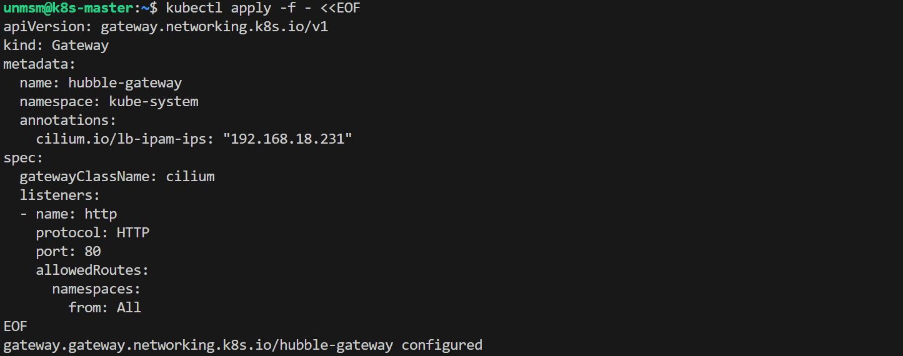
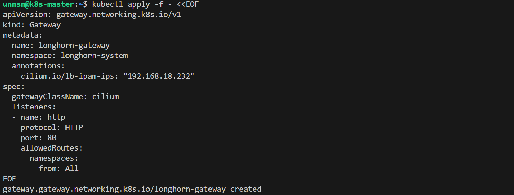
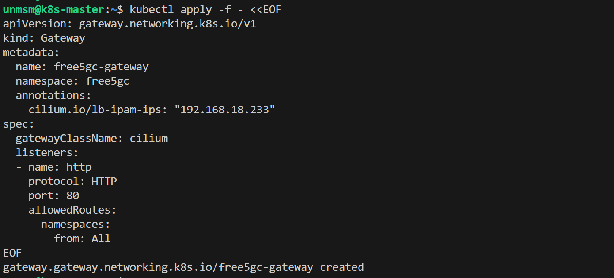

# 09 — Gateway API

This section enables the Kubernetes Gateway API on the cluster using Cilium's built-in controller. Gateway API is the official Kubernetes SIG Network successor to the Ingress API. It centralizes access to all observability and management UIs under a single dedicated IP on the local network.

> ⚠️ **Run this section on k8s-master only.**

---

## Prerequisites

- [ ] Completed [08 — Cluster Storage](../08-cluster-storage/README.md)
- [ ] All four nodes Ready
- [ ] SSH access to k8s-master

---

## Access Layout

Three Gateways are deployed. The observability-gateway handles path-based routing for all tools. Hubble UI and Longhorn UI are React SPAs that require serving from the root path, so each gets a dedicated IP.

| UI | URL | Chapter |
|---|---|---|
| Grafana | http://192.168.18.230/grafana | 4 |
| Prometheus | http://192.168.18.230/prometheus | 4 |
| Hubble UI | http://192.168.18.231 | 4 |
| Longhorn UI | http://192.168.18.232 | 4 |
| free5GC WebUI | http://192.168.18.233 | 5 |

---

## IP Pool

| Gateway | IP | Namespace |
|---|---|---|
| observability-gateway | 192.168.18.230 | monitoring |
| hubble-gateway | 192.168.18.231 | kube-system |
| longhorn-gateway | 192.168.18.232 | longhorn-system |
| free5gc-gateway | 192.168.18.233 | free5gc |
| available | 192.168.18.234 to .237 | |

---

## Step 1 — Connect to k8s-master

```bash
ssh unmsm@192.168.18.210
```

---

## Step 2 — Install Gateway API CRDs

Cilium 1.19 passes Gateway API v1.4.0 conformance. v1.4.1 is used here as the latest patch release of that series.

```bash
kubectl apply -f https://github.com/kubernetes-sigs/gateway-api/releases/download/v1.4.1/standard-install.yaml
```


<sub>Figure 1. Gateway API v1.4.1 CRDs installed.</sub>
<br><br>

---


## Step 3 — Verify GatewayClass

```bash
kubectl get gatewayclass -o wide
```


<sub>Figure 2. Cilium GatewayClass registered and Accepted.</sub>
<br><br>

---

## Step 4 — Create IP Pool

The pool reserves IPs from 192.168.18.230 to 192.168.18.237 for Gateway services.

```bash
kubectl apply -f - <<EOF
apiVersion: cilium.io/v2
kind: CiliumLoadBalancerIPPool
metadata:
  name: local-pool
spec:
  blocks:
  - start: "192.168.18.230"
    stop: "192.168.18.237"
EOF
```


<sub>Figure 3. IP pool created. IPs 192.168.18.230 to .237 are reserved for Gateway services.</sub>
<br><br>

---

## Step 5 — Create L2 Announcement Policy

Verify the primary network interface name on the nodes before applying:

```bash
ip -br link show | grep -v lo
```

In this testbed all nodes use `ens18`. Common alternatives are `eth0` or `enp1s0`.

```bash
kubectl apply -f - <<EOF
apiVersion: cilium.io/v2alpha1
kind: CiliumL2AnnouncementPolicy
metadata:
  name: l2-announcement-policy
  namespace: kube-system
spec:
  nodeSelector:
    matchLabels:
      role: observability
  interfaces:
  - ens18
  externalIPs: true
  loadBalancerIPs: true
EOF
```


<sub>Figure 4. L2 Announcement Policy created. k8s-worker-3 will send ARP replies for all LoadBalancer IPs in the pool on the ens18 interface.</sub>
<br><br>

---

## Step 6 — Create the Observability Gateway

```bash
kubectl create namespace monitoring
```

```bash
kubectl apply -f - <<EOF
apiVersion: gateway.networking.k8s.io/v1
kind: Gateway
metadata:
  name: observability-gateway
  namespace: monitoring
  annotations:
    cilium.io/lb-ipam-ips: "192.168.18.230"
spec:
  gatewayClassName: cilium
  listeners:
  - name: http
    protocol: HTTP
    port: 80
    allowedRoutes:
      namespaces:
        from: All
EOF
```


<sub>Figure 5. monitoring namespace and observability-gateway created with address 192.168.18.230.</sub>
<br><br>

---

## Step 7 — Create the Hubble Gateway

Hubble UI requires serving from the root path. A dedicated Gateway is created in the kube-system namespace so it receives its own IP and HTTPRoutes can target it from `/`.

```bash
kubectl apply -f - <<EOF
apiVersion: gateway.networking.k8s.io/v1
kind: Gateway
metadata:
  name: hubble-gateway
  namespace: kube-system
  annotations:
    cilium.io/lb-ipam-ips: "192.168.18.231"
spec:
  gatewayClassName: cilium
  listeners:
  - name: http
    protocol: HTTP
    port: 80
    allowedRoutes:
      namespaces:
        from: All
EOF
```


<sub>Figure 6. hubble-gateway created with address 192.168.18.231.</sub>
<br><br>

---

## Step 8 — Create the Longhorn Gateway

Longhorn UI also requires serving from the root path for the same reason as Hubble UI.

```bash
kubectl apply -f - <<EOF
apiVersion: gateway.networking.k8s.io/v1
kind: Gateway
metadata:
  name: longhorn-gateway
  namespace: longhorn-system
  annotations:
    cilium.io/lb-ipam-ips: "192.168.18.232"
spec:
  gatewayClassName: cilium
  listeners:
  - name: http
    protocol: HTTP
    port: 80
    allowedRoutes:
      namespaces:
        from: All
EOF
```


<sub>Figure 7. longhorn-gateway created with address 192.168.18.232.</sub>
<br><br>

---

## Step 9 — Create the free5GC Gateway

free5GC WebUI is a React SPA that requires serving from the root path.
A dedicated Gateway is created in the free5gc namespace so it receives
its own IP.

```bash
kubectl apply -f - <<EOF
apiVersion: gateway.networking.k8s.io/v1
kind: Gateway
metadata:
  name: free5gc-gateway
  namespace: free5gc
  annotations:
    cilium.io/lb-ipam-ips: "192.168.18.233"
spec:
  gatewayClassName: cilium
  listeners:
  - name: http
    protocol: HTTP
    port: 80
    allowedRoutes:
      namespaces:
        from: All
EOF
```


<sub>Figure 8. free5gc-gateway created with address 192.168.18.233.</sub>
<br><br>

---

## Step 10 — Verify

```bash
kubectl get gateway -A
kubectl get svc -A | grep cilium-gateway
```


<sub>Figure 9. All four Gateways PROGRAMMED: True with their assigned IPs.</sub>
<br><br>

```bash
curl -I http://192.168.18.230
curl -I http://192.168.18.231
curl -I http://192.168.18.232
curl -I http://192.168.18.233
```


<sub>Figure 10. observability-gateway returns 404 at root path as expected. hubble-gateway and longhorn-gateway return 200 serving their respective UIs.</sub>
<br><br>

| Check | Expected |
|---|---|
| observability-gateway ADDRESS | 192.168.18.230 |
| hubble-gateway ADDRESS | 192.168.18.231 |
| longhorn-gateway ADDRESS | 192.168.18.232 |
| curl 192.168.18.230 | 404 — root path has no route |
| curl 192.168.18.231 | 200 — Hubble UI |
| curl 192.168.18.232 | 200 — Longhorn UI |
| ping | No response. Cilium LB handles TCP/UDP only |

> **Note:** HTTPRoutes for each UI are created in their respective chapters once each service is deployed.

---

## References

- \[1\] Cilium Documentation, "Gateway API Support."
      https://docs.cilium.io/en/v1.19/network/servicemesh/gateway-api/gateway-api/ [Accessed: May 2026]
- \[2\] Cilium Documentation, "LB-IPAM."
      https://docs.cilium.io/en/v1.19/network/lb-ipam/ [Accessed: May 2026]
- \[3\] Cilium Documentation, "L2 Announcements."
      https://docs.cilium.io/en/v1.19/network/l2-announcements/ [Accessed: May 2026]
- \[4\] Kubernetes SIG Network, "Gateway API."
      https://gateway-api.sigs.k8s.io/ [Accessed: May 2026]
- \[5\] cilium/hubble, "Hubble baseUrl with Gateway and HTTPRoute."
      https://github.com/cilium/hubble/issues/1704 [Accessed: May 2026]


---

✅ You are here: `chapter-03-kubernetes-setup / 09-gateway-api`

⏭️ Next Chapter: [Chapter 4 — Observability Stack → 01 Prometheus and Grafana](../../chapter-04-observability/01-prometheus-grafana/README.md)
