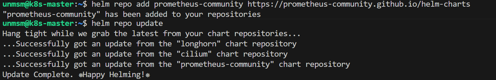
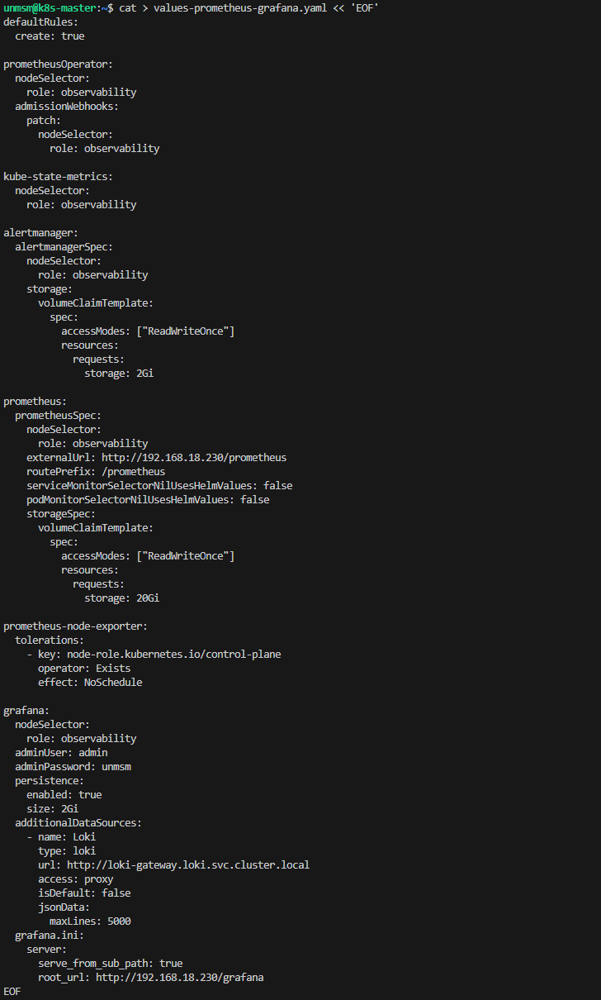
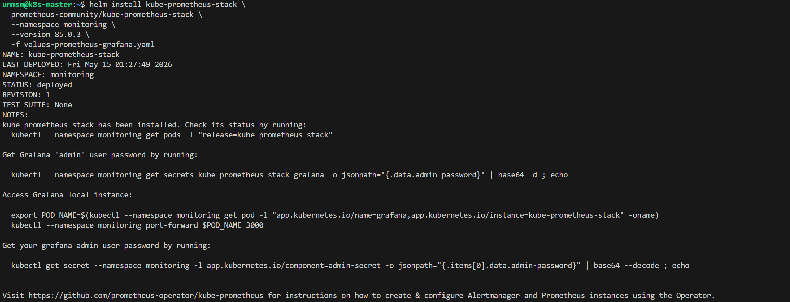
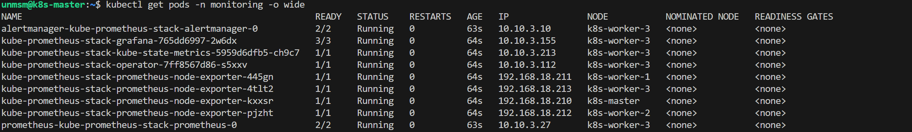
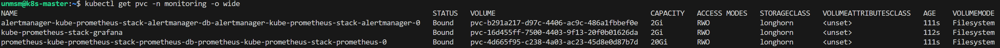
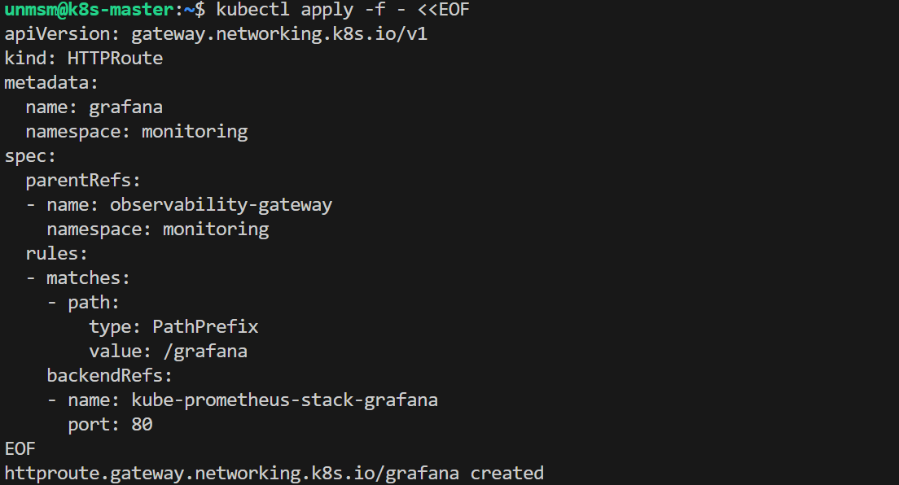
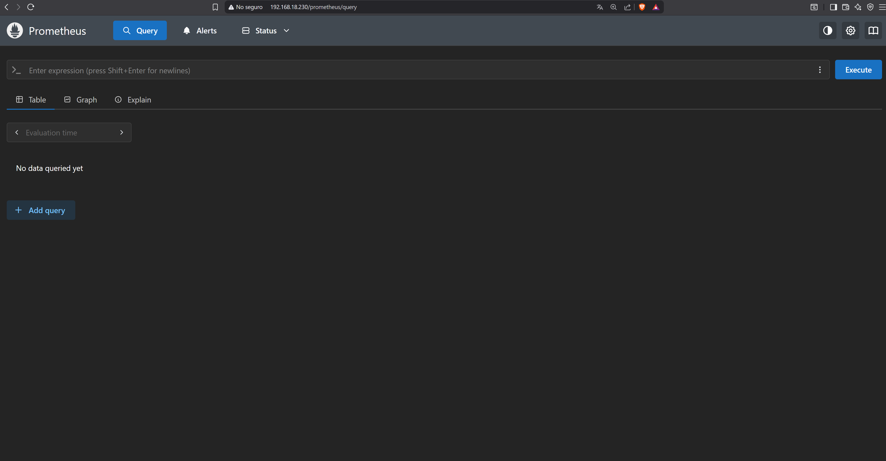
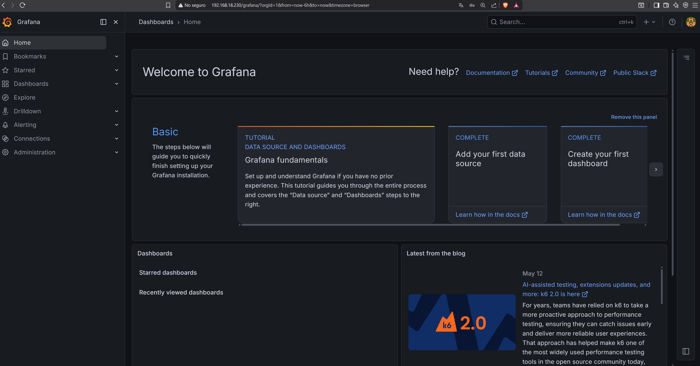

# 01 — Prometheus and Grafana

This section installs kube-prometheus-stack, which bundles Prometheus, Grafana, Alertmanager, node-exporter, and kube-state-metrics into a single Helm release. All components are pinned to k8s-worker-3 via nodeSelector. Persistent storage is provided automatically by Longhorn. The Loki datasource is pre-configured in Grafana via the values file.

> ⚠️ **Run this section on k8s-master only.**

---

## Prerequisites

- [ ] Completed [09 — Gateway API](../../chapter-03-kubernetes-setup/09-gateway-api/README.md)
- [ ] Longhorn StorageClass available as default
- [ ] monitoring namespace exists
- [ ] SSH access to k8s-master

---

## Component Versions

| Component | Chart | Version |
|---|---|---|
| kube-prometheus-stack | prometheus-community/kube-prometheus-stack | 85.0.3 |

---

## Step 1 — Connect to k8s-master

```bash
ssh unmsm@192.168.18.210
```

---

## Step 2 — Add Helm Repository

```bash
helm repo add prometheus-community https://prometheus-community.github.io/helm-charts
helm repo update
```


<sub>Figure 1. prometheus-community Helm repository added and updated.</sub>
<br><br>

---

## Step 3 — Create values file

```bash
cat > values-prometheus-grafana.yaml << 'EOF'
defaultRules:
  create: true

prometheusOperator:
  nodeSelector:
    role: observability
  admissionWebhooks:
    patch:
      nodeSelector:
        role: observability

kube-state-metrics:
  nodeSelector:
    role: observability

alertmanager:
  alertmanagerSpec:
    nodeSelector:
      role: observability
    storage:
      volumeClaimTemplate:
        spec:
          accessModes: ["ReadWriteOnce"]
          resources:
            requests:
              storage: 2Gi

prometheus:
  prometheusSpec:
    nodeSelector:
      role: observability
    externalUrl: http://192.168.18.230/prometheus
    routePrefix: /prometheus
    storageSpec:
      volumeClaimTemplate:
        spec:
          accessModes: ["ReadWriteOnce"]
          resources:
            requests:
              storage: 20Gi

prometheus-node-exporter:
  tolerations:
    - key: node-role.kubernetes.io/control-plane
      operator: Exists
      effect: NoSchedule

grafana:
  nodeSelector:
    role: observability
  adminUser: admin
  adminPassword: unmsm
  persistence:
    enabled: true
    size: 2Gi
  additionalDataSources:
    - name: Loki
      type: loki
      url: http://loki-gateway.loki.svc.cluster.local
      access: proxy
      isDefault: false
      jsonData:
        maxLines: 5000
  grafana.ini:
    server:
      serve_from_sub_path: true
      root_url: http://192.168.18.230/grafana
EOF
```

> **Note:** Replace `192.168.18.230` with the address shown in `kubectl get gateway -n monitoring` if your Gateway IP differs.


<sub>Figure 2. values-prometheus-grafana.yaml created.</sub>
<br><br>

---

## Step 4 — Install kube-prometheus-stack

```bash
helm install kube-prometheus-stack \
  prometheus-community/kube-prometheus-stack \
  --namespace monitoring \
  --version 85.0.3 \
  -f values-prometheus-grafana.yaml
```


<sub>Figure 3. kube-prometheus-stack 85.0.3 installed in the monitoring namespace.</sub>
<br><br>

---

## Step 5 — Verify Pods

```bash
kubectl get pods -n monitoring -o wide
```


<sub>Figure 4. All kube-prometheus-stack pods Running on k8s-worker-3. node-exporter runs on all four nodes including k8s-master.</sub>
<br><br>

---

## Step 6 — Verify PVCs

```bash
kubectl get pvc -n monitoring
```


<sub>Figure 5. Prometheus (20Gi), Grafana (2Gi), and Alertmanager (2Gi) PVCs bound via Longhorn automatically.</sub>
<br><br>

---

## Step 7 — Create Prometheus HTTPRoute

```bash
kubectl apply -f - <<EOF
apiVersion: gateway.networking.k8s.io/v1
kind: HTTPRoute
metadata:
  name: prometheus
  namespace: monitoring
spec:
  parentRefs:
  - name: observability-gateway
    namespace: monitoring
  rules:
  - matches:
    - path:
        type: PathPrefix
        value: /prometheus
    backendRefs:
    - name: kube-prometheus-stack-prometheus
      port: 9090
EOF
```


<sub>Figure 6. Prometheus HTTPRoute created.</sub>
<br><br>

---

## Step 8 — Create Grafana HTTPRoute

```bash
kubectl apply -f - <<EOF
apiVersion: gateway.networking.k8s.io/v1
kind: HTTPRoute
metadata:
  name: grafana
  namespace: monitoring
spec:
  parentRefs:
  - name: observability-gateway
    namespace: monitoring
  rules:
  - matches:
    - path:
        type: PathPrefix
        value: /grafana
    backendRefs:
    - name: kube-prometheus-stack-grafana
      port: 80
EOF
```


<sub>Figure 7. Grafana HTTPRoute created.</sub>
<br><br>

---

## Step 9 — Verify

Access Prometheus from your browser. No login required.

```
http://192.168.18.230/prometheus
```


<sub>Figure 8. Prometheus UI accessible at http://192.168.18.230/prometheus.</sub>
<br><br>

Access Grafana from your browser. Login with `admin` / `unmsm`.

```
http://192.168.18.230/grafana
```


<sub>Figure 9. Grafana UI accessible at http://192.168.18.230/grafana. The Loki datasource is pre-configured and becomes active once Loki is deployed in the next section.</sub>
<br><br>

---

## References

- \[1\] Prometheus Community, "kube-prometheus-stack."
      https://github.com/prometheus-community/helm-charts/tree/main/charts/kube-prometheus-stack [Accessed: May 2026]

---

✅ You are here: `chapter-04-observability / 01-prometheus-grafana`

⏭️ Next: [02 — Loki and Grafana Alloy →](../02-loki-alloy/README.md)
