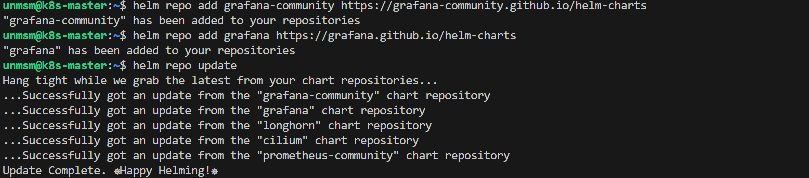
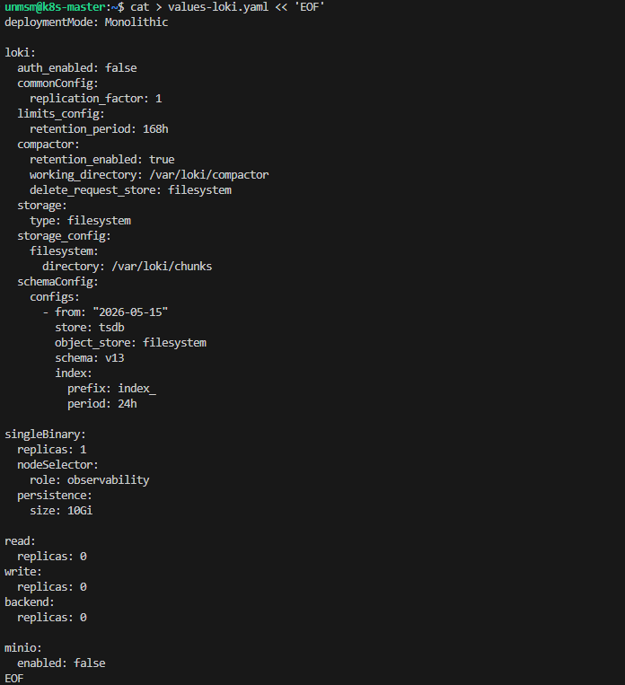
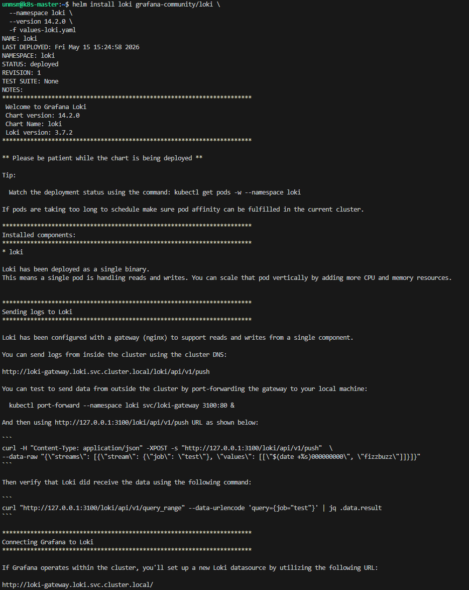
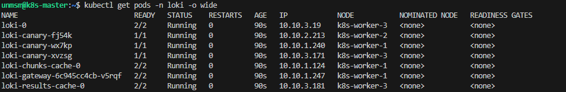
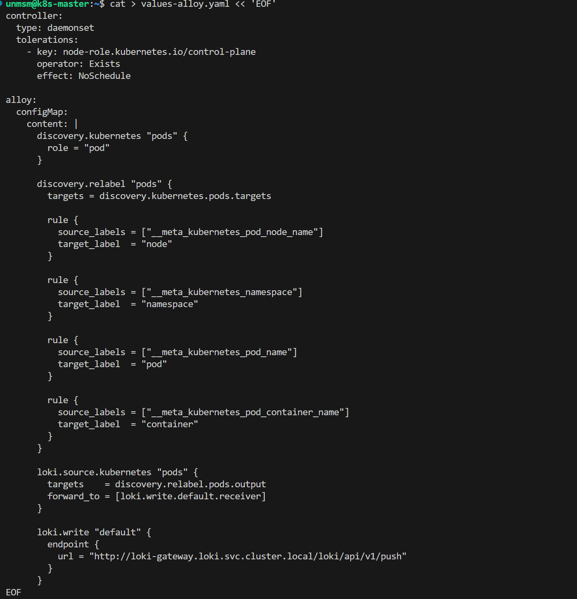
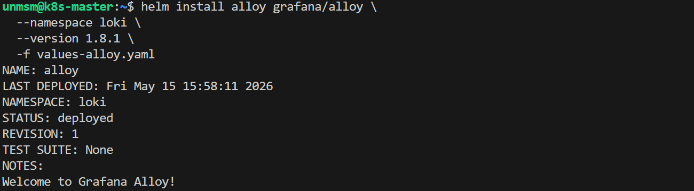
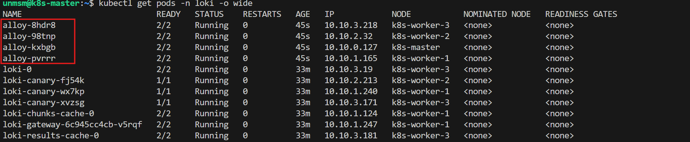
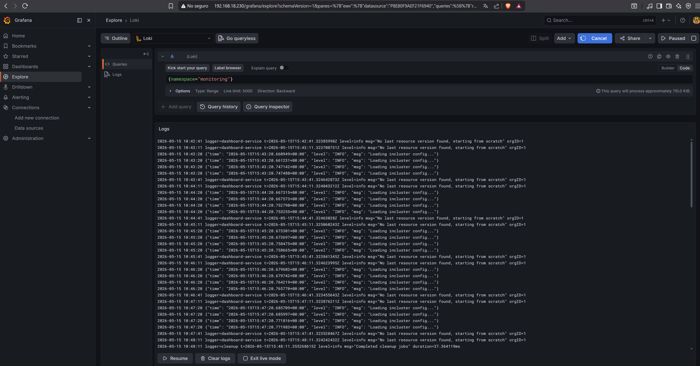

# 02 — Loki and Grafana Alloy

This section installs Grafana Loki as the log storage backend and Grafana Alloy as the log collection agent. Loki stores logs from all cluster workloads. Alloy runs as a DaemonSet on every node and tails container logs via the Kubernetes API, forwarding them to Loki. Logs are queried in Grafana via the Loki datasource pre-configured in section 01.

> ⚠️ **Run this section on k8s-master only.**

---

## Prerequisites

- [ ] Completed [01 — Prometheus and Grafana](../01-prometheus-grafana/README.md)
- [ ] SSH access to k8s-master

---

## Component Versions

| Component | Chart | Version | App Version |
|---|---|---|---|
| Loki | grafana-community/loki | 14.2.0 | 3.7.2 |
| Grafana Alloy | grafana/alloy | 1.8.1 | v1.16.1 |

---

## Step 1 — Connect to k8s-master

```bash
ssh unmsm@192.168.18.210
```

---

## Step 2 — Add Helm Repositories

```bash
helm repo add grafana-community https://grafana-community.github.io/helm-charts
helm repo add grafana https://grafana.github.io/helm-charts
helm repo update
```


<sub>Figure 1. grafana-community and grafana Helm repositories added and updated.</sub>
<br><br>

---

## Step 3 — Create loki namespace and values file

```bash
kubectl create namespace loki
```

```bash
cat > values-loki.yaml << 'EOF'
deploymentMode: Monolithic

loki:
  auth_enabled: false
  commonConfig:
    replication_factor: 1
  limits_config:
    retention_period: 168h
  compactor:
    retention_enabled: true
    working_directory: /var/loki/compactor
    delete_request_store: filesystem
  storage:
    type: filesystem
  storage_config:
    filesystem:
      directory: /var/loki/chunks
  schemaConfig:
    configs:
      - from: "2026-05-15"
        store: tsdb
        object_store: filesystem
        schema: v13
        index:
          prefix: index_
          period: 24h

singleBinary:
  replicas: 1
  nodeSelector:
    role: observability
  persistence:
    size: 10Gi

read:
  replicas: 0
write:
  replicas: 0
backend:
  replicas: 0

minio:
  enabled: false
EOF
```


<sub>Figure 2. values-loki.yaml created. Loki runs in Monolithic mode on k8s-worker-3 with a 10Gi PVC, filesystem storage, and 7-day log retention.</sub>
<br><br>

---

## Step 4 — Install Loki

```bash
helm install loki grafana-community/loki \
  --namespace loki \
  --version 14.2.0 \
  -f values-loki.yaml
```


<sub>Figure 3. Loki 3.7.2 installed in the loki namespace.</sub>
<br><br>

Wait for all Loki pods to be Running:

```bash
kubectl get pods -n loki -o wide
```


<sub>Figure 4. loki-0 Running on k8s-worker-3. loki-canary pods run on all worker nodes and verify Loki health by sending synthetic log entries periodically.</sub>
<br><br>

---

## Step 5 — Create Alloy values file

Alloy discovers all pods in the cluster via the Kubernetes API and forwards their logs to Loki with namespace, pod, container, and node labels. Each container in a pod is collected separately and identifiable by the container label.

```bash
cat > values-alloy.yaml << 'EOF'
controller:
  type: daemonset
  tolerations:
    - key: node-role.kubernetes.io/control-plane
      operator: Exists
      effect: NoSchedule

alloy:
  configMap:
    content: |
      discovery.kubernetes "pods" {
        role = "pod"
      }

      discovery.relabel "pods" {
        targets = discovery.kubernetes.pods.targets

        rule {
          source_labels = ["__meta_kubernetes_pod_node_name"]
          target_label  = "node"
        }

        rule {
          source_labels = ["__meta_kubernetes_namespace"]
          target_label  = "namespace"
        }

        rule {
          source_labels = ["__meta_kubernetes_pod_name"]
          target_label  = "pod"
        }

        rule {
          source_labels = ["__meta_kubernetes_pod_container_name"]
          target_label  = "container"
        }
      }

      loki.source.kubernetes "pods" {
        targets    = discovery.relabel.pods.output
        forward_to = [loki.write.default.receiver]
      }

      loki.write "default" {
        endpoint {
          url = "http://loki-gateway.loki.svc.cluster.local/loki/api/v1/push"
        }
      }
EOF
```


<sub>Figure 5. values-alloy.yaml created.</sub>
<br><br>

---

## Step 6 — Install Grafana Alloy

```bash
helm install alloy grafana/alloy \
  --namespace loki \
  --version 1.8.1 \
  -f values-alloy.yaml
```


<sub>Figure 6. Grafana Alloy 1.8.1 installed as DaemonSet in the loki namespace.</sub>
<br><br>

---

## Step 7 — Verify

```bash
kubectl get pods -n loki -o wide
```


<sub>Figure 7. loki-0 Running on k8s-worker-3. One Alloy pod Running on each node including k8s-master.</sub>
<br><br>

---

## Step 8 — Verify Logs in Grafana

Open Grafana and navigate to Explore. Select the Loki datasource and run a query to confirm logs are being collected:

```
{namespace="monitoring"}
```

```
http://192.168.18.230/grafana
```


<sub>Figure 8. Grafana Explore showing logs from the monitoring namespace via the Loki datasource.</sub>
<br><br>

---

## References

- \[1\] Grafana Community, "Loki Helm Chart."
      https://github.com/grafana-community/helm-charts/tree/main/charts/loki [Accessed: May 2026]
- \[2\] Grafana, "loki.source.kubernetes component."
      https://grafana.com/docs/alloy/latest/reference/components/loki/loki.source.kubernetes/ [Accessed: May 2026]
- \[3\] Grafana, "Install Grafana Loki with Helm."
      https://grafana.com/docs/loki/latest/setup/install/helm/ [Accessed: May 2026]

---

✅ You are here: `chapter-04-observability / 02-loki-alloy`

⏭️ Next: [03 — Hubble →](../03-hubble/README.md)
