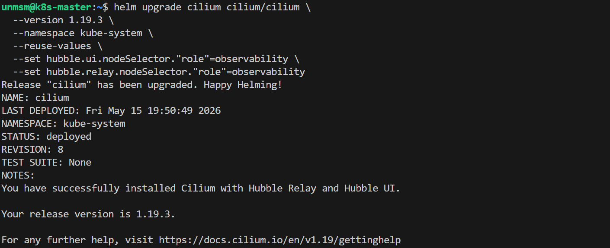
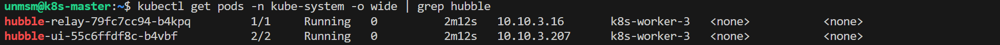
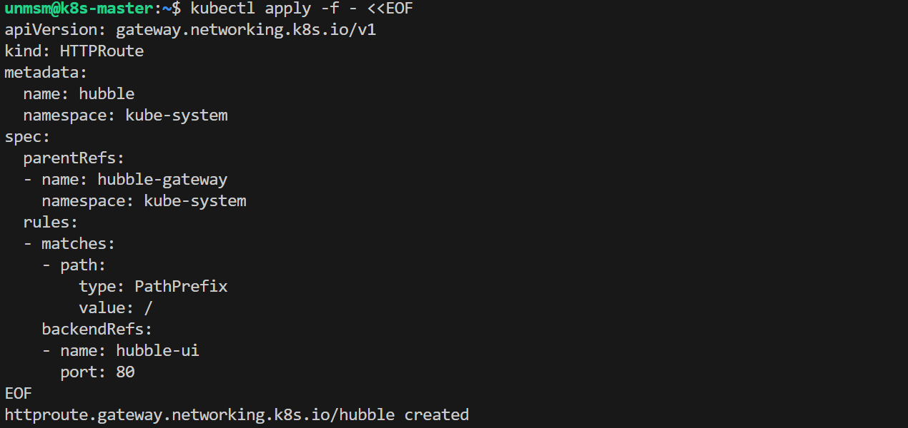
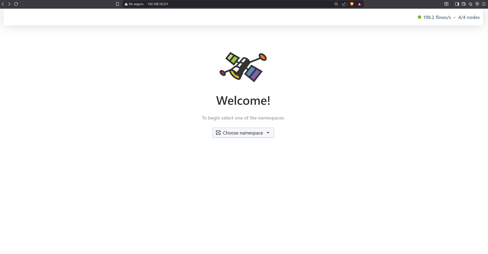

# 03 — Hubble

This section moves Hubble UI and Hubble Relay to k8s-worker-3 and creates the HTTPRoute on the hubble-gateway. Hubble is Cilium's built-in network observability component providing real-time flow visibility at L3/L4 and L7 across all cluster workloads.
> ⚠️ **Run this section on k8s-master only.**

---

## Prerequisites

- [ ] Completed [02 — Loki and Grafana Alloy](../02-loki-alloy/README.md)
- [ ] SSH access to k8s-master

---

## Step 1 — Connect to k8s-master

```bash
ssh unmsm@192.168.18.210
```

---

## Step 2 — Move Hubble UI and Relay to k8s-worker-3

```bash
helm upgrade cilium cilium/cilium \
  --version 1.19.3 \
  --namespace kube-system \
  --reuse-values \
  --set hubble.ui.nodeSelector."role"=observability \
  --set hubble.relay.nodeSelector."role"=observability
```


<sub>Figure 1. Cilium upgraded with Hubble UI and Relay pinned to k8s-worker-3.</sub>
<br><br>

---

## Step 3 — Verify

```bash
kubectl get pods -n kube-system -o wide | grep hubble
```


<sub>Figure 2. Hubble UI and Hubble Relay Running on k8s-worker-3.</sub>
<br><br>

---

## Step 4 — Create Hubble HTTPRoute

```bash
kubectl apply -f - <<EOF
apiVersion: gateway.networking.k8s.io/v1
kind: HTTPRoute
metadata:
  name: hubble
  namespace: kube-system
spec:
  parentRefs:
  - name: hubble-gateway
    namespace: kube-system
  rules:
  - matches:
    - path:
        type: PathPrefix
        value: /
    backendRefs:
    - name: hubble-ui
      port: 80
EOF
```


<sub>Figure 3. Hubble HTTPRoute created. Traffic to 192.168.18.231 is forwarded to the hubble-ui Service.</sub>
<br><br>

---

## Step 5 — Verify

Access Hubble UI from your browser:

```
http://192.168.18.231
```


<sub>Figure 4. Hubble UI accessible at http://192.168.18.231 .</sub>
<br><br>

---

## References

- \[1\] Cilium Documentation, "Hubble Setup."
      https://docs.cilium.io/en/v1.19/observability/hubble/setup/ [Accessed: May 2026]

---

✅ You are here: `chapter-04-observability / 03-hubble`

⏭️ Next: [04 — Longhorn UI →](../04-longhorn-ui/README.md)
