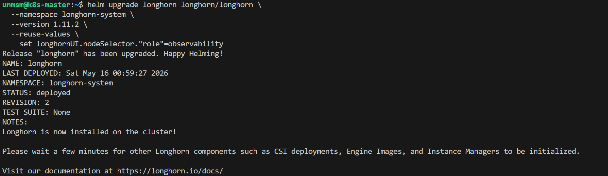
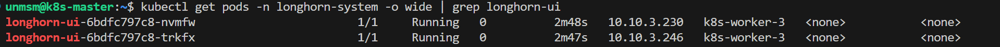
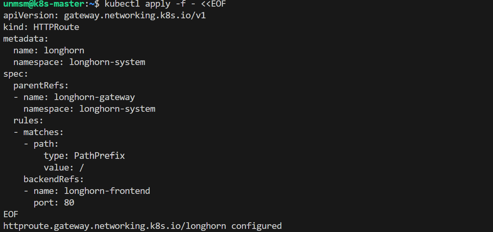
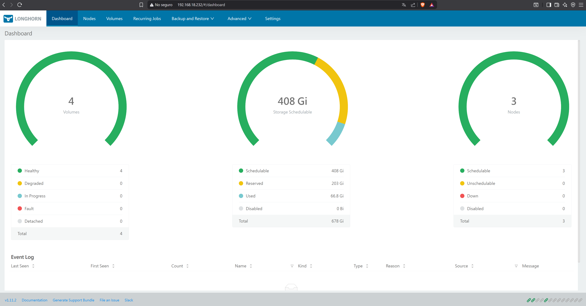

# 04 — Longhorn UI

This section moves the Longhorn UI pods to k8s-worker-3 and creates an HTTPRoute to expose the UI via the observability-gateway. Longhorn is already installed and managing cluster storage from Chapter 3. Only the UI deployment and routing are configured here.

> ⚠️ **Run this section on k8s-master only.**

---

## Prerequisites

- [ ] Completed [03 — Hubble](../03-hubble/README.md)
- [ ] Longhorn running in the longhorn-system namespace
- [ ] SSH access to k8s-master

---

## Step 1 — Connect to k8s-master

```bash
ssh unmsm@192.168.18.210
```

---

## Step 2 — Move Longhorn UI to k8s-worker-3

```bash
helm upgrade longhorn longhorn/longhorn \
  --namespace longhorn-system \
  --version 1.11.2 \
  --reuse-values \
  --set longhornUI.nodeSelector."role"=observability
```


<sub>Figure 1. Longhorn upgraded with UI pods pinned to k8s-worker-3.</sub>
<br><br>

```bash
kubectl get pods -n longhorn-system -o wide | grep longhorn-ui
```


<sub>Figure 2. Longhorn UI pods Running on k8s-worker-3.</sub>
<br><br>

---

## Step 3 — Create Longhorn HTTPRoute

```bash
kubectl apply -f - <<EOF
apiVersion: gateway.networking.k8s.io/v1
kind: HTTPRoute
metadata:
  name: longhorn
  namespace: longhorn-system
spec:
  parentRefs:
  - name: observability-gateway
    namespace: monitoring
  rules:
  - matches:
    - path:
        type: PathPrefix
        value: /longhorn
    filters:
    - type: URLRewrite
      urlRewrite:
        path:
          type: ReplacePrefixMatch
          replacePrefixMatch: /
    backendRefs:
    - name: longhorn-frontend
      port: 80
EOF
```


<sub>Figure 3. Longhorn HTTPRoute created. Traffic to 192.168.18.232 is forwarded to the longhorn-frontend Service.</sub>
<br><br>

---

## Step 4 — Verify

Access Longhorn UI from your browser:

```
http://192.168.18.230/longhorn
```


<sub>Figure 4. Longhorn UI accessible at http://192.168.18.232 showing cluster volumes and storage nodes.</sub>
<br><br>

---

## References

- \[1\] Longhorn Documentation, "Longhorn UI."
      https://longhorn.io/docs/1.11.2/deploy/accessing-the-ui/ [Accessed: May 2026]

---

✅ You are here: `chapter-04-observability / 04-longhorn-ui`

⏭️ Next Chapter: [Chapter 5 — 5G Core Deployment → 01 gtp5g](../../chapter-05-5g-core/01-gtp5g/README.md)
