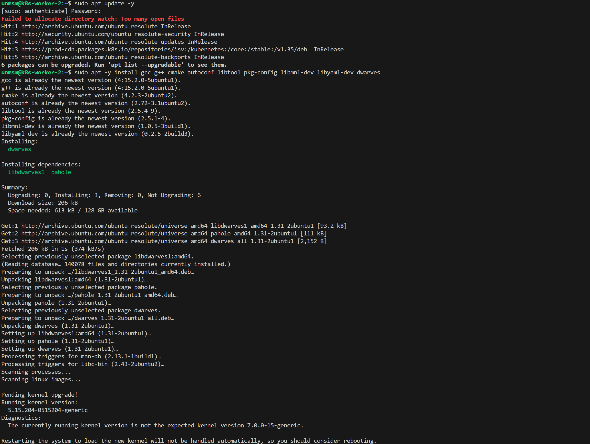
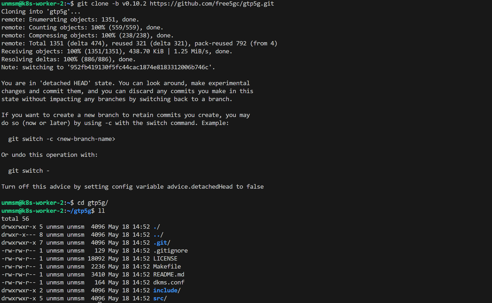
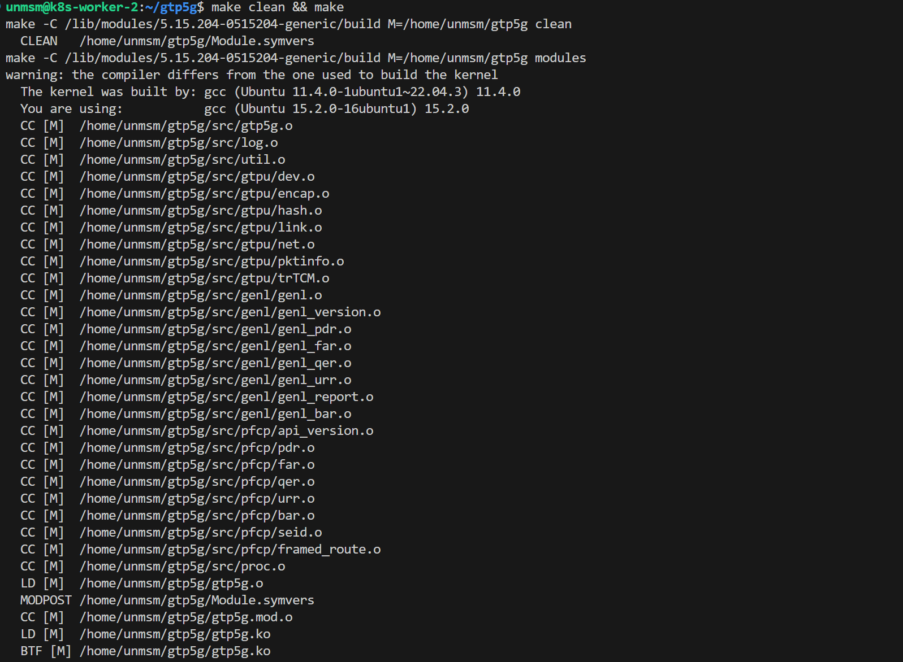
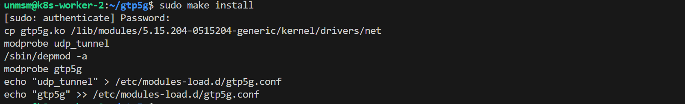
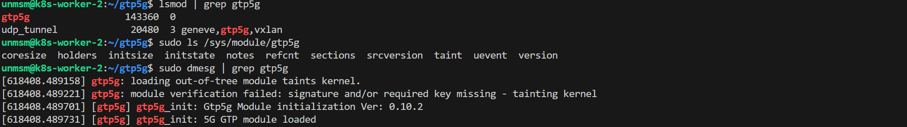

# 01 — gtp5g Kernel Module

This section compiles and installs the gtp5g kernel module on k8s-worker-2. gtp5g is a customized Linux kernel module that handles GTP-U packets using PFCP information elements such as PDR, FAR, and QER as defined in 3GPP TS 29.281 and TS 29.244. It is required by the free5GC UPF to create and manage GTP-U tunnels for user plane traffic.

> ⚠️ **Run this section on k8s-worker-2 only.** This node runs kernel 5.15 specifically to support gtp5g.

---

## Prerequisites

- [ ] Completed [Chapter 4 — Observability Stack](../../chapter-04-observability/)
- [ ] k8s-worker-2 running kernel 5.15.x
- [ ] SSH access to k8s-worker-2

---

## Component Version

| Component | Version |
|---|---|
| gtp5g | v0.10.2 |

---

## Step 1 — Connect to k8s-worker-2

```bash
ssh unmsm@192.168.18.212
```

---

## Step 2 — Verify Kernel Version

```bash
uname -r
```


<sub>Figure 1. k8s-worker-2 running kernel 5.15.204 required for gtp5g.</sub>
<br><br>

---

## Step 3 — Install Build Dependencies

```bash
sudo apt update -y
sudo apt -y install gcc g++ cmake autoconf libtool pkg-config libmnl-dev libyaml-dev dwarves
```


<sub>Figure 2. Build dependencies installed.</sub>
<br><br>

---

## Step 4 — Clone gtp5g

```bash
git clone -b v0.10.2 https://github.com/free5gc/gtp5g.git
cd gtp5g
```


<sub>Figure 3. gtp5g v0.10.2 cloned.</sub>
<br><br>

---

## Step 5 — Compile

```bash
make clean && make
```


<sub>Figure 4. gtp5g v0.10.2 compiled successfully.</sub>
<br><br>

---

## Step 6 — Install

```bash
sudo make install
```


<sub>Figure 5. gtp5g module installed and loaded automatically at boot.</sub>
<br><br>

---

## Step 7 — Verify

```bash
lsmod | grep gtp5g
sudo ls /sys/module/gtp5g
sudo dmesg | grep gtp5g
```


<sub>Figure 6. gtp5g v0.10.2 loaded. lsmod, /sys/module and dmesg confirm the module is active and initialized.</sub>
<br><br>

---

## References

- \[1\] free5GC, "gtp5g — GTP-U Linux Kernel Module."
      https://github.com/free5gc/gtp5g [Accessed: May 2026]
- \[2\] 3GPP, "TS 29.244 — Interface between the Control Plane and the User Plane nodes."
      https://www.3gpp.org/ftp/Specs/archive/29_series/29.244/ [Accessed: May 2026]

---

✅ You are here: `chapter-05-5g-environment / 01-gtp5g`

⏭️ Next: [02 — free5GC →](../02-free5gc/README.md)
