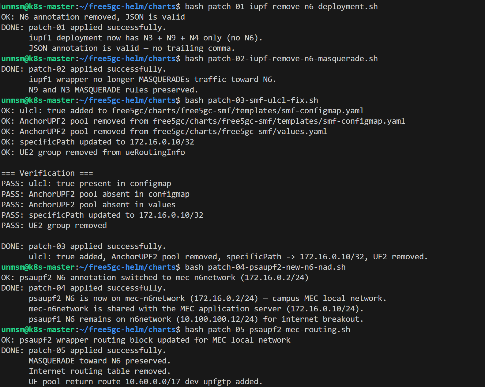
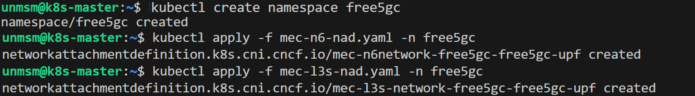
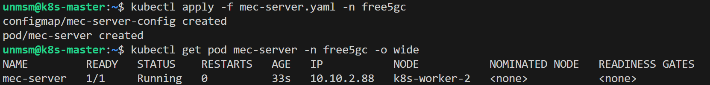

# 02 — free5GC

This section deploys the free5GC 5G SA core using the official free5gc-helm chart v4.2.2.

> **Scope of this guide:** The steps below reproduce the exact deployment used in *"A Cloud-Native 5G Standalone ULCL Testbed on Kubernetes for User-Plane Evaluation Under Load and Failure"* (INTERCON 2026). They configure a specific ULCL two-anchor topology with a local MEC application server and apply a set of minimal patches to free5gc-helm v4.2.2 required for this topology to work correctly. For a generic free5GC deployment without ULCL customizations, follow the [official chart documentation](https://github.com/free5gc/free5gc-helm) directly and skip the patch steps.

> ⚠️ **Steps 1 through 3 run on k8s-worker-2. Remaining steps run on k8s-master.**

---

## Prerequisites

- Completed [01 — gtp5g](../01-gtp5g/README.md)
- gtp5g v0.10.2 loaded on k8s-worker-2
- SSH access to k8s-master and k8s-worker-2

---

## Component Versions

| Component | Version |
| :--- | :--- |
| free5gc-helm | v4.2.2 |
| free5GC core | v4.2.2 |
| SMF (patched) | lpoclin/free5gc-smf:v4.2.2-ulcl-fix |

---

## Topology

This deployment implements the ULCL topology described in the paper. The SMF installs PDR/FAR rules via PFCP on the ULCL UPF, which steers uplink flows to the C-PSA or L-PSA based on static destination prefix rules per 3GPP TS 23.501, Section 5.6.4.

| Network Function | Role | Node |
| :--- | :--- | :--- |
| AMF, SMF, NRF, AUSF, UDM, UDR, PCF, NSSF, CHF, NEF, MongoDB | Control plane | k8s-worker-1 |
| ULCL UPF (iupf1) | Uplink Classifier, N3+N9+N4 only | k8s-worker-2 |
| C-PSA UPF (psaupf1) | Central PDU Session Anchor, internet breakout | k8s-worker-2 |
| L-PSA UPF (psaupf2) | Local PDU Session Anchor, campus MEC anchor | k8s-worker-2 |
| MEC Application Server | Campus edge application server (UAV control) | k8s-worker-2 |
| WebUI | free5GC web interface | k8s-worker-3 |

```
UE (10.60.0.1)
    |  N3
    v
ULCL UPF (iupf1)          <- classifier only, no N6
    |
    +-- N9 --> C-PSA UPF (psaupf1) --> N6 (10.100.100.12) --> internet
    |
    +-- N9 --> L-PSA UPF (psaupf2) --> N6 (172.16.0.2)    --> MEC server (172.16.0.10)
```


<sub>Figure 1. ULCL testbed topology. Traffic to 172.16.0.10/32 is steered to the L-PSA campus MEC anchor. All other traffic follows the default path to the C-PSA internet breakout. The ULCL UPF has no N6 interface per 3GPP TS 23.501, Section 5.6.4.</sub>
<br><br>

---

## Step 1 — Connect to k8s-worker-2

```bash
ssh unmsm@192.168.18.212
```

---

## Step 2 — Allow unsafe sysctl in kubelet

The free5GC UPF chart sets `net.ipv4.ip_forward=1` in its podSecurityContext. kubelet only permits a fixed set of safe sysctls by default and rejects any others with SysctlForbidden. k8s-worker-2 must explicitly allowlist this sysctl before deploying the UPF.

```bash
sudo tee -a /var/lib/kubelet/config.yaml << 'EOF'
allowedUnsafeSysctls:
  - "net.ipv4.ip_forward"
EOF

sudo systemctl restart kubelet
```

Verify:

```bash
sudo grep allowedUnsafe /var/lib/kubelet/config.yaml
```


<sub>Figure 2. allowedUnsafeSysctls added to kubelet config. Without this the UPF pods fail with SysctlForbidden.</sub>
<br><br>

> **Note:** `allowedUnsafeSysctls` is an official KubeletConfiguration field read directly from `--config=/var/lib/kubelet/config.yaml`. This file is not overwritten by `apt upgrade kubelet` and survives upgrades.

---

## Step 3 — Configure N6 gateway on k8s-worker-2

Creates the N6 gateway interface for the C-PSA UPF (psaupf1), providing IP `10.100.100.1/24` and NAT toward the internet for uplink traffic that follows the default path.

> **Note:** This gateway serves only the C-PSA internet path. The L-PSA UPF (psaupf2) uses a separate MEC network (172.16.0.0/24) configured via Multus NAD, no additional gateway is needed for that path.

```bash
sudo tee /etc/systemd/system/macv-n6.service << 'EOF'
[Unit]
Description=N6 gateway interface for free5GC UPF
After=network.target

[Service]
Type=oneshot
RemainAfterExit=yes
ExecStart=/bin/bash -c '\
  ip link add macv-n6 link ens18 type ipvlan mode l2 && \
  ip addr add 10.100.100.1/24 dev macv-n6 && \
  ip link set macv-n6 up && \
  iptables -t nat -A POSTROUTING -s 10.100.100.0/24 -o ens18 -j MASQUERADE'
ExecStop=/bin/bash -c '\
  iptables -t nat -D POSTROUTING -s 10.100.100.0/24 -o ens18 -j MASQUERADE; \
  ip link del macv-n6'

[Install]
WantedBy=multi-user.target
EOF

sudo systemctl daemon-reload
sudo systemctl enable macv-n6
sudo systemctl start macv-n6
```

<sub>Figure 3. N6 gateway 10.100.100.1/24 service applied.</sub>
<br><br>

Verify:

```bash
sudo systemctl status macv-n6
ip addr show macv-n6
sudo iptables -t nat -L POSTROUTING -n | grep 10.100.100
```


<sub>Figure 4. N6 gateway 10.100.100.1/24 active and MASQUERADE rule verified.</sub>
<br><br>

---

## Step 4 — Connect to k8s-master

```bash
ssh unmsm@192.168.18.210
```

---

## Step 5 — Clone free5gc-helm

```bash
git clone -b v4.2.2 https://github.com/free5gc/free5gc-helm.git
cd free5gc-helm/charts
```


<sub>Figure 5. free5gc-helm v4.2.2 cloned.</sub>
<br><br>

---

## Step 6 — Apply chart patches

Five targeted patches modify free5gc-helm v4.2.2 to support the two-anchor ULCL topology. Run them from inside `free5gc-helm/charts/`:

```bash
curl -O https://raw.githubusercontent.com/lpoclin/5gc-cloudnative-testbed/main/patches/patch-01-iupf-remove-n6-deployment.sh
curl -O https://raw.githubusercontent.com/lpoclin/5gc-cloudnative-testbed/main/patches/patch-02-iupf-remove-n6-masquerade.sh
curl -O https://raw.githubusercontent.com/lpoclin/5gc-cloudnative-testbed/main/patches/patch-03-smf-ulcl-fix.sh
curl -O https://raw.githubusercontent.com/lpoclin/5gc-cloudnative-testbed/main/patches/patch-04-psaupf2-new-n6-nad.sh
curl -O https://raw.githubusercontent.com/lpoclin/5gc-cloudnative-testbed/main/patches/patch-05-psaupf2-mec-routing.sh
chmod +x patch-*.sh

bash patch-01-iupf-remove-n6-deployment.sh
bash patch-02-iupf-remove-n6-masquerade.sh
bash patch-03-smf-ulcl-fix.sh
bash patch-04-psaupf2-new-n6-nad.sh
bash patch-05-psaupf2-mec-routing.sh
```

| Patch | File | What it does |
| :--- | :--- | :--- |
| 01 | iupf1-deployment.yaml | Removes N6 annotation. The ULCL UPF is a classifier only, no N6 per 3GPP TS 23.501, Section 5.6.4. |
| 02 | iupf1-configmap.yaml | Removes the N6 MASQUERADE rule from the wrapper, consistent with patch 01 removing the N6 interface. |
| 03 | smf-configmap.yaml + values.yaml | Enables `ulcl: true`. Removes the L-PSA IP pool so only the C-PSA allocates UE addresses. Sets specificPath to 172.16.0.10/32 to steer MEC-bound traffic to the L-PSA anchor. |
| 04 | psaupf2-deployment.yaml | Switches the L-PSA N6 annotation to mec-n6network (172.16.0.0/24). |
| 05 | psaupf2-configmap.yaml | Removes the internet routing table whose gateway (10.100.100.1) belongs to the C-PSA path and does not exist on the MEC network. Keeps MASQUERADE toward N6 so the MEC server can return traffic to the UE via psaupf2. Adds UE pool return route via upfgtp. |


<sub>Figure 6. All five patches applied to free5gc-helm v4.2.2 templates.</sub>
<br><br>

---

## Step 7 — Create namespace and apply MEC network NADs

Two NADs must exist before the helm install. The `mec-n6network` NAD attaches psaupf2 to the MEC segment using ipvlan L2. The `mec-l3s-network` NAD attaches the MEC server to the same segment using ipvlan L3S.

> **Note:** Both pods run on k8s-worker-2 and share `ens18` as the master interface. ipvlan L3S is required for the MEC server because ipvlan L2 slaves on the same host and master cannot communicate directly at L2.

```bash
curl -O https://raw.githubusercontent.com/lpoclin/5gc-cloudnative-testbed/main/manifests/mec-n6-nad.yaml
curl -O https://raw.githubusercontent.com/lpoclin/5gc-cloudnative-testbed/main/manifests/mec-l3s-nad.yaml

kubectl create namespace free5gc
kubectl apply -f mec-n6-nad.yaml -n free5gc
kubectl apply -f mec-l3s-nad.yaml -n free5gc
```


<sub>Figure 7. mec-n6network and mec-l3s-network created on 172.16.0.0/24.</sub>
<br><br>

---

## Step 8 — Download testbed values and install free5GC

```bash
curl -O https://raw.githubusercontent.com/lpoclin/5gc-cloudnative-testbed/main/values/values-free5gc.yaml

helm install free5gc ./free5gc/ \
  --namespace free5gc \
  -f values-free5gc.yaml
```


<sub>Figure 8. free5GC v4.2.2 installed in the free5gc namespace.</sub>
<br><br>

---

## Step 9 — Verify pods

```bash
kubectl get pods -n free5gc -o wide
```


<sub>Figure 9. All free5GC NFs running. Control plane on k8s-worker-1, UPF instances on k8s-worker-2, WebUI on k8s-worker-3.</sub>
<br><br>

---

## Step 10 — Deploy MEC application server

```bash
curl -O https://raw.githubusercontent.com/lpoclin/5gc-cloudnative-testbed/main/manifests/mec-server.yaml

kubectl apply -f mec-server.yaml -n free5gc
kubectl get pod mec-server -n free5gc -o wide
```


<sub>Figure 10. MEC application server running with IP 172.16.0.10 on mec-n6network.</sub>
<br><br>

---

## Step 11 — Create WebUI HTTPRoute

```bash
kubectl apply -f - <<EOF
apiVersion: gateway.networking.k8s.io/v1
kind: HTTPRoute
metadata:
  name: free5gc-webui
  namespace: free5gc
spec:
  parentRefs:
  - name: free5gc-gateway
    namespace: free5gc
  rules:
  - matches:
    - path:
        type: PathPrefix
        value: /
    backendRefs:
    - name: webui-service
      port: 5000
EOF
```

Access the free5GC WebUI from your browser. Login with `admin` / `free5gc`.

```
http://192.168.18.233
```


<sub>Figure 11. free5GC WebUI accessible.</sub>
<br><br>

---

## References

- \[1\] free5GC, "free5gc-helm v4.2.2."
      https://github.com/free5gc/free5gc-helm [Accessed: May 2026]
- \[2\] free5GC, "free5GC v4.2.2."
      https://github.com/free5gc/free5gc [Accessed: May 2026]
- \[3\] 3GPP, "TS 23.501: System Architecture for the 5G System," Release 17, Section 5.6.4.
      https://www.3gpp.org/ftp/Specs/archive/23_series/23.501/ [Accessed: May 2026]
- \[4\] L. Poclin, "fix(ulcl): fix PSA2 selection failure in two-anchor topology," free5gc/smf PR #224.
      https://github.com/free5gc/smf/pull/224 [Accessed: June 2026]

---

✅ You are here: `chapter-05-5g-network-environment / 02-free5gc`

⏭️ Next: [03 — UERANSIM →](../03-ueransim/README.md)
