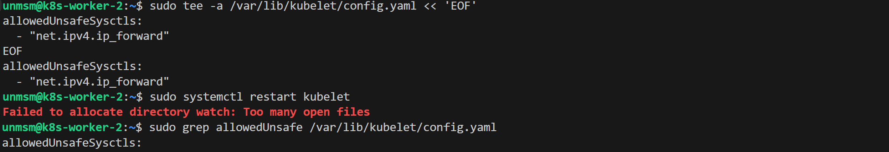
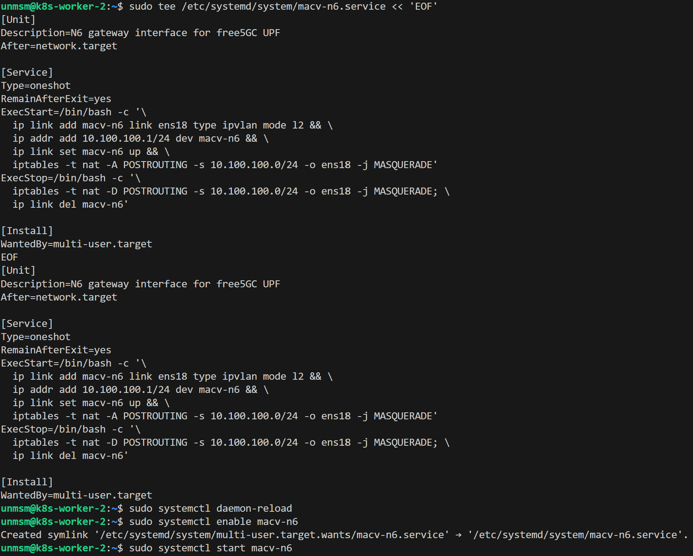
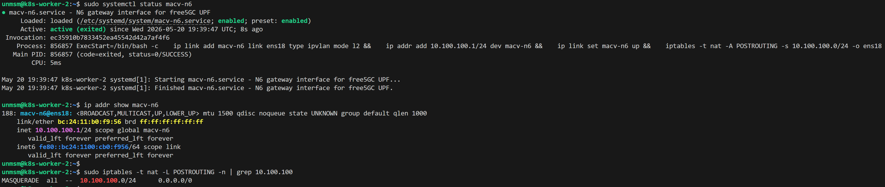
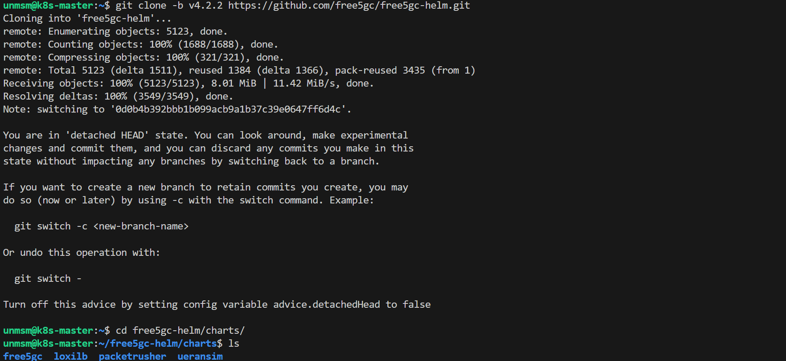
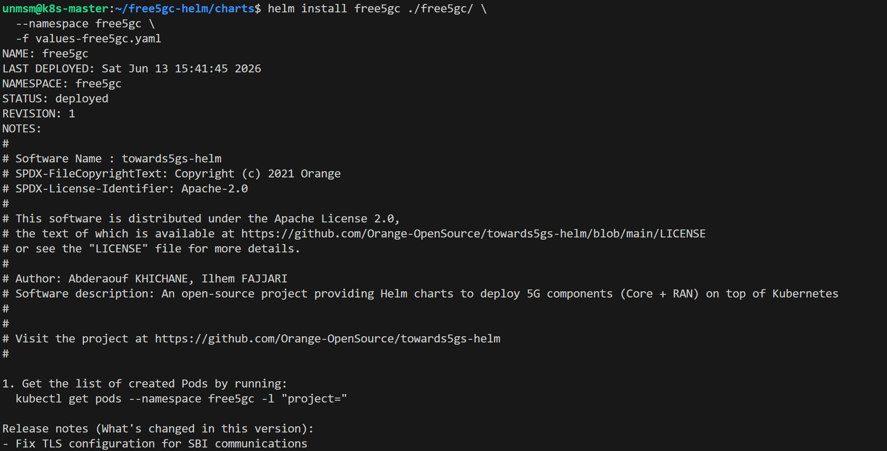
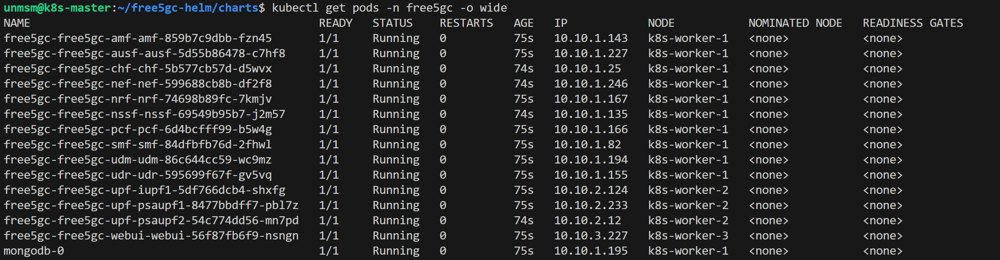
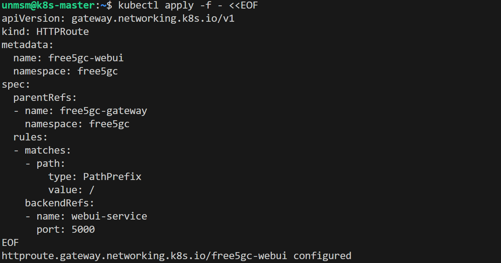
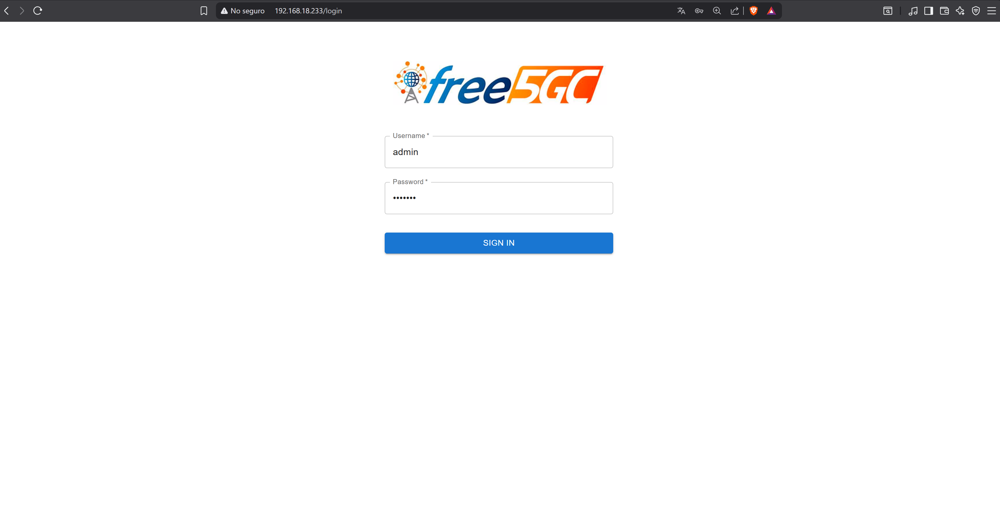

# 02 — free5GC

This section deploys the free5GC 5G SA core using the official free5gc-helm chart v4.2.2 in ULCL user plane architecture with Multus CNI. A minimal values override file centralizes all testbed-specific customizations. The chart is fully configurable; refer to the official chart README for all available parameters.

> ⚠️ **Steps 1 through 3 run on k8s-worker-2. Remaining steps run on k8s-master.**

---

## Prerequisites

- [ ] Completed [01 — gtp5g](../01-gtp5g/README.md)
- [ ] gtp5g v0.10.2 loaded on k8s-worker-2
- [ ] SSH access to k8s-master and k8s-worker-2

---

## Component Versions

| Component | Version |
|---|---|
| free5gc-helm | v4.2.2 |
| free5GC core | v4.2.2 |

---

## Architecture

free5GC ULCL deploys four UPF instances. The SMF installs PDR/FAR rules via PFCP on the I-UPF, which steers uplink flows to PSA-UPF1 or PSA-UPF2 based on static destination prefix rules per 3GPP TS 23.501.

| NF | Node |
|---|---|
| AMF, SMF, NRF, AUSF, UDM, UDR, PCF, NSSF, CHF, NEF, MongoDB | k8s-worker-1 |
| UPF, iUPF1, PSA-UPF1, PSA-UPF2 | k8s-worker-2 |
| WebUI | k8s-worker-3 |

---

## Step 1 — Connect to k8s-worker-2

```bash
ssh unmsm@192.168.18.212
```

---

## Step 2 — Allow unsafe sysctl in kubelet

The free5GC UPF chart sets `net.ipv4.ip_forward=1` in its podSecurityContext. kubelet only permits a fixed set of safe sysctls by default and rejects any others with SysctlForbidden. k8s-worker-2 must explicitly allowlist this sysctl before deploying the UPF.

```bash
sudo tee -a /var/lib/kubelet/config.yaml << 'EOF'
allowedUnsafeSysctls:
  - "net.ipv4.ip_forward"
EOF

sudo systemctl restart kubelet
```

Verify:

```bash
sudo grep allowedUnsafe /var/lib/kubelet/config.yaml
```


<sub>Figure 1. allowedUnsafeSysctls added to kubelet config. Without this the UPF pods fail with SysctlForbidden.</sub>
<br><br>

> **Note:** `allowedUnsafeSysctls` is an official KubeletConfiguration field read directly from `--config=/var/lib/kubelet/config.yaml`. This file is not overwritten by `apt upgrade kubelet` and survives upgrades.

---

## Step 3 — Configure N6 gateway on k8s-worker-2

The free5GC UPF chart handles masquerade for UE traffic internally via the N6 interface. The host only needs to provide the N6 gateway IP (`10.100.100.1`) and NAT the N6 subnet to reach the internet.

```bash
sudo tee /etc/systemd/system/macv-n6.service << 'EOF'
[Unit]
Description=N6 gateway interface for free5GC UPF
After=network.target

[Service]
Type=oneshot
RemainAfterExit=yes
ExecStart=/bin/bash -c '\
  ip link add macv-n6 link ens18 type ipvlan mode l2 && \
  ip addr add 10.100.100.1/24 dev macv-n6 && \
  ip link set macv-n6 up && \
  iptables -t nat -A POSTROUTING -s 10.100.100.0/24 -o ens18 -j MASQUERADE'
ExecStop=/bin/bash -c '\
  iptables -t nat -D POSTROUTING -s 10.100.100.0/24 -o ens18 -j MASQUERADE; \
  ip link del macv-n6'

[Install]
WantedBy=multi-user.target
EOF

sudo systemctl daemon-reload
sudo systemctl enable macv-n6
sudo systemctl start macv-n6
```


<sub>Figure 2. macv-n6 service created, enabled and started.</sub>
<br><br>

Verify:

```bash
sudo systemctl status macv-n6
ip addr show macv-n6
sudo iptables -t nat -L POSTROUTING -n | grep 10.100.100
```


<sub>Figure 3. N6 gateway 10.100.100.1/24 active and MASQUERADE rule applied.</sub>
<br><br>

---

## Step 4 — Connect to k8s-master

```bash
ssh unmsm@192.168.18.210
```

---

## Step 5 — Clone free5gc-helm

```bash
git clone -b v4.2.2 https://github.com/free5gc/free5gc-helm.git
cd free5gc-helm/charts
```


<sub>Figure 4. free5gc-helm v4.2.2 cloned.</sub>
<br><br>

---

## Step 6 — Download testbed values

Run from inside `free5gc-helm/charts` where the helm install will be executed.

```bash
curl -O https://raw.githubusercontent.com/lpoclin/5gc-cloudnative-testbed/main/values/values-free5gc.yaml
curl -O https://raw.githubusercontent.com/lpoclin/5gc-cloudnative-testbed/main/values/values-ueransim.yaml
```


<br><sub>Figure 5. Testbed values files downloaded into free5gc-helm/charts.</sub>
<br><br>

The override file sets only what differs from the chart defaults. To adapt to a different environment, change `masterIf` to match your node interface name and `role` label values to match your node labels.

```yaml
# values-free5gc.yaml
# UNMSM 5G Cloud-Native Testbed
# Override values for free5gc-helm v4.2.2
# Usage: helm install free5gc ./free5gc/ -n free5gc -f values-free5gc.yaml
#
# Only values that differ from chart defaults are set here.
# For full parameter reference see: https://github.com/free5gc/free5gc-helm

global:
  userPlaneArchitecture: ulcl

  amf:
    multus:
      enabled: true
      n2network:
        masterIf: ens18        # change to match your node interface (ip -br link show)

  smf:
    multus:
      enabled: true
      n4network:
        masterIf: ens18

  upf:
    multus:
      enabled: true
      n3network:
        masterIf: ens18
      n4network:
        masterIf: ens18
      n6network:
        masterIf: ens18
      n9network:
        masterIf: ens18

# MongoDB — Longhorn StorageClass, no hardcoded PV
mongodb:
  nodeSelector:
    role: general
  persistence:
    storageClass: longhorn
    size: 6Gi
  extraDeploy: []

# Control plane NFs on nodes labeled role=general
free5gc-amf:
  amf:
    nodeSelector:
      role: general
free5gc-smf:
  smf:
    nodeSelector:
      role: general
free5gc-nrf:
  nrf:
    nodeSelector:
      role: general
free5gc-ausf:
  ausf:
    nodeSelector:
      role: general
free5gc-udm:
  udm:
    nodeSelector:
      role: general
free5gc-udr:
  udr:
    nodeSelector:
      role: general
free5gc-pcf:
  pcf:
    nodeSelector:
      role: general
free5gc-nssf:
  nssf:
    nodeSelector:
      role: general
free5gc-chf:
  chf:
    nodeSelector:
      role: general
free5gc-nef:
  nef:
    nodeSelector:
      role: general

# User plane NFs on nodes labeled role=userplane (kernel 5.15 + gtp5g required)
free5gc-upf:
  upf:
    nodeSelector:
      role: userplane
  psaupf1:
    nodeSelector:
      role: userplane
  psaupf2:
    nodeSelector:
      role: userplane
  iupf1:
    nodeSelector:
      role: userplane

# WebUI on nodes labeled role=observability (Gateway API HTTPRoute /free5gc)
free5gc-webui:
  webui:
    nodeSelector:
      role: observability
```

---

## Step 7 — Create namespace and install free5GC

```bash
kubectl create namespace free5gc
```

```bash
helm install free5gc ./free5gc/ \
  --namespace free5gc \
  -f values-free5gc.yaml
```


<sub>Figure 6. free5GC v4.2.2 installed in the free5gc namespace.</sub>
<br><br>

---

## Step 8 — Verify Pods

```bash
kubectl get pods -n free5gc -o wide
```


<sub>Figure 7. All free5GC NFs Running. Control plane on k8s-worker-1, UPF instances on k8s-worker-2, WebUI on k8s-worker-3.</sub>
<br><br>

---

## Step 9 — Create WebUI HTTPRoute

```bash
kubectl apply -f - <<EOF
apiVersion: gateway.networking.k8s.io/v1
kind: HTTPRoute
metadata:
  name: free5gc-webui
  namespace: free5gc
spec:
  parentRefs:
  - name: free5gc-gateway
    namespace: free5gc
  rules:
  - matches:
    - path:
        type: PathPrefix
        value: /
    backendRefs:
    - name: webui-service
      port: 5000
EOF
```


<sub>Figure 8. WebUI HTTPRoute created.</sub>
<br><br>

Access free5GC WebUI from your browser. Login with `admin` / `free5gc`.

```
http://192.168.18.233
```


<sub>Figure 9. free5GC WebUI accessible.</sub>
<br><br>

---

## References

- \[1\] free5GC, "free5gc-helm v4.2.2."
      https://github.com/free5gc/free5gc-helm [Accessed: May 2026]
- \[2\] free5GC, "free5GC v4.2.2."
      https://github.com/free5gc/free5gc [Accessed: May 2026]
- \[3\] Kubernetes Documentation, "Using sysctls in a Kubernetes Cluster."
      https://kubernetes.io/docs/tasks/administer-cluster/sysctl-cluster/ [Accessed: May 2026]

---

✅ You are here: `chapter-05-5g-network-environment / 02-free5gc`

⏭️ Next: [03 — UERANSIM →](../03-ueransim/README.md)
