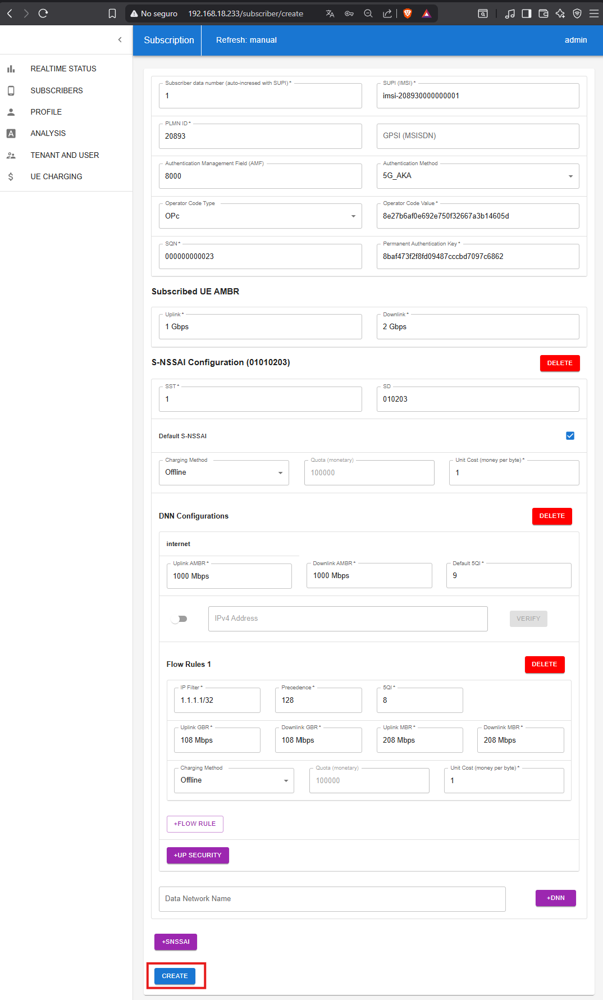
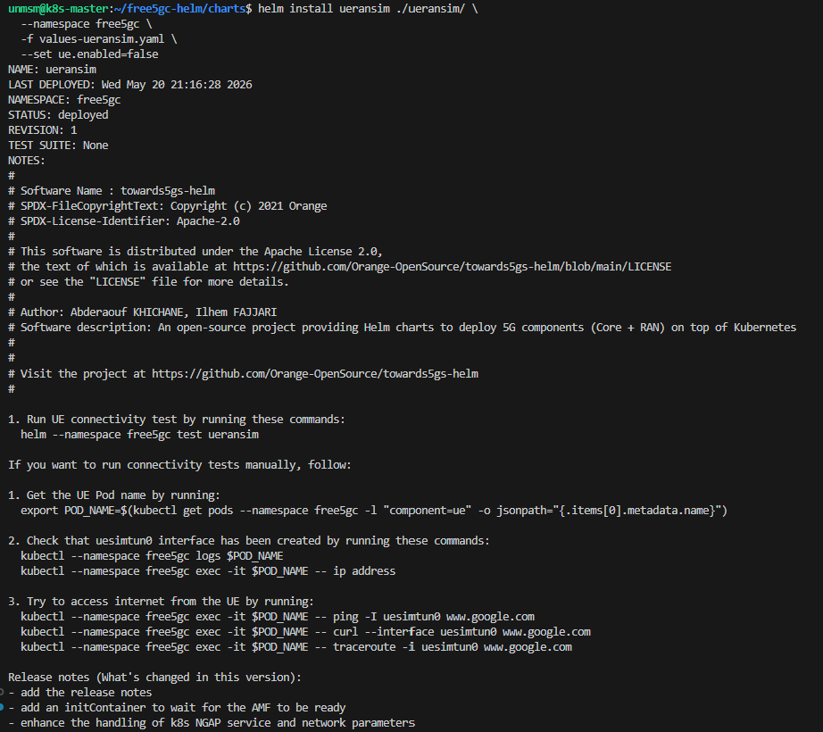
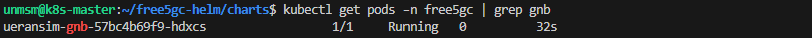
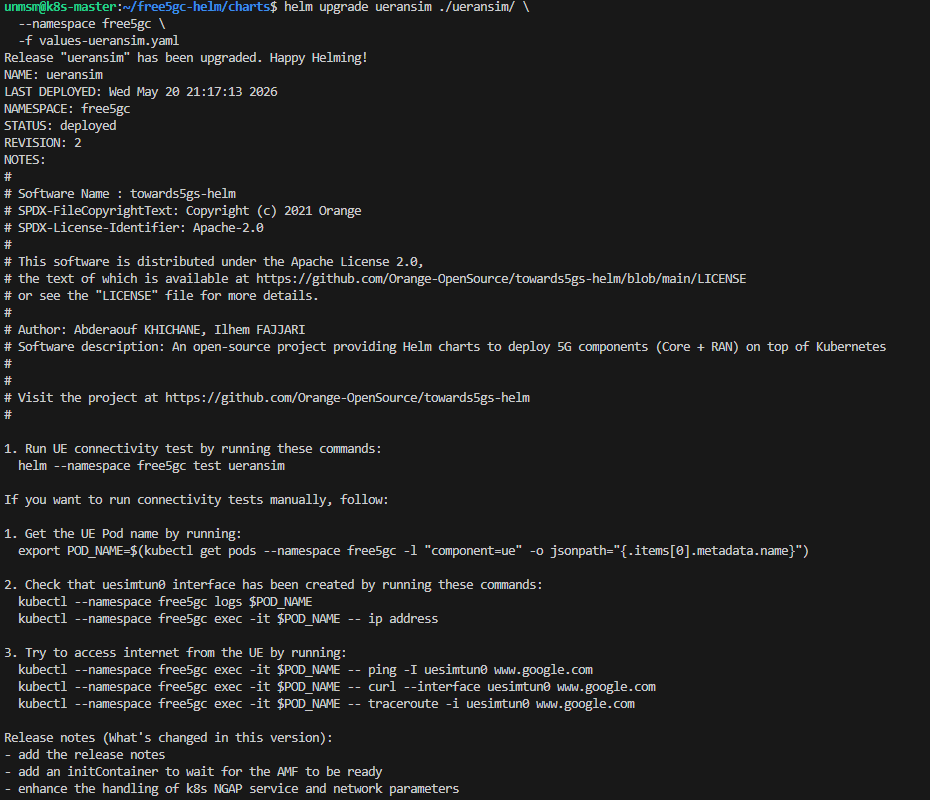
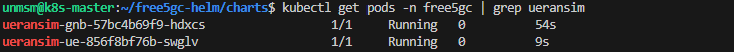
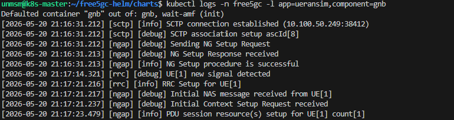
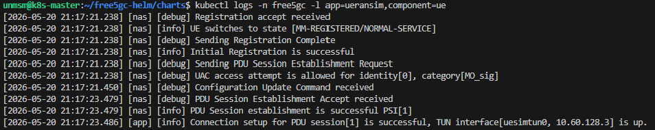

# 03 — UERANSIM

This section deploys UERANSIM as a simulated 5G NR gNB and UE using the ueransim chart included in free5gc-helm v4.2.2. UERANSIM connects to the free5GC core over dedicated Multus interfaces on the N2 and N3 planes.

> ⚠️ **Run this section on k8s-master only.**

---

## Prerequisites

- [ ] Completed [02 — free5GC](../02-free5gc/README.md)
- [ ] All free5GC NFs Running
- [ ] SSH access to k8s-master

---

## Component Versions

| Component | Version |
|---|---|
| ueransim chart | free5gc-helm v4.2.2 |
| UERANSIM image | free5gc/ueransim:v4.0.1 |

---

## Architecture

UERANSIM runs a gNB and a UE pod on k8s-worker-2. The gNB connects to AMF over N2 (SCTP/NGAP) and to iUPF1 over N3 (GTP-U). The UE attaches and triggers PDU session establishment, creating a `uesimtun0` TUN interface inside the UE pod.

| Component | Interface | Peer |
|---|---|---|
| gNB N2 | 10.100.50.250 | AMF 10.100.50.249 |
| gNB N3 | 10.100.50.236 | iUPF1 10.100.50.234 |
| UE | uesimtun0 | DN via UPF N6 |

---

## Step 1 — Connect to k8s-master

```bash
ssh unmsm@192.168.18.210
```

---

## Step 2 — Register subscriber in free5GC WebUI

Register the UE subscriber at `http://192.168.18.233` using `admin` / `free5gc`. Add a new subscriber with the parameters below. The WebUI pre-fills extra S-NSSAI slices — remove any slice other than `01010203` before saving.

| Field | Value |
|---|---|
| SUPI | imsi-208930000000001 |
| MCC | 208 |
| MNC | 93 |
| Key | 8baf473f2f8fd09487cccbd7097c6862 |
| OP | 8e27b6af0e692e750f32667a3b14605d |
| OP Type | OPC |
| AMF | 8000 |
| SST | 1 |
| SD | 010203 |
| DNN | internet |


<sub>Figure 1. UE subscriber registered in free5GC WebUI.</sub>
<br><br>

---

## Step 3 — Navigate to chart directory

```bash
cd ~/free5gc-helm/charts
```

---

## Step 4 — Download testbed values

```bash
curl -O https://raw.githubusercontent.com/lpoclin/5gc-cloudnative-testbed/main/values/values-ueransim.yaml
```


<sub>Figure 2. Testbed values file downloaded.</sub>
<br><br>

The override file sets only what differs from the chart defaults. Change `masterIf` to match your node interface and `role` labels to match your node labels.

```yaml
global:
  free5gcReleaseName: free5gc
  gnb:
    multus:
      enabled: true
      n2network:
        masterIf: ens18        # change to match your node interface (ip -br link show)
      n3network:
        masterIf: ens18

# gNB and UE on nodes labeled role=userplane (same node as UPF for N3 adjacency)
gnb:
  nodeSelector:
    role: userplane

ue:
  nodeSelector:
    role: userplane
```

---

## Step 5 — Install UERANSIM

The gNB and UE are deployed in two steps to avoid a race condition where the UE starts before the gNB Multus interface is ready. Deploy the gNB first and wait until Running before enabling the UE.

```bash
helm install ueransim ./ueransim/ \
  --namespace free5gc \
  -f values-ueransim.yaml \
  --set ue.enabled=false
```


<sub>Figure 3. UERANSIM installed with gNB only.</sub>
<br><br>

Wait for the gNB pod to reach Running:

```bash
kubectl get pods -n free5gc | grep gnb
```


<sub>Figure 4. gNB Running. Proceed to enable the UE.</sub>
<br><br>

```bash
helm upgrade ueransim ./ueransim/ \
  --namespace free5gc \
  -f values-ueransim.yaml
```


<sub>Figure 5. UE enabled via helm upgrade.</sub>
<br><br>

---

## Step 6 — Verify Pods

```bash
kubectl get pods -n free5gc -o wide | grep ueransim
```


<sub>Figure 6. gNB and UE pods Running on k8s-worker-2 with RESTARTS=0.</sub>
<br><br>

---

## Step 7 — Verify gNB registration

```bash
kubectl logs -n free5gc -l app=ueransim,component=gnb
```


<sub>Figure 7. gNB registered with AMF. NG Setup procedure completed.</sub>
<br><br>

---

## Step 8 — Verify UE registration and PDU session

```bash
kubectl logs -n free5gc -l app=ueransim,component=ue
```


<sub>Figure 8. UE registered and PDU session established. uesimtun0 interface created.</sub>
<br><br>

---

## References

- \[1\] free5GC, "free5gc-helm v4.2.2."
      https://github.com/free5gc/free5gc-helm [Accessed: May 2026]
- \[2\] aligungr, "UERANSIM."
      https://github.com/aligungr/UERANSIM [Accessed: May 2026]

---

✅ You are here: `chapter-05-5g-network-environment / 03-ueransim`

⏭️ Next: [04 — Validation →](../04-validation/README.md)
