# Experiment 1 — ULCL Steering Verification

This experiment verifies that the ULCL UPF correctly classifies uplink traffic by destination prefix and steers each flow to the designated anchor UPF, as configured in the SMF routing policy.

The scenario models a university network spanning multiple campuses. The ULCL UPF sits at a regional edge point serving all campuses, enabling local traffic breakout without routing through the central core. The L-PSA UPF and a simulated MEC application server are co-located at the campus edge, keeping local traffic within the campus network. The C-PSA UPF handles internet breakout at the central core.

In this experiment, the UE simulates a campus security drone (UAV-SEC-01) sending flight telemetry to a local control server. The MEC server is a containerized application that simulates that campus service. It receives telemetry, logs the source address of each incoming request, and responds with flight commands. The internet path serves as a reference to quantify the latency benefit of local breakout.

**What this experiment demonstrates:**

- Traffic to 172.16.0.10 (MEC server) is steered exclusively through PSA-UPF2, with no packets at PSA-UPF1.
- Traffic to 8.8.8.8 (internet reference) is steered exclusively through PSA-UPF1, with no packets at PSA-UPF2.
- PSA-UPF2 applies MASQUERADE toward N6. The MEC server sees 172.16.0.2 as the source address. The original UE address is visible in the GTP-U decapsulated traffic on the upfgtp interface of PSA-UPF2.
- RTT toward the campus MEC is significantly lower than toward the internet reference, quantifying the latency benefit of ULCL local breakout.


**Paper reference:** Section IV.A — Table III, Fig. 2, Fig. 3.

---

## Prerequisites

- Completed [03 — UERANSIM](../../docs/chapter-05-5g-network-environment/03-ueransim/README.md)
- All free5GC NFs and UERANSIM pods Running
- UE registered and PDU session established (uesimtun0 active)
- MEC server Running with IP 172.16.0.10
- SSH access to k8s-master

---

## Terminals layout

This experiment requires six terminals open simultaneously:

| Terminal | Purpose |
| :--- | :--- |
| T1 | tcpdump on N9 — PSA-UPF1 (GTP-U tunnel entry) |
| T2 | tcpdump on N9 — PSA-UPF2 (GTP-U tunnel entry) |
| T3 | tcpdump on upfgtp — PSA-UPF1 (decapsulated ICMP) |
| T4 | tcpdump on upfgtp — PSA-UPF2 (decapsulated ICMP) |
| T5 | MEC server logs |
| T6 | UE client |

> **Note:** Pod names in the commands below reflect this testbed deployment. Replace them with the names from your own cluster using `kubectl get pods -n free5gc`.

---

## Step 1 — Install tcpdump on both anchor UPFs

PSA-UPF1:

```bash
kubectl exec -it free5gc-free5gc-upf-psaupf1-8477bbdff7-lgj8l \
  -n free5gc -- bash -c "apt-get update -qq && apt-get install -y -qq tcpdump"
```

PSA-UPF2:

```bash
kubectl exec -it free5gc-free5gc-upf-psaupf2-56b68b4967-5zg2g \
  -n free5gc -- bash -c "apt-get update -qq && apt-get install -y -qq tcpdump"
```

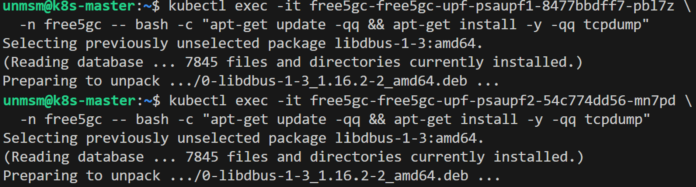
<sub>Figure 1. tcpdump installed on PSA-UPF1 and PSA-UPF2.</sub>
<br><br>

---

## Step 2 — Start tcpdump on PSA-UPF1 (T1 + T3)

Open Terminal 1, enter the PSA-UPF1 pod and capture GTP-U packets on N9. This confirms that traffic arrives via the correct tunnel before decapsulation.

```bash
kubectl exec -it free5gc-free5gc-upf-psaupf1-8477bbdff7-pbl7z -n free5gc -- bash
```

Inside the pod:

```bash
tcpdump -i n9 -n udp port 2152
```

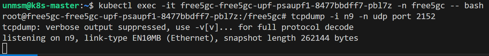
<sub>Figure 2. tcpdump on PSA-UPF1 N9 interface. GTP-U encapsulated traffic will appear here confirming tunnel entry.</sub>
<br><br>

Open Terminal 3 in the same pod and capture decapsulated ICMP on upfgtp. This shows the original UE source and destination IPs after the gtp5g kernel module processes the GTP-U tunnel.

```bash
kubectl exec -it free5gc-free5gc-upf-psaupf1-8477bbdff7-pbl7z -n free5gc -- bash
```

Inside the pod:

```bash
tcpdump -i upfgtp -n icmp
```

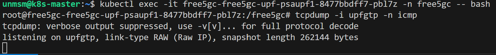
<sub>Figure 3. tcpdump on PSA-UPF1 upfgtp interface. Decapsulated ICMP with original UE source IP will appear here.</sub>
<br><br>

---

## Step 3 — Start tcpdump on PSA-UPF2 (T2 + T4)

Open Terminal 2, enter the PSA-UPF2 pod and capture GTP-U packets on N9.

```bash
kubectl exec -it free5gc-free5gc-upf-psaupf2-54c774dd56-mn7pd -n free5gc -- bash
```

Inside the pod:

```bash
tcpdump -i n9 -n udp port 2152
```

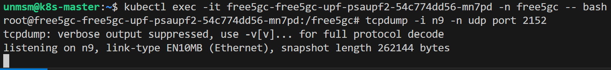
<sub>Figure 4. tcpdump on PSA-UPF2 N9 interface. GTP-U encapsulated traffic will appear here confirming tunnel entry.</sub>
<br><br>

Open Terminal 4 in the same pod and capture decapsulated ICMP on upfgtp.

```bash
kubectl exec -it free5gc-free5gc-upf-psaupf2-54c774dd56-mn7pd -n free5gc -- bash
```

Inside the pod:

```bash
tcpdump -i upfgtp -n icmp
```

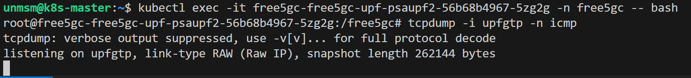
<sub>Figure 5. tcpdump on PSA-UPF2 upfgtp interface. Decapsulated ICMP with original UE source IP will appear here.</sub>
<br><br>

---

## Step 4 — Verify uesimtun0 is active (T6)

Before running any test, confirm the UE tunnel interface is up and has an IP address assigned:

```bash
UE_POD=$(kubectl get pod -n free5gc -l app=ueransim,component=ue \
  -o jsonpath='{.items[0].metadata.name}')

kubectl exec -it ${UE_POD} -n free5gc -- ip addr show uesimtun0
```

Expected output: `uesimtun0` with IP `10.60.0.1/16`. If the interface is not present, the PDU session has not been established — restart the UE pod and verify AMF and SMF logs.

  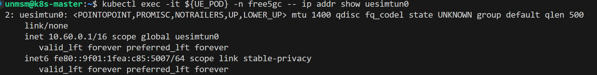
<sub>Figure 6. uesimtun0 active with IP 10.60.0.1. PDU session established.</sub>
<br><br>

---

## Step 5 — Run steering verification pings (T6)

With T1, T2, T3 and T4 running, send ICMP echo requests from uesimtun0 to each destination. Traffic to 172.16.0.10 is expected to appear exclusively at PSA-UPF2. Traffic to 8.8.8.8 is expected to appear exclusively at PSA-UPF1. The complementary anchor shows no activity in each case.

Ping toward MEC server — expected on PSA-UPF2 only:

```bash
kubectl exec -it ${UE_POD} -n free5gc -- ping -I uesimtun0 -c 5 172.16.0.10
```

Ping toward internet reference — expected on PSA-UPF1 only:

```bash
kubectl exec -it ${UE_POD} -n free5gc -- ping -I uesimtun0 -c 5 8.8.8.8
```

---

## Step 6 — Open MEC server logs (T5)

Open Terminal 5 and follow MEC server logs. The server prints each incoming HTTP POST request with the measured application-layer latency and the PSA-UPF2 N6 address (172.16.0.2) as the source, reflecting MASQUERADE applied at the L-PSA anchor before traffic exits toward the MEC network.

```bash
kubectl logs mec-server -n free5gc -f
```

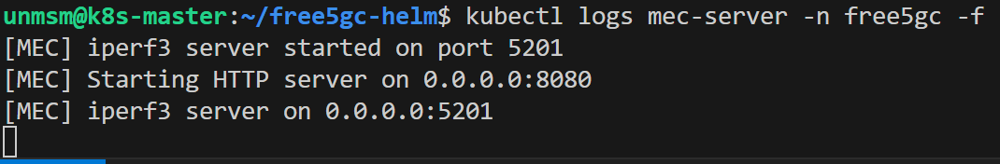
<sub>Figure 7. MEC server ready. HTTP server on port 8080, iperf3 on port 5201.</sub>
<br><br>


---

## Step 7 — Install tools in the UE pod (T6)

Install Python3 and curl inside the UE pod. Required once per pod lifecycle.

```bash
kubectl exec -it ${UE_POD} -n free5gc -- \
  bash -c "apt-get update -qq && apt-get install -y -qq python3 curl"
```
 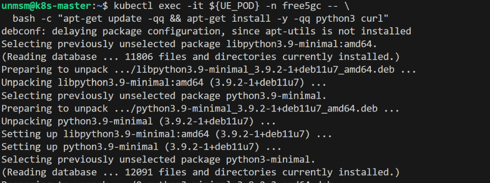
<sub>Figure 8. Python3 and curl installed in the UE pod.</sub>
<br><br>

---

## Step 8 — Copy UAV client script to UE pod

```bash
curl -O https://raw.githubusercontent.com/lpoclin/5gc-cloudnative-testbed/main/experiments/01-steering-verification/uav_client.py

kubectl cp uav_client.py free5gc/${UE_POD}:/tmp/uav_client.py
```

The script sends HTTP POST requests carrying simulated drone telemetry to the MEC server over uesimtun0, and measures ICMP RTT to 8.8.8.8 as an internet reference. Both paths exercise the ULCL steering rules installed by the SMF.

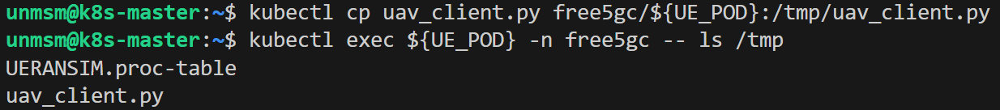
<sub>Figure 9. UAV client script copied to /tmp/uav_client.py inside the UE pod.</sub>
<br><br>

---

## Step 9 — Run UAV client (T6)

With T1, T2, T3, T4 and T5 open, enter the UE pod and run the UAV client:

```bash
kubectl exec -it ${UE_POD} -n free5gc -- bash
```

```bash
python3 /tmp/uav_client.py
```

The client sends 30 HTTP POST requests to the MEC server and measures ICMP RTT to 8.8.8.8 per request, printing a per-request summary and aggregate statistics at the end.

---

## Results

### Table III. ULCL Steering Verification

| Destination | Expected UPF | RTT avg ± std (ms) | Packet loss |
| :--- | :--- | :--- | :--- |
| 172.16.0.10 (MEC) | PSA-UPF2 | 0.46 ± 0.08 | 0% |
| 8.8.8.8 (internet) | PSA-UPF1 | 37.08 ± 0.34 | 0% |

Table III reports RTT as mean ± standard deviation over 90 ICMP echo requests (3 runs × 30 packets per destination), collected using `measure_rtt.sh`.

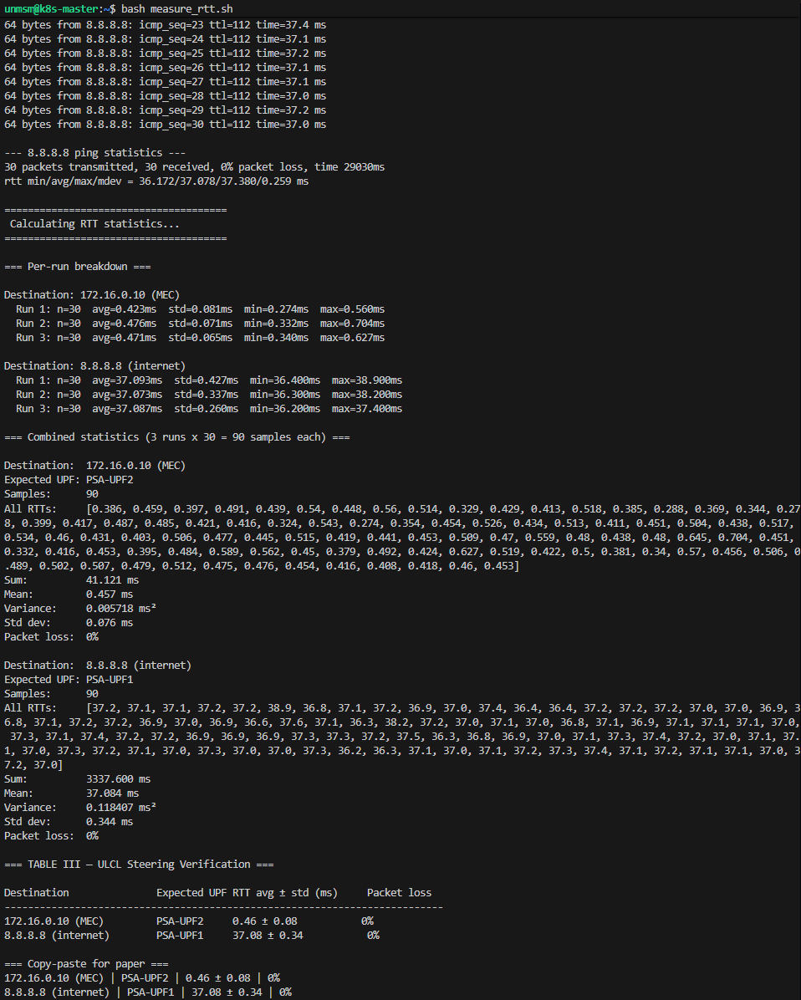
<sub>Figure 10. Output of <code>measure_rtt.sh</code> showing per-run breakdown and combined statistics (90 samples per destination) used to compute Table III.</sub>
<br><br>


### Fig. 2. Steering verification — ping to 172.16.0.10

Simultaneous tcpdump captures on N9 and upfgtp of PSA-UPF2 (active) and PSA-UPF1 (no traffic) during ping to 172.16.0.10. Traffic appears exclusively at the L-PSA anchor.

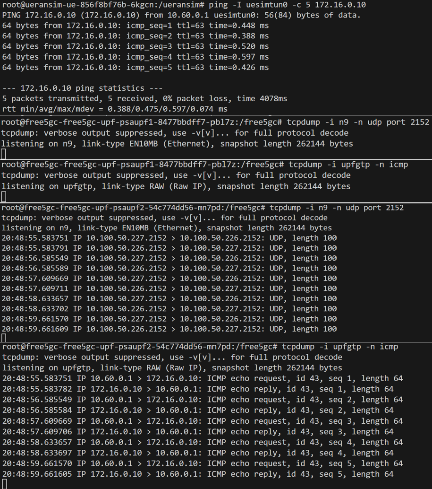
<br><br>


### Fig. 3. Steering verification — ping to 8.8.8.8

Simultaneous tcpdump captures on N9 and upfgtp of PSA-UPF1 (active) and PSA-UPF2 (no traffic) during ping to 8.8.8.8. Traffic appears exclusively at the C-PSA anchor.

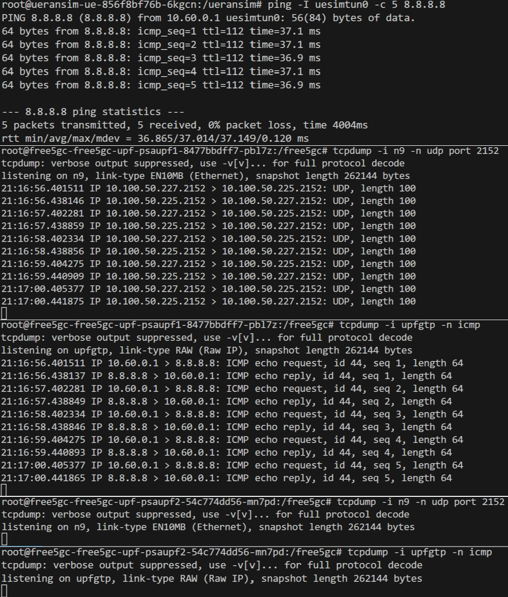
<br><br>


### Fig. 4. Application-layer evidence

UAV client output (top) and MEC server logs (bottom) during the first HTTP POST requests. The MEC path achieves 1.33ms end-to-end RTT versus 37.06ms on the internet reference, a 96.4% latency reduction confirming the benefit of ULCL local breakout. The MEC server receives requests from 172.16.0.2 (PSA-UPF2 N6 address after MASQUERADE) with sub-millisecond server-side processing latency.

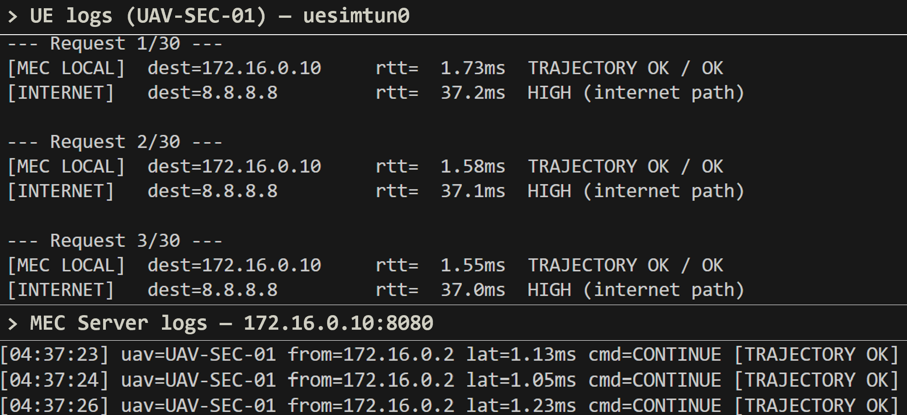
<br><br>


### ▶ Demo

[](https://www.youtube.com/watch?v=G7dTJ8kTV3o)
<br><br>

### Additional evidence

Raw measurement logs, ping captures and UAV client output used to compute Table III are available in:

📁 [`evidence/`](evidence/)

---

## References

- \[1\] 3GPP, "TS 23.501: System Architecture for the 5G System," Release 17, Section 5.6.4.
      https://www.3gpp.org/ftp/Specs/archive/23_series/23.501/ [Accessed: May 2026]
- \[2\] free5GC, "free5GC v4.2.2."
      https://github.com/free5gc/free5gc [Accessed: May 2026]
---

✅ You are here: `experiments / 01-steering-verification`

⏭️ Next: [Experiment 2 — User-Plane Load Characterization →](../02-load-characterization/README.md)
